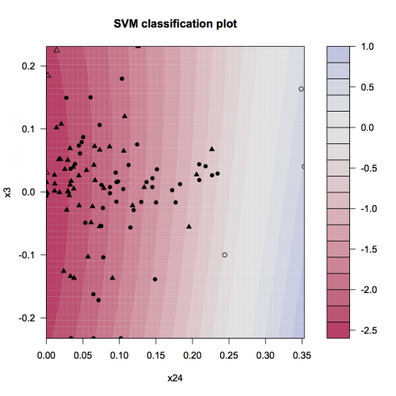
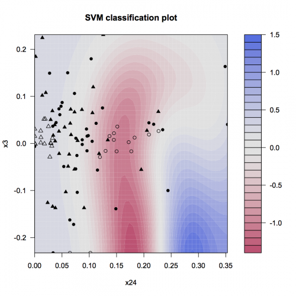
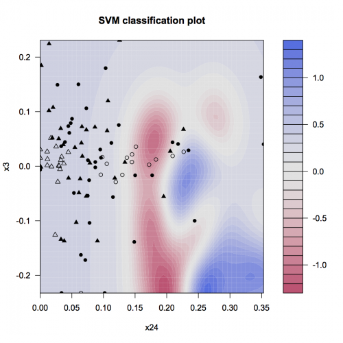
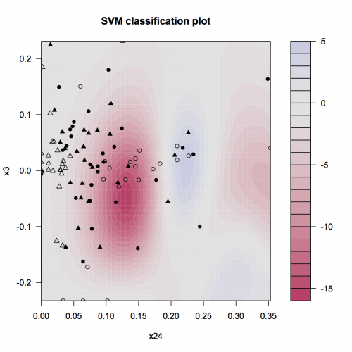

[](http://quantlet.de/)

## [](http://quantlet.de/) **STF2svm01** [](http://quantlet.de/)

```yaml

Name of QuantLet : STF2svm01

Published in : Statistical Tools for Finance and Insurance

Description : 'Plots the area of two different groups. It refers to the four plots in the SVM
chapter.'

Keywords : SVM, risk management, kernel, default, classification

See also : MVAsvmSig05C200, MVAsvmSig100C1, MVAsvmSig2C1, SMSsvmbankrupt, SMSsvmspiral

Author : Linda Hoffmann, Awdesch Melzer

Submitted : Tue, October 15 2013 by Awdesch Melzer

Datafile : Training100by100noNA.txt

Input : 'G- Data Matrix, needs to include labels x1- integer, First variable to be drawn on the 2
Dim. plot x2- integer, Second variable drawn on the 2 Dim. plot y- integer, Indicates the column
number where the lables are stored in D c- scalar, Capacity constraint sig- scalar, prior for RBF
kernel'

Output : 'Four 2-DIm Plot of a svm classification. The RBF kernel and hinge loss are used. The
triangles represent solvent (y = -1) and circles represent insolvent companies (y = +1). The shaded
object represent the support vectors. The colored background corresponds to different score values
$f$. The bluer the area, the higher the score (y= +1). Most successful companies (y=-1) are in the
red area.'

Example : 'Plots for commands: stf2svm01(G,28,7,3,1,100), stf2svm01(G,28,7,3,1,2),
stf2svm01(G,28,7,3,1,1/2) and stf2svm01(G,28,7,3,200,2)'

```










### R Code:
```r
graphics.off()
rm(list = ls(all = TRUE))

# load required packages install.packages('kernlab') install.packages('quadprog') install.packages('zoo')
# install.packages('tseries')
library(kernlab)
library(quadprog)
library(zoo)
library(tseries)

# setwd('C:/Users/...') #set your working direktory

x1 = 28
x2 = 7
y = 3
C = c(1, 1, 1, 200)
sig = c(100, 2, 0.5, 2)

G = read.matrix("Training100by100noNA.txt", header = TRUE, sep = "")

stf2svm01 = function(G, x1, x2, y, C, sig) {
    # g = data.frame(x2=G[,x2], x1=G[,x1],y=G[,y])
    
    # Calculate the score values for each company
    scores <- ksvm(G[, c(x2, x1)], G[, y], type = "C-svc", kernel = "rbfdot", kpar = list(sigma = 1/sig), C = C)
    
    # Make a 2-Dim plot
    
    plot(scores, data = G[, c(x2, x1, y)])
}


for (i in 1:4) {
    dev.new()
    stf2svm01(G = G, x1 = x1, x2 = x2, y = y, C = C[i], sig = sig[i])
} 

```
