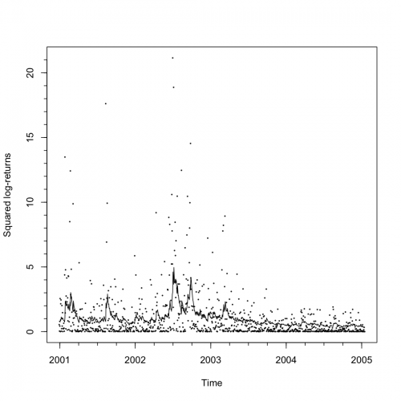

[](http://quantlet.de/)

## [](http://quantlet.de/) **STF2tvch02** [](http://quantlet.de/)

```yaml

Name of QuantLet : STF2tvch02

Published in : Statistical Tools for Finance and Insurance

Description : Plots the data and the GARCH volatility forecast based on all historical data.

Keywords : returns, time-series, garch, nonstationary, heteroskedasticity

See also : STF2tvch01, STF2tvch03, STF2tvch04, STF2tvch05, STF2tvch06, STF2tvch07

Author : Pavel Cizek

Submitted : Thu, October 06 2011 by Awdesch Melzer

Datafile : SP1997-2005s.txt

Example : Plot of the data and the GARCH volatility forecast based on all historical data.

```




### R Code:
```r
# Close windows and clear variables
rm(list = ls(all = TRUE))
graphics.off()

# Load library install.packages(c('aws', 'fGarch', 'igraph', 'Hmisc'))


library("fGarch")
library("igraph")
library("stats")
library("Hmisc")

# Please change working directory setwd('C:/')
data <- read.delim2("SP1997-2005s.txt")

time <- (1:length(data[, 1]))
dat0 <- data[, 1] - c(mean(data[, 1]))
dat0 <- dat0/sd(dat0)

h <- 1
pred <- 0 * time - 1

for (i in 1076:2088) {
    # print(i)
    
    gest <- garchFit(~garch(1, 1), data = dat0[1:(i - 1)], trace = FALSE, include.mean = FALSE)
    pred[i] <- predict(gest, n.ahead = h)$standardDeviation^2
}

timet <- (time - 1078)/250 + 2001
plot(timet[pred >= 0], dat0[pred >= 0]^2, cex = 0.2, xaxp = c(2001, 2005, 4), xlab = "Time", ylab = "Squared log-returns")
lines(timet[pred >= 0], pred[pred >= 0])
 

```
