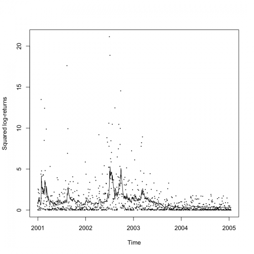

[](http://quantlet.de/)

## [](http://quantlet.de/) **STF2tvch03** [](http://quantlet.de/)

```yaml

Name of QuantLet : STF2tvch03

Published in : Statistical Tools for Finance and Insurance

Description : 'Computes the mean absolute forecast error of the GARCH volatility forecast based on
the number "ghist" of past observations and plots the forecast.'

Keywords : forecast, garch, time-series, volatility, nonstationary, heteroskedasticity

See also : STF2tvch01, STF2tvch02, STF2tvch04, STF2tvch05, STF2tvch06, STF2tvch07

Author : Pavel Cizek

Submitted : Thu, October 06 2011 by Awdesch Melzer

Datafile : SP1997-2005s.txt

Example : 'Plot of mean absolute forecast error of the GARCH volatility forecast based on the
number "ghist" of past observations.'

```




### R Code:
```r
# Close windows and clear variables
graphics.off()
rm(list = ls(all = TRUE))

# Load library install.packages(c('aws', 'fGarch', 'igraph', 'Hmisc'))
install.packages("fGarch")
library("fGarch")
library("igraph")
library("stats")
library("Hmisc")

# Please change working directory setwd('C:/...')
data <- read.delim2("SP1997-2005s.txt")

time <- (1:length(data[, 1]))
dat0 <- data[, 1] - c(mean(data[, 1]))
dat0 <- dat0/sd(dat0)

p <- 1
pred <- 0 * time - 1
esterr <- pred
h <- 1

ghist <- 250

for (i in 1076:2088) {
    print(i)
    
    gest <- garchFit(~garch(1, 1), data = dat0[(i - ghist):(i - 1)], trace = FALSE, include.mean = FALSE)
    pred[i] <- predict(gest, n.ahead = h)$standardDeviation^2
    esterr[i] <- sum(abs(pred[i] - dat0[i:(i + h - 1)]^2))
}

errs <- esterr[pred >= 0]
print(c("Year 2001:", mean(errs[1:250])))
print(c("Year 2002:", mean(errs[251:500])))
print(c("Year 2003:", mean(errs[501:750])))
print(c("Year 2004:", mean(errs[751:1000])))
print(c("Total:", mean(errs[1:1000])))

timet <- (time - 1078)/250 + 2001
plot(timet[pred >= 0], dat0[pred >= 0]^2, cex = 0.2, xaxp = c(2001, 2005, 4), xlab = "Time", ylab = "Squared log-returns")
lines(timet[pred >= 0], pred[pred >= 0])

minor.tick(4, 5) 

```
