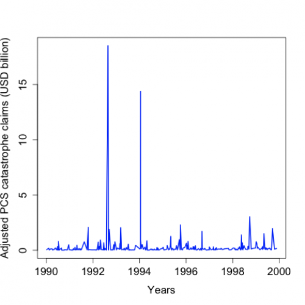
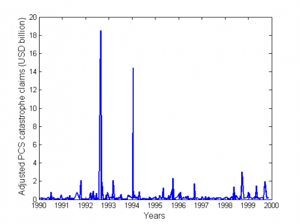

[](http://quantlet.de/)

## [](http://quantlet.de/) **STFcat01** [](http://quantlet.de/)

```yaml

Name of QuantLet : STFcat01

Published in : Statistical Tools for Finance and Insurance

Description : Produces the plot of the PCS catastrophe loss data. Available in R and Matlab

Keywords : CAT bond, risk, bond, plot, currency

See also : STFcat02, STFcat02, STFcat03, STFcat03

Author : Zografia Anastasiadou

Submitted : Fri, May 04 2012 by Dedy Dwi Prastyo

Datafile : ncl.dat

```






### R Code:
```r
rm(list = ls(all = TRUE))
# setwd('C:/...')

d <- read.table("ncl.dat")

plot(1990 + d[, 2], d[, 3]/1e+09, type = "l", col = "blue", xlab = "Years", ylab = "Adjusted PCS catastrophe claims (USD billion)", 
    lwd = 2, cex.lab = 1.4, cex.axis = 1.4) 

```

### MATLAB Code:
```matlab
clear all
close all
clc
d= load('ncl.dat')
plot(1990+d(:,2),d(:,3)/1e9,'LineWidth',2)
xlabel('Years','fontsize',12)
ylabel('Adjusted PCS catastrophe claims (USD billion)','fontsize',12)

```
