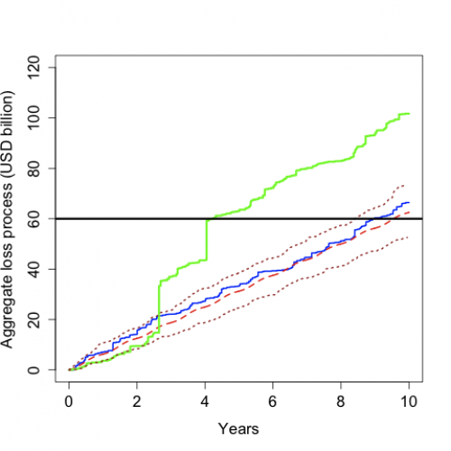
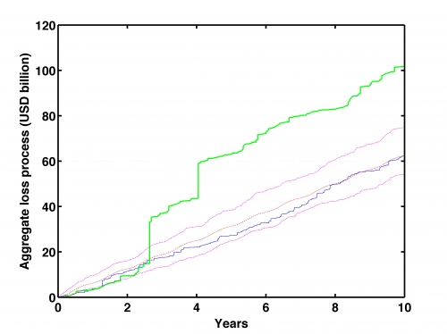

[](http://quantlet.de/index.php?p=info)

## [](http://quantlet.de/) **STFcat02** [](http://quantlet.de/d3/ia)

```yaml

Name of QuantLet : STFcat02

Published in : Statistical Tools for Finance and Insurance

Description : 'Produces the plot of an aggregate loss process together with a real-world
trajectory, two sample quantile lines and mean of the process.'

Keywords : CAT bond, plot, quantile, mean, currency

See also : STFcat01, STFcat03, quantilelines, simHPP, simNHPP, simNHPPALP

Author : Zografia Anastasiadou, Awdesch Melzer

Submitted : Tue, August 06 2013 by Awdesch Melzer

Datafile : ncl.dat

Example : Plot of the aggregate loss process (USD billion) over time.

```






### R Code:
```r
rm(list = ls(all = TRUE))
# setwd('C:/...')

install.packages("abind")
library(abind)

# generates a homogeneous Poisson process with intensity lambda
simHPP <- function(lambda, T, N) {
    # lambda: scalar, intensity of the Poisson process T: scalar, time horizon N: scalar, number of trajectories
    EN <- rpois(N, lambda * T)
    y <- matrix(T, nrow = 2 * max(EN) + 2, ncol = N) * matrix(1, nrow = 2 * max(EN) + 2, ncol = N)
    yy <- abind(y, matrix(1, nrow = 2 * max(EN) + 2, ncol = N) * EN, along = 3)
    i = 1
    while (i <= N) {
        if (EN[i] > 0) {
            yy[1:(2 * EN[i] + 1), i, 1] <- c(0, rep(sort(T * runif(EN[i])), each = 2))
        } else {
            yy[1, i, 1] = 0
        }
        yy[1:(2 * EN[i] + 2), i, 2] <- c(0, floor((1:(2 * EN[i]))/2), EN[i])
        i = i + 1
    }
    return(yy)
}

# generates a non-homogeneous Poisson process with intensity lambda
simNHPP <- function(lambda, parlambda, T, N) {
    # lambda: scalar, intensity function, sine function (lambda=0), linear function (lambda=1) or sine square function
    # (lambda=2) parlambda: n x 1 vector, parameters of the intensity function lambda (n=2 for lambda=1, n=3 otherwise) T:
    # scalar, time horizon N: scalar, number of trajectories
    a <- parlambda[1]
    b <- parlambda[2]
    if (lambda == 0) {
        c <- parlambda[3]
        JM <- simHPP(a + b, T, N)
    } else {
        if (lambda == 1) {
            JM <- simHPP(a + b * T, T, N)
        } else {
            if (lambda == 3) {
                JM <- simHPP(a + b * T, T, N)
            }
        }
    }
    rjm <- nrow(JM)
    yy <- abind(matrix(T, nrow = rjm, ncol = N), matrix(0, nrow = rjm, ncol = N), along = 3)
    i = 1
    maxEN = 0
    while (i <= N) {
        pom <- JM[, i, 1][JM[, i, 1] < T]
        pom <- pom[2 * (1:(length(pom)/2))]
        R <- runif(NROW(pom))
        if (lambda == 0) {
            lambdat <- (a + b * sin(2 * pi * (pom + c)))/(a + b)
        } else {
            if (lambda == 1) {
                lambdat <- (a + b * pom)/(a + b * T)
            } else {
                if (lambda == 3) {
                  lambdat <- (a + b * sin(2 * pi * (pom + c))^2)/(a + b)
                }
            }
        }
        pom <- pom[R < lambdat]
        EN <- NROW(pom)
        maxEN <- max(maxEN, EN)
        yy[1:(2 * EN + 1), i, 1] <- c(0, rep(pom, each = 2))
        yy[2:(2 * EN), i, 2] <- c(floor((1:(2 * EN - 1))/2))
        yy[(2 * EN + 1):rjm, i, 2] <- matrix(EN, nrow = rjm - 2 * EN, ncol = 1)
        i = i + 1
    }
    yy <- yy[1:(2 * maxEN + 2), , ]
    return(yy)
}

# generates aggregate loss process driven by the non-homogeneous Poisson process for lognormal distribution
simNHPPALP <- function(lambda, parlambda, params, T, N) {
    # lambda: scalar, intensity function, sine function (lambda=0), linear function (lambda=1) or sine square function
    # (lambda=2) parlambda: n x 1 vector, parameters of the intensity function lambda (n=2 for lambda=1, n=3 otherwise) params:
    # n x 1 vector, parameters of the lognormal distribution # T: scalar, time horizon N: scalar, number of trajectories
    if (N == 1) {
        poisproc <- simNHPP(lambda, parlambda, T, N)
        poisproc <- abind(matrix(poisproc[, 1]), matrix(poisproc[, 2]), along = 3)
    } else {
        poisproc <- simNHPP(lambda, parlambda, T, N)
    }
    rpp <- nrow(poisproc)
    cpp <- ncol(poisproc)
    losses <- matrix(0, nrow = rpp, ncol = cpp)
    i = 1
    while (i <= N) {
        aux <- min(which(poisproc[, i, 1] == T))
        if (aux > 2) {
            laux <- cumsum(rlnorm(aux/2 - 1, params[1], params[2]))
            losses[3:aux, i] <- rep(laux, each = 2)
        } else {
            if (aux < rpp) {
                losses[(aux + 1):rpp, i] <- laux[NROW(laux)] * matrix(1, nrow = rpp - aux)
            } else {
                losses[, i] <- matrix(0, nrow = rpp)
            }
        }
        i = i + 1
    }
    if (N == 1) {
        y <- abind(poisproc[, , 1], losses)
    } else {
        y <- abind(poisproc[, , 1], losses, along = 3)
    }
    return(y)
}

set.seed(2)

lambda1 <- 0  # intensity 
parlambda1 <- c(35.32, 2.32 * 2 * pi, -0.2)  # parameters of intensity function
params1 <- c(18.3806, 1.1052)  # parameters of the lognormal distribution
T1 <- 10  # time
N1 <- 1  # trajectories
N2 <- 100

y1 <- simNHPPALP(lambda1, parlambda1, params1, T1, N1)  # aggregate loss process for lognormal distribution
y1[, 2] <- y1[, 2]/1e+09

x <- read.table("ncl.dat")

t <- rep(x[, 2], each = 2)
t1 <- c(0, t, T1)
PCS <- cumsum(x[, 3])/1e+09
PCS1 <- rep(PCS, each = 2)
PCS1 <- c(0, 0, PCS1)
z <- cbind(t1, PCS1)

# mean of aggregate loss process
t2 <- (0:(100 * T1))/100
RP <- exp(params1[1] + params1[2]^2/2) * (parlambda1[1] * t2 - parlambda1[2]/2/pi * (cos(2 * pi * (t2 + parlambda1[3])) - cos(2 * 
    pi * parlambda1[3])))
me <- cbind(t2, RP/1e+09)

# computes quantiles of trajectories
quantilelines <- function(data, step, perc) {
    # data: n x m x 2 array, data, where n is the length of trajectories and m the number of trajectories step: scalar, time
    # interval between points at which the quantiles are computed perc: s x 1 vector, orders of quantiles
    N <- ncol(data)
    R <- nrow(data)
    begin <- data[1, 1, 1]
    theend <- data[R, 1, 1]
    numofpoints <- (theend - begin)/step + 1
    vecstep <- seq(begin, theend, step)
    y <- matrix(0, nrow = 1, ncol = NROW(perc))
    i = 1
    while (i <= numofpoints) {
        j = 1
        vecval = 0
        while (j <= N) {
            aux1 = data[, j, 1]
            aux2 = data[, j, 2]
            pos = sum(aux1 <= vecstep[i])
            if (pos < R) {
                vecval <- c(vecval, aux2[pos] + (vecstep[i] - aux1[pos]) * (aux2[pos + 1] - aux2[pos])/(aux1[pos + 1] - aux1[pos]))
            } else {
                vecval <- c(vecval, aux2[pos])
            }
            j = j + 1
        }
        y <- rbind(y, quantile(vecval[2:(N + 1)], perc))
        i = i + 1
    }
    y = cbind(vecstep, y[2:(numofpoints + 1), ])
}

step1 <- 0.05  #time
perc1 <- c(0.05, 0.95)  #quantiles

# quantiles of trajectories
qq1 <- quantilelines(simNHPPALP(lambda1, parlambda1, params1, T1, N2), step1, perc1[1])  # 0.05 quantile of trajectories
qq2 <- quantilelines(simNHPPALP(lambda1, parlambda1, params1, T1, N2), step1, perc1[2])  # 0.95 quantile of trajectories

qq1 <- cbind(qq1[, 1], qq1[, 2]/1e+09)
qq2 <- cbind(qq2[, 1], qq2[, 2]/1e+09)

plot(y1, type = "l", col = "blue", ylim = c(0, 120), xlab = "Years", ylab = "Aggregate loss process (USD billion)", cex.lab = 1.4, 
    cex.axis = 1.4, lwd = 2)
lines(me, col = "red", lty = 2, lwd = 2)
lines(z, col = "green", lwd = 3)
lines(qq1[1:200, ], col = "brown", lty = 3, lwd = 2)
lines(qq2[1:200, ], col = "brown", lty = 3, lwd = 2)
abline(h = 60, lwd = 3) 

```

### MATLAB Code:
```matlab
clear all
close all
clc

 RandStream.setGlobalStream(RandStream('mt19937ar','seed',99));

lambda    = 0;                        % default Poisson process NHPP1 
parlambda = [35.32,2.32*2*pi,-0.2];   % NHPP1
distr     = 'lognormal'; % default distribution
params    = [18.3806,1.1052];
T         = 10;          % max time (years)
N         = 100;         % number of trajectories in NHPPALP, default 5000
qu        = [0.05,0.95]; % quantiles
step      = 0.05;        % step in quantile plot

%=========== aggregate process - single realization 
y = simNHPPALP(lambda,parlambda,distr,params,T,1);
y(:,:,2) = y(:,:,2)/1e+9;

%=========== real PCS trajectory 
c    = load('ncl.dat');
t2   = c(ceil((1:2*size(c(:,2),1))/2),2);
t2   = [0;t2;T];
PCS  = cumsum(c(:,3))/1e+9;
PCS2 = PCS(ceil((1:2*size(PCS,1))/2));
PCS2 = [0;0;PCS2];
z    = [t2,PCS2];

%=========== mean of aggregate loss process (only for NHPP1 and lognormal loss size distribution)
t    = [(0:100*T)/100]';
RP   = exp(params(1)+params(2).^2/2).*(parlambda(1)*t-parlambda(2)/2/pi*(cos(2*pi*(t+parlambda(3))) - cos(2*pi*parlambda(3))));
me   = [t,RP/1e+9];

%=========== quantiles
vqu  = quantilelines(simNHPPALP(lambda,parlambda,distr,params,T,N),step,qu');

%=========== plot

plot(y(:,:,1),y(:,:,2),'b-')
hold on
plot(me(:,1),me(:,2),'r-.')
plot(z(:,1),z(:,2),'g-','LineWidth',1.5)
plot(y(:,:,1),60,'k-','LineWidth',1.5)
plot(vqu(:,1),vqu(:,2)/1e+9, 'm--')
plot(vqu(:,1),vqu(:,3)/1e+9, 'm--')
xlim([0,10])
ylim([0,120])
xlabel('Years','FontSize',16,'FontWeight','bold')
ylabel('Aggregate loss process (USD billion)','FontSize',16,'FontWeight','bold')
hold off
box on
set(gca,'FontSize',16,'LineWidth',2,'FontWeight','bold');
% print -painters -dpdf -r600 STFcat02.pdf
% print -painters -dpng -r600 STFcat02.png

```
