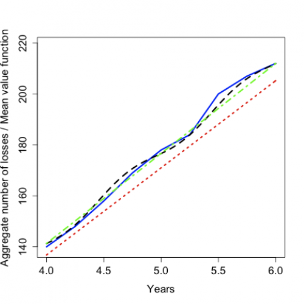
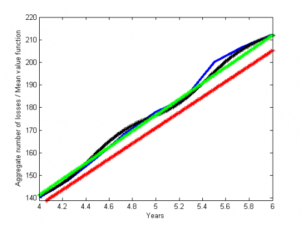

[](http://quantlet.de/)

## [](http://quantlet.de/) **STFcat03** [](http://quantlet.de/)

```yaml

Name of QuantLet : STFcat03

Published in : Statistical Tools for Finance and Insurance

Description : 'Produces the plot of the aggregate quarterly number of losses for the PCS data
together with different mean value functions.'

Keywords : calibration, plot, mean, currency, empirical, mean, CAT bond

See also : STFcat01, STFcat01, STFcat02

Author : Zografia Anastasiadou

Submitted : Fri, May 04 2012 by Dedy Dwi Prastyo

Datafile : ncl.dat

Example : Plot of the aggregate number of losses / Mean value function over time.

```






### R Code:
```r
rm(list = ls(all = TRUE))
# setwd('C:/...')

m <- read.table("ncl.dat")

lambdaHPP <- 34.2
lambdaNHPP1 <- c(35.32, 2.32 * 2 * pi, -0.2)
lambdaNHPP2 <- c(35.22, 0.224, -0.16)

A <- 4
B <- 6
Delta <- 0.01

n <- table(m[, 5])
n <- as.data.frame(n)$Freq
t <- (1:length(n))/4
tn <- cbind(t, n)
ncum <- cumsum(n)
tncum <- cbind(t, ncum)

t <- seq(A, B, Delta)

HP <- lambdaHPP * t
NHP1 <- lambdaNHPP1[1] * t - lambdaNHPP1[2]/(2 * pi) * cos(2 * pi * (t + lambdaNHPP1[3])) + lambdaNHPP1[2]/(2 * pi) * cos(2 * 
    pi * lambdaNHPP1[3])
NHP2 <- lambdaNHPP2[1] * t + lambdaNHPP2[2] * (0.5 * t - 1/(8 * pi) * sin(4 * pi * (t + lambdaNHPP2[3])) + 1/(8 * pi) * sin(4 * 
    pi * lambdaNHPP2[3]))

plot(tncum[16:24, ], type = "l", col = "blue", lwd = 3, xlim = c(4, 6), ylim = c(139, 219), xlab = "Years", ylab = "Aggregate number of losses / Mean value function", 
    cex.lab = 1.4, cex.axis = 1.4)
lines(t, HP, col = "red", lwd = 3, lty = 3)
lines(t, NHP1, col = "black", lwd = 3, lty = 2)
lines(t, NHP2, col = "green", lwd = 3, lty = 4) 

```

### MATLAB Code:
```matlab
clear all
close all
clc
m= load('ncl.dat')

lambdaHPP = 34.2
lambdaNHPP1 =[35.32,2.32*2*pi,-0.2]
lambdaNHPP2= [35.22,0.224,-0.16]
A=4
B=6
Delta=0.01

i = tabulate(m(:,5))
j = i (:, 2)
n=j'
t = (1:length(n))/4
tn=[t;n]
ncum = cumsum(n)
p=A:Delta:B
HP = lambdaHPP*p
NHP1 = lambdaNHPP1(1)*p-lambdaNHPP1(2)/(2*pi)*cos(2*pi*(p+lambdaNHPP1(3)))+lambdaNHPP1(2)/(2*pi)*cos(2*pi*lambdaNHPP1(3))
NHP2 = lambdaNHPP2(1)*p+lambdaNHPP2(2)*(0.5*p-1/(8*pi)*sin(4*pi*(p+lambdaNHPP2(3)))+1/(8*pi)*sin(4*pi*lambdaNHPP2(3)))

plot(t,ncum,'b', 'LineWidth',3)
axis([4 6 139 220])
xlabel('Years')
ylabel('Aggregate number of losses / Mean value function')
hold on
plot(p,HP,'r*:')
hold on
plot(p,NHP1,'k*--')
hold on
plot(p,NHP2,'g*-.')
```
