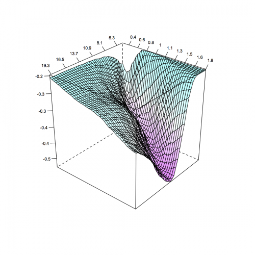
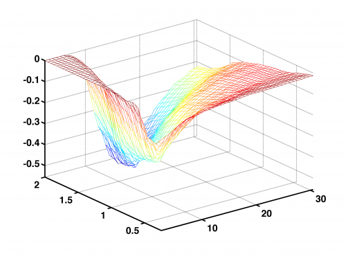

[](http://quantlet.de/)

## [](http://quantlet.de/) **STFcat07** [](http://quantlet.de/)

```yaml

Name of QuantLet : STFcat07

Published in : Statistical Tools for Finance and Insurance

Description : 'Plots the difference between zero-coupon CAT bond prices in the Burr and lognormal
claim amount cases for a non-homogeneous Poisson process governing the flow of losses.'

Keywords : CAT bond, plot, 3d, zero-coupon, lognormal, Poisson process

See also : 'BondCoupon, BondOnlyCoupon, BondZeroCoupon, Burrrnd, Paretornd, mixexprnd, simHPP,
simNHPP, simNHPPALP'

Author : Awdesch Melzer

Submitted : Tue, August 06 2013 by Awdesch Melzer

Datafile : ncl.dat

Example : '3D plot of the difference between zero-coupon CAT bond prices in the Burr and lognormal
claim amount cases for a non-homogeneous Poisson process governing the flow of losses.'

```






### R Code:
```r
# ---------------------------------------------------------------------------- Book: STF
# ---------------------------------------------------------------------------- See also: BondZeroCoupon, Burrrnd, mixexprnd,
# simHPP, simNHPP, Paretornd, simNHPPALP ----------------------------------------------------------------------------
# Quantlet: STFcat07 ---------------------------------------------------------------------------- Description: Plot of the
# difference between zero-coupon CAT bond prices in the Burr and lognormal claim amount cases for a non-homogeneous Poisson
# process governing the flow of losses. ---------------------------------------------------------------------------- Author:
# Awdesch Melzer 20130629 ----------------------------------------------------------------------------

rm(list = ls(all = TRUE))
graphics.off()


########################## SUBROUTINES ##########################

BondZeroCoupon = function(Z, D, T, r, lambda, parlambda, distr, params, Tmax, N) {
    # computes price of the zero-coupon CAT bond for the given claim amount distribution and the non-homogeneous Poisson process
    # governing the flow of losses.  y = BondZeroCoupon(Z,D,T,r,lambda,parlambda,distr,params,Tmax,N)
    # --------------------------------------------------------------------- Inputs: Parameter Z Definition scalar, payment at
    # maturity Parameter D Definition n1 x 1 vector, threshold level Parameter T Definition n2 x 1 vector, time to expiry
    # Parameter r Definition scalar, continuously-compounded discount rate Parameter lambda Definition scalar, intensity
    # function, if lambda=0, a sine function, if lambda=1, a linear function, if lambda=2, a sine square function Parameter
    # parlambda Definition n x 1 vector, parameters of the intensity function lambda (n=2 for lambda=1, n=3 otherwise) Parameter
    # distrib Definition string, claim size distribution Parameter params Definition n x 1 vector, parameters of the claim size
    # distribution n = 1 (exponential) n = 2 (gamma, lognormal, Pareto, Weibull) n = 3 (Burr, mixofexps) Parameter Tmax
    # Definition scalar, time horizon Parameter N Definition scalar, number of trajectories
    # --------------------------------------------------------------------- Output: Parameter y Definition m x 3 matrix, the
    # first column are times to bond's expiration, the second threshold levels and the third corresponding prices of the bond
    # ---------------------------------------------------------------------
    
    if (lambda != 0 && lambda != 1 && lambda != 2) {
        stop("BondZeroCoupon: Lambda must be either 0,1 or 2.")
    }
    if (length(Z) != 1) {
        stop("BondZeroCoupon: payment at maturity Z needs to be a scalar")
    }
    if (length(r) != 1) {
        stop("BondZeroCoupon: discount rate needs to be a scalar")
    }
    if (dim(as.matrix(D))[1] == 1) {
        stop("BondZeroCoupon: threshold level D needs to be a vector ")
    }
    if (dim(as.matrix(T))[1] == 1) {
        stop("BondZeroCoupon: time to expiry T needs to be a vector ")
    }
    
    
    x = simNHPPALP(lambda, parlambda, distr, params, Tmax, N)
    Tl = length(T)
    Dl = length(D)
    y = matrix(0, Tl * Dl, 3)
    i = 1  #loop (times to maturity)
    j = 1  #loop (treshold levels)
    k = 1  #loop (trajectories)
    wyn = 0
    while (i <= Tl) {
        while (j <= Dl) {
            while (k <= N) {
                traj = cbind(x[, k, 1], x[, k, 2])
                wyn = wyn + as.numeric(traj[length(traj[which(traj[, 1] <= T[i]), 1]), 2] <= D[j])
                k = k + 1
            }
            y[(i - 1) * Dl + j, 1] = T[i]
            y[(i - 1) * Dl + j, 2] = D[j]
            y[(i - 1) * Dl + j, 3] = Z * exp(-r * T[i]) * wyn/N  #
            wyn = 0
            k = 1
            j = j + 1
        }
        j = 1
        i = i + 1
    }
    y = y
    return(y)
}

Burrrnd = function(alpha, lambda, tau, n, m) {
    # BURRRND Random arrays from Burr distribution.  --------------------------------------------------------------------- R =
    # BURRRND(ALPHA,LAMBDA,TAU,N,M) returns an M-by-N array of random numbers chosen from the Burr distribution with parameters
    # ALPHA, LAMBDA, TAU.  --------------------------------------------------------------------- The default values for the
    # parameters ALPHA, LAMBDA, TAU, M, N are 1, 1, 2, 1, 1, respectively.  BURRRND uses the inversion method.
    # ---------------------------------------------------------------------
    
    
    if (missing(m)) {
        m = 1
    }
    if (missing(n)) {
        n = 1
    }
    if (missing(tau)) {
        tau = 2
    }
    if (missing(lambda)) {
        lambda = 1
    }
    if (missing(alpha)) {
        alpha = 1
    }
    u = matrix(0, n, m)
    for (i in 1:m) {
        u[, i] = (lambda * (runif(n, 0, 1)^(-1/alpha) - 1))^(1/tau)
    }
    y = u
    return(y)
}

mixexprnd = function(p, beta1, beta2, n, m) {
    # MIXEXPRND Random arrays from the mixed exponential distribution.
    # --------------------------------------------------------------------- Y = MIXEXPRND(P,BETA1,BETA2,N,M) returns an M-by-N
    # array of random numbers chosen from the mixed exponential distribution with parameters P, BETA1, BETA2.
    # --------------------------------------------------------------------- The default values for A, BETA1, BETA2, N, M are
    # 0.5, 1, 2, 1, 1, respectively.  MIXEXPRND uses the exponential number generator.
    # ---------------------------------------------------------------------
    
    if (missing(p)) {
        p = 0.5
    }
    if (missing(beta1)) {
        beta1 = 1
    }
    if (missing(beta2)) {
        beta2 = 2
    }
    y = rexp(n * m, rate = (1/beta2))
    aux = which(runif(n * m, 0, 1) <= p)
    
    if (!missing(aux)) {
        y[aux] = rexp(length(aux), 1/beta1)
    }
    
    y = matrix(y, n, m)
    return(y)
}

simHPP = function(lambda, T, N) {
    # SIMHPP Homogeneous Poisson process.  --------------------------------------------------------------------- Y =
    # SIMHPP(lambda,T,N) generates N trajectories of the homogeneous Poisson process with intensity LAMBDA. T is the time
    # horizon.  ---------------------------------------------------------------------
    
    if (lambda <= 0 || length(lambda) != 1) {
        stop("simHPP: Lambda must be a positive scalar.")
    }
    if (T <= 0 || length(T) != 1) {
        stop("simHPP: T must be a positive scalar.")
    }
    if (N <= 0 || length(N) != 1) {
        stop("simHPP: N must be a positive scalar.")
    }
    EN = rpois(N, lambda * T)
    ym = matrix(T, 2 * max(EN) + 2, N)
    tmp = array(0, c(2 * max(EN) + 2, N, 2))
    y = tmp
    y[, , 1] = ym
    y[, , 2] = matrix(1, 2 * max(EN) + 2, 1) %*% t(EN)
    
    i = 1
    while (i <= N) {
        if (EN[i] > 0) {
            ttmp = c(sort(T * runif(EN[i])))
            y[1:(2 * EN[i] + 1), i, 1] = c(0, ttmp[ceiling((1:(2 * EN[i]))/2)])
        } else {
            y[1, i, 1] = 0
        }
        y[1:(2 * EN[i] + 2), i, 2] = c(0, floor((1:(2 * EN[i]))/2), EN[i])
        i = i + 1
    }
    return(y)
}


simNHPP = function(lambda, parlambda, T, N) {
    
    # SIMNHPP Non-homogeneous Poisson process.  --------------------------------------------------------------------- Y =
    # SIMNHPP(lambda,parlambda,T,N) generates N trajectories of the non-homogeneous Poisson process with intensity specified by
    # LAMBDA (0 - sine function, 1 - linear function, 2 - sine square function) with paramters in PARLAMBDA. T is the time
    # horizon. The function usues thining method.  ---------------------------------------------------------------------
    
    # lambda: scalar, intensity function, sine function (lambda=0), linear function (lambda=1) or sine square function
    # (lambda=2) parlambda: n x 1 vector, parameters of the intensity function lambda (n=2 for lambda=1, n=3 otherwise) T:
    # scalar, time horizon N: scalar, number of trajectories
    a = parlambda[1]
    b = parlambda[2]
    if (lambda == 0) {
        d = parlambda[3]
        JM = simHPP(a + b, T, N)
    } else if (lambda == 1) {
        JM = simHPP(a + b * T, T, N)
    } else if (lambda == 2) {
        d = parlambda[3]
        JM = simHPP(a + b * T, T, N)
    }
    rjm = nrow(JM)
    yy = array(0, c(rjm, N, 2))
    yy[, , 1] = matrix(T, nrow = rjm, ncol = N)
    
    i = 1
    maxEN = 0
    while (i <= N) {
        pom = JM[, i, 1][JM[, i, 1] < T]
        pom = pom[2 * (1:(length(pom)/2))]
        R = runif(NROW(pom))
        if (lambda == 0) {
            lambdat = (a + b * sin(2 * pi * (pom + d)))/(a + b)
        } else {
            if (lambda == 1) {
                lambdat = (a + b * pom)/(a + b * T)
            } else {
                if (lambda == 2) {
                  lambdat = (a + b * sin(2 * pi * (pom + d))^2)/(a + b)
                }
            }
        }
        pom = pom[R < lambdat]
        EN = NROW(pom)
        maxEN = max(maxEN, EN)
        yy[1:(2 * EN + 1), i, 1] = c(0, rep(pom, each = 2))
        yy[2:(2 * EN), i, 2] = c(floor((1:(2 * EN - 1))/2))
        yy[(2 * EN + 1):rjm, i, 2] = matrix(EN, nrow = rjm - 2 * EN, ncol = 1)
        i = i + 1
    }
    yy = yy[1:(2 * maxEN + 2), , ]
    return(yy)
}

Paretornd = function(alpha, lambda, n, m) {
    # PARETORND Random arrays from Pareto distribution.  --------------------------------------------------------------------- Y
    # = PARETORND(ALPHA,LAMBDA,N,M) returns an M-by-N array of random numbers chosen from the Pareto distribution with
    # parameters ALPHA, LAMBDA.  The default values for ALPHA, LAMBDA, N, M 1, 1, 1, 1, respectively.  PARETORND uses the
    # inversion method.  ---------------------------------------------------------------------
    
    if (missing(m)) {
        m = 1
    }
    if (missing(n)) {
        n = 1
    }
    if (missing(lambda)) {
        lambda = 1
    }
    if (missing(alpha)) {
        alpha = 1
    }
    u = matrix(0, n, m)
    for (i in 1:m) {
        u[, i] = lambda * (runif(n, 0, 1)^(-1/alpha) - 1)
    }
    y = u
    return(y)
}

simNHPPALP = function(lambda, parlambda, distrib, params, T, N) {
    # generates aggregate loss process driven by the non-homogeneous Poisson process.
    # --------------------------------------------------------------------- y = simNHPPALP(lambda,parlambda,distrib,params,T,N)
    # --------------------------------------------------------------------- Output: Parameter: y Definition: 2*max+2 x N x 2
    # array, generated process - max is the maximum number of jumps for all generated trajectories
    # --------------------------------------------------------------------- Input: Parameter: lambda Definition: scalar,
    # intensity function, sine function (lambda=0), linear function (lambda=1) or sine square function (lambda=2) Parameter:
    # parlambda Definition: n x 1 vector, parameters of the intensity function lambda (n=2 for lambda=1, n=3 otherwise)
    # Parameter: distrib Definition: string, claim size distribution Parameter: params Definition: n x 1 vector, parameters of
    # the claim size distribution n = 1 (exponential) n = 2 (gamma, lognormal, Pareto, Weibull) n = 3 (Burr, mixofexps)
    # Parameter: T Definition: scalar, time horizon Parameter: N Definition: scalar, number of trajectories
    # ---------------------------------------------------------------------
    
    if (lambda != 0 && lambda != 1 && lambda != 2) {
        stop("simNHPPALP: Lambda must be either 0,1 or 2.")
    }
    if (T <= 0 || (length(T)) != 1) {
        stop("simNHPPALP: T must be a positive scalar.")
    }
    if (N <= 0 || (length(N)) != 1) {
        stop("simNHPPALP: N must be a positive scalar.")
    }
    if (length(parlambda) != 3 && (lambda) != 1) {
        stop("simNHPPALP: for lambda 0 or 2, parlambda must be a 3 x 1 vector.")
    }
    if (length(parlambda) != 2 && (lambda) == 1) {
        stop("simNHPPALP: for lambda 1, parlambda must be a 2 x 1 vector.")
    }
    if ((distrib == "Burr" || distrib == "mixofexps") && (length(params)) != 3) {
        stop("simNHPPALP: for Burr and mixofexps distributions, params must be a 3 x 1 vector.")
    }
    if ((distrib == "gamma" || distrib == "lognormal" || distrib == "Pareto" || distrib == "Weibull") && (length(params)) != 
        2) {
        stop("simNHPPALP: for gamma, lognormal, Pareto and Weibull distributions, params must be a 2 x 1 vector.")
    }
    if (distrib == "exponential" && (length(params)) != 1) {
        stop("simNHPPALP: for exponential distribution, params must be a scalar.")
    }
    if (distrib != "exponential" && distrib != "gamma" && distrib != "mixofexps" && distrib != "Weibull" && distrib != "lognormal" && 
        distrib != "Pareto" && distrib != "Burr") {
        stop("simNHPPALP: distribs should be: exponential, gamma, mixofexps, Weibull, lognormal, Pareto or Burr")
    }
    poisproc = simNHPP(lambda, parlambda, T, N)
    rpp = dim(poisproc)[1]
    cpp = dim(poisproc)[2]
    losses = matrix(0, rpp, cpp)
    
    if (distrib == "Burr") {
        i = 1
        while (i <= N) {
            if (N == 1) {
                aux = min(as.matrix(which(poisproc[, 1] == T)))  #[1:i,])
            } else {
                aux = min(as.matrix(which(poisproc[, i, 1] == T)))  #[1:i,])
            }
            if (aux > 2) {
                laux = cumsum(Burrrnd(params[1], params[2], params[3], aux/2 - 1, 1))
                losses[3:aux, i] = laux[ceiling((1:(aux - 2))/2)]
                if (aux < rpp) {
                  losses[(aux + 1):rpp, i] = matrix(laux[length(laux)], rpp - aux, 1)
                }
            } else {
                losses[, i] = rep(0, rpp)
            }
            i = i + 1
        }
    } else if (distrib == "exponential") {
        i = 1
        while (i <= N) {
            if (N == 1) {
                aux = min(as.matrix(which(poisproc[, 1] == T)))  #[1:i,])
            } else {
                aux = min(as.matrix(which(poisproc[, i, 1] == T)))  #[1:i,])
            }
            if (aux > 2) {
                laux = cumsum(rexp(aux/2 - 1, rate = 1/params[1]))
                losses[3:aux, i] = laux[ceiling((1:aux - 2)/2)]
                if (aux < rpp) {
                  losses[(aux + 1):rpp, i] = matrix(laux[length(laux)], rpp - aux, 1)
                }
            } else {
                losses[, i] = rep(0, rpp)
            }
            i = i + 1
        }
    } else if (distrib == "gamma") {
        i = 1
        while (i <= N) {
            if (N == 1) {
                aux = min(as.matrix(which(poisproc[, 1] == T)))  #[1:i,])
            } else {
                aux = min(as.matrix(which(poisproc[, i, 1] == T)))  #[1:i,])
            }
            if (aux > 2) {
                laux = cumsum(rgamma(aux/2 - 1, shape = params[1], rate = params[2], scale = (1/params[2])))
                losses[3:aux, i] = laux[ceiling((1:aux - 2)/2)]
                if (aux < rpp) {
                  losses[(aux + 1):rpp, i] = matrix(laux[length(laux)], rpp - aux, 1)
                }
            } else {
                losses[, i] = rep(0, rpp)
            }
            i = i + 1
        }
    } else if (distrib == "lognormal") {
        i = 1
        while (i <= N) {
            if (N == 1) {
                aux = min(as.matrix(which(poisproc[, 1] == T)))  #[1:i,])
            } else {
                aux = min(as.matrix(which(poisproc[, i, 1] == T)))  #[1:i,])
            }
            if (aux > 2) {
                laux = cumsum(rlnorm(aux/2 - 1, meanlog = params[1], sdlog = params[2]))
                losses[3:aux, i] = laux[ceiling((1:(aux - 2))/2)]
                if (aux < rpp) {
                  losses[(aux + 1):rpp, i] = matrix(laux[length(laux)], rpp - aux, 1)
                }
            } else {
                losses[, i] = rep(0, rpp)
            }
            i = i + 1
        }
    } else if (distrib == "mixofexps") {
        i = 1
        while (i <= N) {
            if (N == 1) {
                aux = min(as.matrix(which(poisproc[, 1] == T)))  #[1:i,])
            } else {
                aux = min(as.matrix(which(poisproc[, i, 1] == T)))  #[1:i,])
            }
            if (aux > 2) {
                laux = cumsum(mixexprnd(params[3], params[1], params[2], aux/2 - 1, 1))
                losses[3:aux, i] = laux[ceiling((1:(aux - 2))/2)]
                if (aux < rpp) {
                  losses[(aux + 1):rpp, i] = matrix(laux[length(laux)], rpp - aux, 1)
                }
            } else {
                losses[, i] = rep(0, rpp)
            }
            i = i + 1
        }
    } else if (distrib == "Pareto") {
        i = 1
        while (i <= N) {
            if (N == 1) {
                aux = min(as.matrix(which(poisproc[, 1] == T)))  #[1:i,])
            } else {
                aux = min(as.matrix(which(poisproc[, i, 1] == T)))  #[1:i,])
            }
            if (aux > 2) {
                laux = cumsum(Paretornd(params[1], params[2], aux/2 - 1, 1))
                losses[3:aux, i] = laux[ceiling((1:(aux - 2))/2)]
                if (aux < rpp) {
                  losses[(aux + 1):rpp, i] = matrix(laux[length(laux)], rpp - aux, 1)
                }
            } else {
                losses[, i] = rep(0, rpp)
            }
            i = i + 1
        }
    } else if (distrib == "Weibull") {
        i = 1
        while (i <= N) {
            if (N == 1) {
                aux = min(as.matrix(which(poisproc[, 1] == T)))  #[1:i,])
            } else {
                aux = min(as.matrix(which(poisproc[, i, 1] == T)))  #[1:i,])
            }
            if (aux > 2) {
                laux = cumsum(rweibull(aux/2 - 1, scale = params[1]^(-1/params[2]), shape = params[2]))
                losses[3:aux, i] = laux[ceiling((1:(aux - 2))/2)]
                if (aux < rpp) {
                  losses[(aux + 1):rpp, i] = matrix(laux[length(laux)], rpp - aux, 1)
                }
            } else {
                losses[, i] = rep(0, rpp)
            }
            i = i + 1
        }
    }
    if (N == 1) {
        y = array(0, dim(poisproc))
        y[, 1] = poisproc[, 1]
        y[, 2] = losses[, 1]
    } else {
        y = array(0, dim(poisproc))
        y[, , 1] = poisproc[, , 1]
        y[, , 2] = losses
    }
    return(y)
}

########################## MAIN PROGRAM ##########################


# parlambda=34.2#HPP
parlambda = c(35.32, 2.32 * 2 * pi, -0.2)  #NHPP1
# parlambda=#(35.22,0.224,-0.16)#NHPP2
distr1 = "Burr"
distr2 = "lognormal"
params2 = c(18.3806, 1.1052)  #lognormal
params1 = c(0.4801, 3.9495 * 1e+16, 2.1524)  #Burr

data = read.table("ncl.dat")
A = mean(data[, 3]) * (34.2/4)

na = 41  # default 41
D = seq(A, length = na, by = (12 * A - A)/(na - 1))
B = 0.25
nb = 41  # default 41
T = seq(B, length = nb, by = (8 * B - B)/(nb - 1))
Tmax = max(T)
lambda = 0

N = 1000  # default 1000
r = log(1.025)
Z = 1.06
d1 = BondZeroCoupon(Z, D, T, r, lambda, parlambda, distr1, params1, Tmax, N)
d2 = BondZeroCoupon(Z, D, T, r, lambda, parlambda, distr2, params2, Tmax, N)
y = d1[, 1]
x = d1[, 2]/1e+09
z = d1[, 3] - d2[, 3]
data = data.frame(cbind(x, y, z))

require("lattice")
par.set = list(axis.line = list(col = "transparent"), clip = list(panel = "off"))
wireframe(z ~ x + y, data = data, screen = list(z = -130, x = -60), drape = TRUE, colorkey = F, ticktype = "detailed", scales = list(arrows = FALSE, 
    col = "black", distance = 1, tick.number = 8, cex = 0.7, x = list(labels = round(seq(min(x), max(x), length = 11), 1)), 
    y = list(labels = round(seq(min(y), max(y), length = 11), 1)), z = list(labels = round(seq(min(z), max(z), length = 11), 
        1))), xlab = list("", rot = 30, cex = 1.2), ylab = list("", rot = -40, cex = 1.2), zlab = list("", rot = 95, cex = 1.1), 
    par.settings = par.set) 

```

### MATLAB Code:
```matlab
clear all
close all
clc


%parlambda=34.2%HPP
parlambda = [35.32,2.32*2*pi,-0.2]; %NHPP1
%parlambda = [35.22,0.224,-0.16]; %NHPP2
distr1    = 'Burr';
distr2    = 'lognormal';
params2   = [18.3806,1.1052]; %lognormal
params1   = [0.4801,3.9495*1e16,2.1524]; %Burr

data      = load('ncl.dat');
A         = mean(data(:,3))*(34.2/4);

na     = 41; % default 41
AE     = 12*A;
D      = A:(12*A-A)/(na-1):AE;
B      = 0.25;
nb     = 41; % default 41
BE     = 8*B;
T      = B:(8*B-B)/(nb-1):BE;
Tmax   = max(T);
lambda = 0;

N      = 1000; % default 1000
r      = log(1.025);
Z      = 1.06;
d1     = BondZeroCoupon(Z,D,T,r,lambda,parlambda,distr1,params1,Tmax,N);
d2     = BondZeroCoupon(Z,D,T,r,lambda,parlambda,distr2,params2,Tmax,N);
y      = d1(:,1);
x      = d1(:,2)/1e9;
z      = d1(:,3)-d2(:,3);


yy        = reshape(y,na,nb);
xx        = reshape(x,na,nb);
zz        = reshape(z,na,nb);

% Plot
mesh(xx,yy,zz)
xlim([min(x),max(x)])
ylim([min(y),max(y)])
zlim([min(z),max(z)])
 
set(gca,'FontSize',16,'LineWidth',2,'FontWeight','bold');


% print -painters -dpdf -r600 STFcat07.pdf
% print -painters -dpng -r600 STFcat07.png
```
