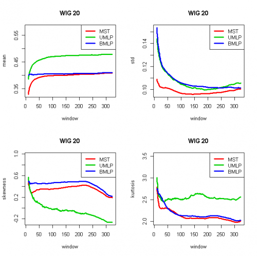
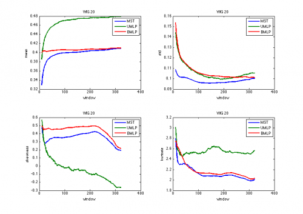

[](http://quantlet.de/)

## [](http://quantlet.de/) **STFdmm03** [](http://quantlet.de/)

```yaml

Name of QuantLet : STFdmm03

Published in : Statistical Tools for Finance and Insurance

Description : 'Presents statistical poperties of the minimum spanning tree bidirectional minimum
length path and unidirectional length path. The WIG 20 subset is analysed (gwp.csv) Requires mst.m,
umlp.m, bmlp.m, ultra.m and {Statistical Toolbox} from Matlab to run the quantlet.'

Keywords : financial, distance, tree, portfolio, asset, visualization, descriptive-statistics

See also : STFdmm11, bmlp, mst, ultra, umlp

Author : Janusz Miskiewicz, Awdesch Melzer

Submitted : Fri, November 09 2012 by Dedy Dwi Prastyo

Datafile : gwp.csv

Example : mst.m, umlp.m, bmlp.m, ultra.m create these plots.

```






### R Code:
```r
# clear variables and close windows
rm(list = ls(all = TRUE))

install.packages("moments")
library(moments)


########################################### Subroutine mst(x) ############


mst = function(x) {
    # Algorithm generates minimum spanning tree The rsult is presentes as a set of links between nodes
    n = nrow(x)
    m = ncol(x)
    true = upper.tri(x)
    x = true * x
    net = matrix(0, n - 1, 3)
    onnet = rep(as.integer(0), n)
    klaster = rep(as.integer(0), n)
    klast = 0L
    licz = 0L
    # check if the matrics is symmetric and positive
    maxx = max(apply(x, 2, max))
    smax = 10 * abs(maxx)
    x[x == 0] = smax
    while (licz < n - 1) {
        
        minx = min(apply(x, 2, min))
        d = which(x <= minx, arr.ind = T)
        i = d[, 1]
        j = d[, 2]
        if (length(i) > 1) {
            ii = i[1]
            jj = j[1]
            i = 0
            j = 0
            i = ii
            j = jj
        }
        
        if (onnet[i] == 0 & onnet[j] == 0) {
            licz = licz + 1L
            net[licz, 1] = i
            net[licz, 2] = j
            klast = klast + 1L
            klaster[i] = klast
            klaster[j] = klast
            net[licz, 3] = min(x[i, j], x[j, i])
            onnet[i] = 1
            onnet[j] = 1
            x[i, j] = smax
            x[j, i] = smax
            
        } else if (onnet[i] == 0 & onnet[j] == 1) {
            licz = licz + 1
            net[licz, 1] = i
            net[licz, 2] = j
            net[licz, 3] = min(x[i, j], x[j, i])
            onnet[i] = 1
            klaster[i] = klaster[j]
            x[i, j] = smax
            x[j, i] = smax
        } else if (onnet[i] == 1 & onnet[j] == 0) {
            licz = licz + 1L
            net[licz, 1] = i
            net[licz, 2] = j
            net[licz, 3] = min(x[i, j], x[j, i])
            onnet[j] = 1
            klaster[j] = klaster[i]
            x[i, j] = smax
            x[j, i] = smax
        } else if (onnet[i] == 1 & onnet[j] == 1 & klaster[i] == klaster[j]) {
            x[i, j] = smax
            x[j, i] = smax
        } else if (onnet[i] == 1 & onnet[j] == 1 & klaster[i] != klaster[j]) {
            licz = licz + 1L
            net[licz, 1] = i
            net[licz, 2] = j
            net[licz, 3] = min(x[i, j], x[j, i])
            klaster[klaster == klaster[i]] = klaster[j]
        }
    }
    retval = net
    return(retval)
}


########################################### Subroutine bmlp(x) ############

bmlp = function(x) {
    # bidirextional minimum length path algoritm x - the distance matrix The result is presentes as a set of links between nodes
    n = nrow(x)
    m = ncol(x)
    net = matrix(0, n - 1, 3)
    onnet = matrix(0, n, 1)
    end1 = 0
    end2 = 0
    licz = 0
    
    # the distance matrics should be symmetric and positive
    maxx = 10 * max(x)
    smax = maxx * diag(nrow = nrow(x), ncol = ncol(x))
    x = x + smax
    
    # the first pair
    minx = min(x)
    ij = which(x == minx, arr.ind = T)
    i = ij[, 1]
    j = ij[, 2]
    
    if (length(i) == 1) {
        end1 = i
        end2 = j
        onnet[end1] = 1
        onnet[end2] = 1
        net[1, 1] = end1
        net[1, 2] = end2
        net[1, 3] = minx
        licz = 1
        x[end1, end2] = maxx
        x[end2, end1] = maxx
    } else {
        end1 = i[1]
        end2 = j[1]
        onnet[end1] = 1
        onnet[end2] = 1
        net[1, 1] = end1
        net[1, 2] = end2
        net[1, 3] = minx
        licz = 1
        x[end1, end2] = maxx
        x[end2, end1] = maxx
    }
    
    while (licz < n - 1) {
        minx1 = min(x[end1, ])
        minx2 = min(x[end2, ])
        if (minx1 < minx2) {
            y = end1
            minx = minx1
        } else {
            y = end2
            minx = minx2
        }
        i = which(x[y, ] == minx, arr.ind = T)
        if (length(i) > 1) {
            tmp = 1
            while ((onnet[i[tmp]] == 1) && (tmp < length(i))) {
                tmp = tmp + 1
            }
            if (onnet[i[tmp]] == 0) {
                ii = i(tmp)
                i = NULL
                i = ii
                tmp = 0
            } else {
                ii = i[1]
                i = NULL
                i = ii
            }
        }
        if (onnet[i] == 0) {
            licz = licz + 1
            net[licz, 1] = y
            net[licz, 2] = i
            net[licz, 3] = x[i, y]
            onnet[i] = 1
            x[i, y] = maxx
            x[y, i] = maxx
            y = i
        }
        if ((onnet[i] == 1) && (onnet[y] == 1)) {
            x[i, y] = maxx
            x[y, i] = maxx
        }
    }
    retval = net
    return(retval)
}

########################################### Subroutine ultra(x) ############


ultra = function(x) {
    # Ultrametric distance between time series.  x - time series matrix
    h = nrow(x)
    k = ncol(x)
    retval = sqrt(abs(0.5 * (matrix(1, k, k) - cor(x))))
    return(retval)
}

########################################### Subroutine umlp(x,y) ##########

umlp = function(x, y) {
    # unidirextional minimum length path algorithm x - the distance matrix y - root of the chain (the number of column) The
    # rsult is presentes as a set of links between nodes
    
    n = nrow(x)
    m = ncol(x)
    net = matrix(0, n - 1, 3)
    onnet = matrix(0, n, 1)
    licz = 0
    onnet[y] = 1
    maxx = 10 * max(x)
    smax = maxx * diag(nrow = nrow(x), ncol = ncol(x))
    x = x + smax
    
    while (licz < n - 1) {
        minx = min(x[y, ])
        it = which(x[y, ] == minx, arr.ind = T)
        
        if (length(it) > 1) {
            tmp = 1
            
            while ((onnet[it[tmp]] == 1) && (tmp < length(it))) {
                tmp = tmp + 1
            }
            
            if (onnet[it[tmp]] == 0) {
                ii = it(tmp)
                it = NULL
                it = ii
                tmp = 0
            } else {
                ii = it[1]
                it = NULL
                it = ii
            }
        }
        if (onnet[it] == 0) {
            licz = licz + 1
            net[licz, 1] = y
            net[licz, 2] = it
            net[licz, 3] = x[it, y]
            onnet[it] = 1
            x[it, y] = maxx
            x[y, it] = maxx
            y = it
        }
        
        if ((onnet[it] == 1) && (onnet[y] == 1)) {
            x[it, y] = maxx
            x[y, it] = maxx
        }
    }
    retval = net
    return(retval)
}

########################################### Main calculation #############


data = read.table("gwp.csv", header = T)
data = as.matrix(data)
data = diff(log(data))  # log return
dl_szer = nrow(data)
podmioty = ncol(data)
okno = 10

wynik_wind = matrix(0, (dl_szer - okno - 10), 1)
wynik_wind_mst = matrix(0, (dl_szer - okno - 10), 4)
wynik_wind_bmlp = matrix(0, (dl_szer - okno - 10), 4)
wynik_wind_umlp = matrix(0, (dl_szer - okno - 10), 4)

# time window loop
for (window in 10:(dl_szer - okno - 1)) {
    wynik_mst = numeric()
    wynik_umlp = numeric()
    wynik_bmlp = numeric()
    
    for (t in 1:(dl_szer - window - 1)) {
        # calculation of the minimum spanning tree, bidirectional minimum length path and unidirectional length path
        window_data = data[t:(t + window), ]
        wind_dist = ultra(window_data)  # ultrametric distance between time series
        wind_mst = mst(wind_dist)  # the minimum spanning tree
        wynik_mst = c(wynik_mst, wind_mst[, 3])
        wind_umlp = umlp(wind_dist, 1)  # unidirectional length path
        wynik_umlp = c(wynik_umlp, wind_umlp[, 3])
        wind_bmlp = bmlp(wind_dist)  # bidirectional minimum length path 
        wynik_bmlp = c(wynik_bmlp, wind_bmlp[, 3])
        wind_bmlp = numeric()
        wind_umlp = numeric()
        wind_mst = numeric()
        wind_dist = numeric()
    }
    # computation of moments notice that in R the kurtosis is centered around 3, while in Matlab around 0
    wynik_wind[window - 9, 1] = window
    wynik_wind_mst[window - 9, 1] = mean(wynik_mst)
    wynik_wind_mst[window - 9, 2] = sd(wynik_mst)
    wynik_wind_mst[window - 9, 3] = skewness(wynik_mst)
    wynik_wind_mst[window - 9, 4] = kurtosis(wynik_mst)
    wynik_wind_bmlp[window - 9, 1] = mean(wynik_bmlp)
    wynik_wind_bmlp[window - 9, 2] = sd(wynik_bmlp)
    wynik_wind_bmlp[window - 9, 3] = skewness(wynik_bmlp)
    wynik_wind_bmlp[window - 9, 4] = kurtosis(wynik_bmlp)
    wynik_wind_umlp[window - 9, 1] = mean(wynik_umlp)
    wynik_wind_umlp[window - 9, 2] = sd(wynik_umlp)
    wynik_wind_umlp[window - 9, 3] = skewness(wynik_umlp)
    wynik_wind_umlp[window - 9, 4] = kurtosis(wynik_umlp)
}

# plot


par(mfrow = c(2, 2))
plot(wynik_wind[, 1], wynik_wind_mst[, 1], type = "l", ylim = c(min(wynik_wind_mst[, 1], wynik_wind_umlp[, 1], wynik_wind_bmlp[, 
    1]), c(max(wynik_wind_mst[, 1], wynik_wind_umlp[, 1], wynik_wind_bmlp[, 1])) + 0.1), ylab = "mean", xlab = "window", col = 2, 
    lwd = 3)
lines(wynik_wind[, 1], wynik_wind_umlp[, 1], col = 3, lwd = 3)
lines(wynik_wind[, 1], wynik_wind_bmlp[, 1], col = 4, lwd = 3)
legend("topright", c("MST", "UMLP", "BMLP"), lty = c(1, 1, 1), col = c(2, 3, 4), lwd = 3)
title("WIG 20")

plot(wynik_wind[, 1], wynik_wind_mst[, 2], type = "l", ylim = c(min(wynik_wind_mst[, 2], wynik_wind_umlp[, 2], wynik_wind_bmlp[, 
    2]), max(wynik_wind_mst[, 2], wynik_wind_umlp[, 2], wynik_wind_bmlp[, 2])), ylab = "std", xlab = "window", col = 2, lwd = 3)
lines(wynik_wind[, 1], wynik_wind_umlp[, 2], lwd = 3, col = 3)
lines(wynik_wind[, 1], wynik_wind_bmlp[, 2], lwd = 3, col = 4)
legend("topright", c("MST", "UMLP", "BMLP"), lty = c(1, 1, 1), col = c(2, 3, 4), lwd = 3)
title("WIG 20")

plot(wynik_wind[, 1], wynik_wind_mst[, 3], type = "l", ylim = c(min(wynik_wind_mst[, 3], wynik_wind_umlp[, 3], wynik_wind_bmlp[, 
    3]), c(max(wynik_wind_mst[, 3], wynik_wind_umlp[, 3], wynik_wind_bmlp[, 3]) + 0.4)), ylab = "skewness", xlab = "window", 
    col = 2, lwd = 3)
lines(wynik_wind[, 1], wynik_wind_umlp[, 3], lwd = 3, col = 3)
lines(wynik_wind[, 1], wynik_wind_bmlp[, 3], lwd = 3, col = 4)
legend("topright", c("MST", "UMLP", "BMLP"), lty = c(1, 1, 1), col = c(2, 3, 4), lwd = 3)
title("WIG 20")

plot(wynik_wind[, 1], (wynik_wind_mst[, 4]), type = "l", ylim = c(min((wynik_wind_mst[, 4]), (wynik_wind_umlp[, 4]), (wynik_wind_bmlp[, 
    4])), c(max((wynik_wind_mst[, 4]), (wynik_wind_umlp[, 4]), (wynik_wind_bmlp[, 4])) + 0.5)), ylab = "kurtosis", xlab = "window", 
    col = 2, lwd = 3)
lines(wynik_wind[, 1], (wynik_wind_umlp[, 4]), lwd = 3, col = 3)
lines(wynik_wind[, 1], (wynik_wind_bmlp[, 4]), lwd = 3, col = 4)
legend("topright", c("MST", "UMLP", "BMLP"), lty = c(1, 1, 1), col = c(2, 3, 4), lwd = 3)
title("WIG 20")

 

```

### MATLAB Code:
```matlab
% clear variables and close windows
clear all
close all
clc

data    = load('gwp.csv');
data    = diff(log(data)); % log return
[dl_szer,podmioty] = size(data);
okno    = 10;

% time window loop
for window=10:(dl_szer-okno-1) 
  wynik_mst     = [];
  wynik_umlp    = [];
  wynik_bmlp    = [];
  for t=1:(dl_szer - window-1)
    window_data = data(t:(t+window),:);
    wind_dist   = ultra(window_data);
    wind_mst    = mst(wind_dist);
    wynik_mst   = [wynik_mst;wind_mst(:,3)];
    wind_umlp   = umlp(wind_dist,1);
    wynik_umlp  = [wynik_umlp;wind_umlp(:,3)];
    wind_bmlp   = bmlp(wind_dist);
    wynik_bmlp  = [wynik_bmlp;wind_bmlp(:,3)];
    wind_bmlp   = [];
    wind_umlp   = [];
    wind_mst    = [];
    wind_dist   = [];
  end;
  wynik_wind(window-9,1)=window;
  wynik_wind_mst(window-9,1)  = mean(wynik_mst);
  wynik_wind_mst(window-9,2)  = std(wynik_mst);
  wynik_wind_mst(window-9,3)  = skewness(wynik_mst);
  wynik_wind_mst(window-9,4)  = kurtosis(wynik_mst);
  
  wynik_wind_bmlp(window-9,1) = mean(wynik_bmlp);
  wynik_wind_bmlp(window-9,2) = std(wynik_bmlp);
  wynik_wind_bmlp(window-9,3) = skewness(wynik_bmlp);
  wynik_wind_bmlp(window-9,4) = kurtosis(wynik_bmlp);
  
  wynik_wind_umlp(window-9,1) = mean(wynik_umlp);
  wynik_wind_umlp(window-9,2) = std(wynik_umlp);
  wynik_wind_umlp(window-9,3) = skewness(wynik_umlp);
  wynik_wind_umlp(window-9,4) = kurtosis(wynik_umlp);
end;

% plot
subplot(2,2,1), plot(wynik_wind(:,1), wynik_wind_mst(:,1),wynik_wind(:,1), wynik_wind_umlp(:,1),wynik_wind(:,1), wynik_wind_bmlp(:,1), 'LineWidth',2)
legend('MST','UMLP','BMLP')
xlabel('window');
ylabel('mean');
title('WIG 20');
subplot(2,2,2),plot(wynik_wind(:,1), wynik_wind_mst(:,2),wynik_wind(:,1), wynik_wind_umlp(:,2),wynik_wind(:,1), wynik_wind_bmlp(:,2), 'LineWidth',2) 
legend('MST','UMLP','BMLP')
xlabel('window');
ylabel('std');
title('WIG 20');
subplot(2,2,3),plot(wynik_wind(:,1), wynik_wind_mst(:,3),wynik_wind(:,1), wynik_wind_umlp(:,3),wynik_wind(:,1), wynik_wind_bmlp(:,3), 'LineWidth',2)
legend('MST','UMLP','BMLP')
xlabel('window');
ylabel('skewness');
title('WIG 20');
subplot(2,2,4),plot(wynik_wind(:,1), wynik_wind_mst(:,4),wynik_wind(:,1), wynik_wind_umlp(:,4),wynik_wind(:,1), wynik_wind_bmlp(:,4), 'LineWidth',2)
legend('MST','UMLP','BMLP')
xlabel('window');
ylabel('kurtosis');
title('WIG 20');

```
