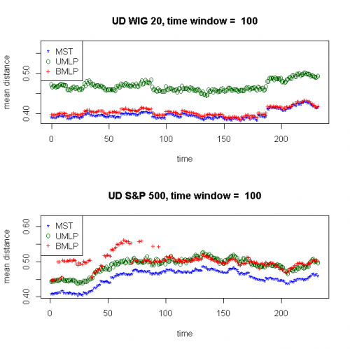
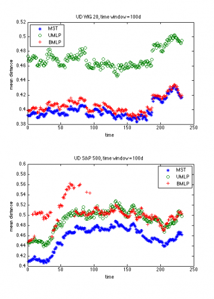

[](http://quantlet.de/)

## [](http://quantlet.de/) **STFdmm04** [](http://quantlet.de/)

```yaml

Name of QuantLet : STFdmm04

Published in : Statistical Tools for Finance and Insurance

Description : 'Compares the mean distance between nodes generated by minimum spanning tree,
unidirectional minimum length path and bidirectional length path The subset of WIG 20 (gwp.csv) and
S&P 500 (close.csv) is analysed. Requires mst.m, umlp.m, bmlp.m, ultra.m to run the quantlet.'

Keywords : financial, distance, tree, portfolio, asset, visualization, descriptive-statistics

See also : STFdmm11, bmlp, mst, ultra, umlp

Author : Janusz Miskiewicz, Awdesch Melzer

Submitted : Fri, November 09 2012 by Dedy Dwi Prastyo

Datafile : close.csv, gwp.csv

Example : mst.m, umlp.m, bmlp.m, ultra.m create these plots.

```






### R Code:
```r

# clear history
rm(list = ls(all = TRUE))
graphics.off()


########################################### Subroutine mst(x) ############


mst = function(x) {
    # Algorithm generates minimum spanning tree The rsult is presentes as a set of links between nodes
    n = nrow(x)
    m = ncol(x)
    true = upper.tri(x)
    x = true * x
    net = matrix(0, n - 1, 3)
    onnet = rep(as.integer(0), n)
    klaster = rep(as.integer(0), n)
    klast = 0L
    licz = 0L
    # check if the matrics is symmetric and positive
    maxx = max(apply(x, 2, max))
    smax = 10 * abs(maxx)
    x[x == 0] = smax
    while (licz < n - 1) {
        
        minx = min(apply(x, 2, min))
        d = which(x <= minx, arr.ind = T)
        i = d[, 1]
        j = d[, 2]
        if (length(i) > 1) {
            ii = i[1]
            jj = j[1]
            i = 0
            j = 0
            i = ii
            j = jj
        }
        
        if (onnet[i] == 0 & onnet[j] == 0) {
            licz = licz + 1L
            net[licz, 1] = i
            net[licz, 2] = j
            klast = klast + 1L
            klaster[i] = klast
            klaster[j] = klast
            net[licz, 3] = min(x[i, j], x[j, i])
            onnet[i] = 1
            onnet[j] = 1
            x[i, j] = smax
            x[j, i] = smax
            
        } else if (onnet[i] == 0 & onnet[j] == 1) {
            licz = licz + 1
            net[licz, 1] = i
            net[licz, 2] = j
            net[licz, 3] = min(x[i, j], x[j, i])
            onnet[i] = 1
            klaster[i] = klaster[j]
            x[i, j] = smax
            x[j, i] = smax
        } else if (onnet[i] == 1 & onnet[j] == 0) {
            licz = licz + 1L
            net[licz, 1] = i
            net[licz, 2] = j
            net[licz, 3] = min(x[i, j], x[j, i])
            onnet[j] = 1
            klaster[j] = klaster[i]
            x[i, j] = smax
            x[j, i] = smax
        } else if (onnet[i] == 1 & onnet[j] == 1 & klaster[i] == klaster[j]) {
            x[i, j] = smax
            x[j, i] = smax
        } else if (onnet[i] == 1 & onnet[j] == 1 & klaster[i] != klaster[j]) {
            licz = licz + 1L
            net[licz, 1] = i
            net[licz, 2] = j
            net[licz, 3] = min(x[i, j], x[j, i])
            klaster[klaster == klaster[i]] = klaster[j]
        }
    }
    retval = net
    return(retval)
}


########################################### Subroutine bmlp(x) ############

bmlp = function(x) {
    # bidirextional minimum length path algoritm x - the distance matrix The result is presentes as a set of links between nodes
    n = nrow(x)
    m = ncol(x)
    net = matrix(0, n - 1, 3)
    onnet = matrix(0, n, 1)
    end1 = 0
    end2 = 0
    licz = 0
    
    # the distance matrics should be symmetric and positive
    maxx = 10 * max(x)
    smax = maxx * diag(nrow = nrow(x), ncol = ncol(x))
    x = x + smax
    
    # the first pair
    minx = min(x)
    ij = which(x == minx, arr.ind = T)
    i = ij[, 1]
    j = ij[, 2]
    
    if (length(i) == 1) {
        end1 = i
        end2 = j
        onnet[end1] = 1
        onnet[end2] = 1
        net[1, 1] = end1
        net[1, 2] = end2
        net[1, 3] = minx
        licz = 1
        x[end1, end2] = maxx
        x[end2, end1] = maxx
    } else {
        end1 = i[1]
        end2 = j[1]
        onnet[end1] = 1
        onnet[end2] = 1
        net[1, 1] = end1
        net[1, 2] = end2
        net[1, 3] = minx
        licz = 1
        x[end1, end2] = maxx
        x[end2, end1] = maxx
    }
    
    while (licz < n - 1) {
        minx1 = min(x[end1, ])
        minx2 = min(x[end2, ])
        if (minx1 < minx2) {
            y = end1
            minx = minx1
        } else {
            y = end2
            minx = minx2
        }
        i = which(x[y, ] == minx, arr.ind = T)
        if (length(i) > 1) {
            tmp = 1
            while ((onnet[i[tmp]] == 1) && (tmp < length(i))) {
                tmp = tmp + 1
            }
            if (onnet[i[tmp]] == 0) {
                ii = i(tmp)
                i = NULL
                i = ii
                tmp = 0
            } else {
                ii = i[1]
                i = NULL
                i = ii
            }
        }
        if (onnet[i] == 0) {
            licz = licz + 1
            net[licz, 1] = y
            net[licz, 2] = i
            net[licz, 3] = x[i, y]
            onnet[i] = 1
            x[i, y] = maxx
            x[y, i] = maxx
            y = i
        }
        if ((onnet[i] == 1) && (onnet[y] == 1)) {
            x[i, y] = maxx
            x[y, i] = maxx
        }
    }
    retval = net
    return(retval)
}

########################################### Subroutine ultra(x) ############


ultra = function(x) {
    # Ultrametric distance between time series.  x - time series matrix
    h = nrow(x)
    k = ncol(x)
    retval = sqrt(abs(0.5 * (matrix(1, k, k) - cor(x))))
    return(retval)
}

########################################### Subroutine umlp(x,y) ##########

umlp = function(x, y) {
    # unidirextional minimum length path algorithm x - the distance matrix y - root of the chain (the number of column) The
    # rsult is presentes as a set of links between nodes
    
    n = nrow(x)
    m = ncol(x)
    net = matrix(0, n - 1, 3)
    onnet = matrix(0, n, 1)
    licz = 0
    onnet[y] = 1
    maxx = 10 * max(x)
    smax = maxx * diag(nrow = nrow(x), ncol = ncol(x))
    x = x + smax
    
    while (licz < n - 1) {
        minx = min(x[y, ])
        it = which(x[y, ] == minx, arr.ind = T)
        
        if (length(it) > 1) {
            tmp = 1
            
            while ((onnet[it[tmp]] == 1) && (tmp < length(it))) {
                tmp = tmp + 1
            }
            
            if (onnet[it[tmp]] == 0) {
                ii = it(tmp)
                it = NULL
                it = ii
                tmp = 0
            } else {
                ii = it[1]
                it = NULL
                it = ii
            }
        }
        if (onnet[it] == 0) {
            licz = licz + 1
            net[licz, 1] = y
            net[licz, 2] = it
            net[licz, 3] = x[it, y]
            onnet[it] = 1
            x[it, y] = maxx
            x[y, it] = maxx
            y = it
        }
        
        if ((onnet[it] == 1) && (onnet[y] == 1)) {
            x[it, y] = maxx
            x[y, it] = maxx
        }
    }
    retval = net
    return(retval)
}

########################################### Main calculation #############


dataSP = read.table("close.csv", header = T)
dataSP = as.matrix(dataSP)

dataWIG = read.table("gwp.csv", header = T)
dataWIG = as.matrix(dataWIG)

dataSP = diff(log(dataSP))  # log return
dataWIG = diff(log(dataWIG))

dl_szerSP = nrow(dataSP)  # size of SP500
podmiotySP = ncol(dataSP)

dl_szerWIG = nrow(dataWIG)  # size of WIG20
podmiotyWIG = ncol(dataWIG)

window = 100  # size of the time window

# analysis of S&P 500
wynikSP = matrix(0, dl_szerSP - window - 1, 4)
for (t in 1:(dl_szerSP - window - 1)) {
    window_data = dataSP[t:(t + window - 1), ]
    wind_dist = ultra(window_data)
    wind_umlp = umlp(wind_dist, 1)
    wind_bmlp = bmlp(wind_dist)
    wind_mst = mst(wind_dist)
    wynikSP[t, 1] = 233 - t
    wynikSP[t, 2] = mean(wind_umlp[, 3])
    wynikSP[t, 3] = mean(wind_bmlp[, 3])
    wynikSP[t, 4] = mean(wind_mst[, 3])
    wind_umlp = numeric()
    wind_bmlp = numeric()
    wind_dist = numeric()
    wind_mst = numeric()
    window_data = numeric()
}


# analysis of WIG 20
wynikWIG = matrix(0, dl_szerWIG - window - 1, 4)
for (t in 1:(dl_szerWIG - window - 1)) {
    window_data = dataWIG[t:(t + window - 1), ]
    wind_dist = ultra(window_data)
    wind_umlp = umlp(wind_dist, 1)
    wind_bmlp = bmlp(wind_dist)
    wind_mst = mst(wind_dist)
    wynikWIG[t, 1] = 233 - t
    wynikWIG[t, 2] = mean(wind_umlp[, 3])
    wynikWIG[t, 3] = mean(wind_bmlp[, 3])
    wynikWIG[t, 4] = mean(wind_mst[, 3])
    wind_umlp = numeric()
    wind_bmlp = numeric()
    wind_dist = numeric()
    wind_mst = numeric()
    window_data = numeric()
}

par(mfrow = c(2, 1))
plot(wynikWIG[, 1], wynikWIG[, 4], pch = "*", ylab = "mean distance", xlab = "time", col = "blue", ylim = c(min(wynikWIG[, 4], 
    wynikWIG[, 2], wynikWIG[, 3]), max(wynikWIG[, 4], wynikWIG[, 2], wynikWIG[, 3]) + 0.07))
points(wynikWIG[, 1], wynikWIG[, 2], pch = "o", col = "darkgreen")
points(wynikWIG[, 1], wynikWIG[, 3], pch = "+", col = "red")
legend("topleft", c("MST", "UMLP", "BMLP"), pch = c("*", "o", "+"), col = c("blue", "darkgreen", "red"))
title(paste("UD WIG 20, time window = ", window))
plot(wynikSP[, 1], wynikSP[, 4], pch = "*", ylab = "mean distance", xlab = "time", col = "blue", ylim = c(min(wynikSP[, 4], 
    wynikSP[, 2], wynikSP[, 3]), max(wynikSP[, 4], wynikSP[, 2], wynikSP[, 3]) + 0.06))
points(wynikSP[, 1], wynikSP[, 2], pch = "o", col = "darkgreen")
points(wynikSP[, 1], wynikSP[, 3], pch = "+", col = "red")
legend("topleft", c("MST", "UMLP", "BMLP"), pch = c("*", "o", "+"), col = c("blue", "darkgreen", "red"))
title(paste("UD S&P 500, time window = ", window)) 

```

### MATLAB Code:
```matlab
clear all
close all 
clc


dataSP  = load('close.csv');
dataWIG = load('gwp.csv');

dataSP  = diff(log(dataSP)); % log return
dataWIG = diff(log(dataWIG));

[dl_szerSP,podmiotySP]   = size(dataSP);
[dl_szerWIG,podmiotyWIG] = size(dataWIG);

window  = 100; % size of the time window

% analysis of S&P 500
wynikSP = zeros(dl_szerSP - window-1,4);
for t=1:(dl_szerSP - window-1)
    window_data  = dataSP(t:(t+window-1),:);
    wind_dist    = ultra(window_data);
    wind_umlp    = umlp(wind_dist,1);
    wind_bmlp    = bmlp(wind_dist);
    wind_mst     = mst(wind_dist);
    wynikSP(t,1) = 233-t;
    wynikSP(t,2) = mean(wind_umlp(:,3));
    wynikSP(t,3) = mean(wind_bmlp(:,3));
    wynikSP(t,4) = mean(wind_mst(:,3));
    wind_umlp    = [];
    wind_bmlp    = [];
    wind_dist    = [];
    wind_mst     = [];
    window_data  = [];
end;

  
 % analysis of WIG 20
 wynikWIG = zeros(dl_szerWIG - window-1,4);
 for t=1:(dl_szerWIG - window-1)
    window_data   = dataWIG(t:(t+window-1),:);
    wind_dist     = ultra(window_data);
    wind_umlp     = umlp(wind_dist,1);
    wind_bmlp     = bmlp(wind_dist);
    wind_mst      = mst(wind_dist);
    wynikWIG(t,1) = 233-t;
    wynikWIG(t,2) = mean(wind_umlp(:,3));
    wynikWIG(t,3) = mean(wind_bmlp(:,3));
    wynikWIG(t,4) = mean(wind_mst(:,3));
    wind_umlp     = [];
    wind_bmlp     = [];
    wind_dist     = [];
    wind_mst      = [];
    window_data   = [];
end;

subplot(2,1,1), plot(wynikWIG(:,1), wynikWIG(:,4),'*',wynikWIG(:,1), wynikWIG(:,2),'o',wynikWIG(:,1), wynikWIG(:,3),'+')
legend('MST','UMLP','BMLP',2)
xlabel('time');
ylabel('mean distance');
title('UD WIG 20, time window =100d');
subplot(2,1,2), plot(wynikSP(:,1), wynikSP(:,4),'*',wynikSP(:,1), wynikSP(:,2),'o',wynikSP(:,1), wynikSP(:,3),'+')
legend('MST','UMLP','BMLP')
xlabel('time');
ylabel('mean distance');
title('UD S&P 500, time window =100d');
```
