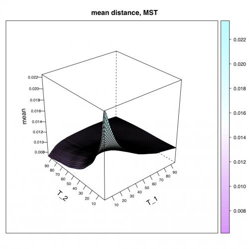
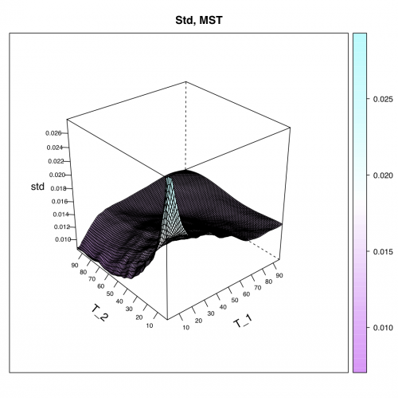
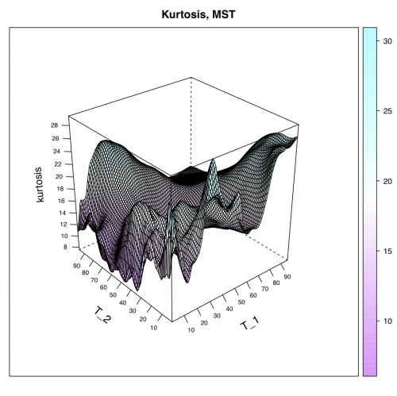
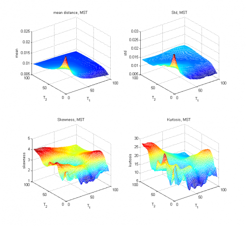

[](http://quantlet.de/)

## [](http://quantlet.de/) **STFdmm11** [](http://quantlet.de/)

```yaml

Name of QuantLet : STFdmm11

Published in : Statistical Tools for Finance and Insurance

Description : 'Presents the statistical properties of the minimum spanning tree as a function of
time windows sizes for elements of the chosen S&P 500 companies (close.csv). The Theil index based
distance is used. Requires theil.m, mst.m, manh.m to run the program.'

Keywords : financial, distance, tree, portfolio, asset, visualization, descriptive-statistics

See also : 'STFdmm01, STFdmm02, STFdmm03, STFdmm04, STFdmm05, STFdmm06, STFdmm07, STFdmm08,
STFdmm09, STFdmm10, manh, mst, theil'

Author : Janusz Miskiewicz, Awdesch Melzer

Submitted : Fri, November 23 2012 by Dedy Dwi Prastyo

Datafile : close.csv

Example : theil.m, mst.m, manh.m produce these plots.

```











### R Code:
```r
rm(list=ls(all=TRUE))
graphics.off()

install.packages("moments")
library(moments)


##########################################
########## Subroutine manh(x) ############
##########################################


manh = function(x){
# Manhattan distence between time series normalised by the time series
# length.
# x - time series
#
x      = as.matrix(x)
h      = nrow(x)
k      = ncol(x)
result = matrix(0,k,k)
for (j in 1:k){
  for (i in 1:k){
	result[i,j] = abs(mean(x[,i]-x[,j]))
  }
}
retval= result
return(retval)
}


###########################################
############ Subroutine mst(x) ############
###########################################


mst	= function(x){
# Algorithm generates minimum spanning tree
# The rsult is presentes as a set of links between nodes
	n		= nrow(x)
	m		= ncol(x)
	true	= upper.tri(x)
	x		= true*x
	net		= matrix(0,n-1,3)
	onnet	= rep(as.integer(0),n)
	klaster	= rep(as.integer(0),n)
	klast	= 0L
	licz	= 0L
	# check if the matrics is symmetric and positive
	maxx	= max(apply(x,2,max))
	smax	= 10*abs(maxx)
	x[x==0]	= smax
while (licz<n-1){

	minx	= min(apply(x,2,min))
	d		= which(x<=minx,arr.ind=T)
	i		= d[,1]
	j		= d[,2]
  if (length(i) > 1){
    ii		= i[1]
    jj		= j[1]
    i		= 0
    j		= 0
    i		= ii
    j		= jj
  }
  
  if (onnet[i] ==0 & onnet[j] ==0){
    licz		= licz+1L
    net[licz,1]	= i
    net[licz,2]	= j
    klast		= klast+1L
    klaster[i]	= klast
    klaster[j]	= klast
    net[licz,3]	= min(x[i,j],x[j,i])
    onnet[i]	= 1
    onnet[j]	= 1
    x[i,j]		= smax
    x[j,i]		= smax

  }else if (onnet[i]==0 & onnet[j]==1)  {
    licz = licz+1
    net[licz,1]	= i
    net[licz,2]	= j
    net[licz,3]	= min(x[i,j],x[j,i])
    onnet[i]	= 1
    klaster[i]	= klaster[j]
    x[i,j]		= smax
    x[j,i]		= smax
  }else if (onnet[i] ==1 & onnet[j] ==0)  {
    licz		= licz+1L
    net[licz,1]	= i
    net[licz,2]	= j
    net[licz,3]	= min(x[i,j],x[j,i])
    onnet[j]	= 1
    klaster[j]	= klaster[i]
    x[i,j]		= smax
    x[j,i]		= smax
  }else if (onnet[i] ==1 & onnet[j] ==1 & klaster[i]==klaster[j])  {
    x[i,j]		= smax
    x[j,i]		= smax
 } else if  (onnet[i] ==1 & onnet[j] ==1 & klaster[i]!=klaster[j]){
    licz 		= licz+1L
    net[licz,1]	= i
    net[licz,2]	= j
    net[licz,3]	= min(x[i,j],x[j,i])
    klaster[klaster==klaster[i]]=klaster[j]
  }
}
retval = net
return(retval) 
}

#############################################
############ Subroutine theil(x) ############
#############################################


theil = function(x,n){
# Converts the given time series into time series of Theil index
# n - size of moving window
# x - analysed time series
#
x         = as.matrix(x)
n_pocz    = nrow(x)
k         = ncol(x)

rozm      = n_pocz-n+1

retval    = matrix(0,rozm,k)
    for (i in 1:rozm){
    	sr          = apply(x[i:(i+n-1),],2,mean)
    	temp        = x[i:(i+n-1),]/(matrix(1,n,1)%*%sr)
    	temp        = temp*log(temp)
    	retval[i,]  = apply(temp,2,mean)
    }
return(retval)
}


###########################################
############ Main calculation #############
###########################################

data    = read.table("close.csv",header=T) # load data
data    = as.matrix(data)
data    = abs(diff(log(data))) # abs log return
dl_szer = nrow(data)
podmioty= ncol(data)
data[data==0]      = 0.0000001
print("The procedure may last several hours since 9025 networks are constructed.")

# define matrices
        wynik_wind_mean = matrix(0,96,96)
        wynik_wind_std  = matrix(0,96,96)
        wynik_wind_skew = matrix(0,96,96)
        wynik_wind_kurt = matrix(0,96,96)


# time window loop
for (window1 in 5:100){
    theil_data  = theil(data,window1)
    for (window2 in 5:100){
    
# moving time window
        wynik   = numeric()
        for (t in 1:(dl_szer - window1-1-window2)){
            window_data = theil_data[t:(t+window2),]
            wind_dist   = manh(window_data)
            wind_mst    = mst(wind_dist)
            wynik       = c(wynik,wind_mst[,3])
            wind_mst    = numeric()
            wind_dist   = numeric()
        }
        wynik_wind_mean[window1-4,window2-4] = mean(wynik)
        wynik_wind_std[window1-4,window2-4]  = sd(wynik)
        wynik_wind_skew[window1-4,window2-4] = skewness(wynik)
        wynik_wind_kurt[window1-4,window2-4] = kurtosis(wynik)
    }
}

require(lattice)

wireframe(wynik_wind_mean,drape=T,#ticktype="detailed",
	main="mean distance, MST",
	scales=list(arrows=FALSE,col="black",distance=1,tick.number=8,cex=.7),
		#x=list(labels=round(seq(Taumin,Taumax,length=7),1)),
		#y=list(labels=round(seq(Smin,Smax,length=7),1))),
	xlab=list("T_1",rot=30,cex=1.2),
	ylab=list("T_2",rot=-40,cex=1.2),
	zlab=list("mean",rot=95,cex=1.1))
dev.new()

wireframe(wynik_wind_std,drape=T,#ticktype="detailed",
	main="Std, MST",
	scales=list(arrows=FALSE,col="black",distance=1,tick.number=8,cex=.7),
		#x=list(labels=round(seq(Taumin,Taumax,length=7),1)),
		#y=list(labels=round(seq(Smin,Smax,length=7),1))),
	xlab=list("T_1",rot=30,cex=1.2),
	ylab=list("T_2",rot=-40,cex=1.2),
	zlab=list("std",cex=1.1))
dev.new()

wireframe(wynik_wind_skew,drape=T,#ticktype="detailed",
	main="Skewness, MST",
	scales=list(arrows=FALSE,col="black",distance=1,tick.number=8,cex=.7),
		#x=list(labels=round(seq(Taumin,Taumax,length=7),1)),
		#y=list(labels=round(seq(Smin,Smax,length=7),1))),
	xlab=list("T_1",rot=30,cex=1.2),
	ylab=list("T_2",rot=-40,cex=1.2),
	zlab=list("skewness",rot=95,cex=1.1))

dev.new()
wireframe(wynik_wind_kurt,drape=T,#ticktype="detailed",
	main="Kurtosis, MST",
	scales=list(arrows=FALSE,col="black",distance=1,tick.number=8,cex=.7),
		#x=list(labels=round(seq(Taumin,Taumax,length=7),1)),
		#y=list(labels=round(seq(Smin,Smax,length=7),1))),
	xlab=list("T_1",rot=30,cex=1.2),
	ylab=list("T_2",rot=-40,cex=1.2),
	zlab=list("kurtosis",rot=95,cex=1.1))


```

### MATLAB Code:
```matlab
clear all
close all
clc

data  = load('close.csv');

data  = abs(diff(log(data))); % abs log return

[dl_szer,podmioty] = size(data);
data(data==0)      = 0.0000001;
disp('The procedure may last several hours since 9025 networks are constructed.')

% time window loop
for window1=5:100
    theil_data  = theil(data,window1);
    for window2 = 5:100
    
% moving time window
        wynik   = [];
        for t=1:(dl_szer - window1-1-window2)
            window_data = theil_data(t:(t+window2),:);
            wind_dist   = manh(window_data);
            wind_mst    = mst(wind_dist);
            wynik       = [wynik;wind_mst(:,3)];
            wind_mst    = [];
            wind_dist   = [];
        end;
        wynik_wind_mean(window1-4,window2-4) = mean(wynik);
        wynik_wind_std(window1-4,window2-4)  = std(wynik);
        wynik_wind_skew(window1-4,window2-4) = skewness(wynik);
        wynik_wind_kurt(window1-4,window2-4) = kurtosis(wynik);
    end;
end;

subplot(2,2,1), mesh(wynik_wind_mean,'DisplayName','mean distance, MST');figure(gcf)
xlabel('T_1');
ylabel('T_2');
zlabel('mean');
title('mean distance, MST');
subplot(2,2,2),mesh(wynik_wind_std,'DisplayName','Std, MST');figure(gcf) 
xlabel('T_1');
ylabel('T_2');
zlabel('std');
title('Std, MST');
subplot(2,2,3),mesh(wynik_wind_skew,'DisplayName','Skewness, MST');figure(gcf)
xlabel('T_1');
ylabel('T_2');
zlabel('skewness');
title('Skewness, MST');
subplot(2,2,4),mesh(wynik_wind_kurt,'DisplayName','Kurtosis, MST');figure(gcf)
xlabel('T_1');
ylabel('T_2');
zlabel('kurtosis');
title('Kurtosis, MST');
```
