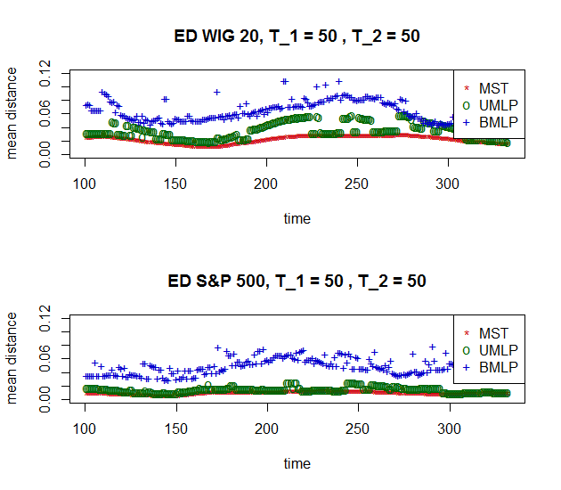
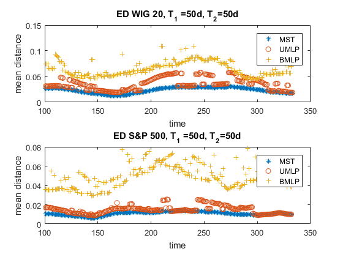

[](http://quantlet.de/)

## [](http://quantlet.de/) **STFdmm13** [](http://quantlet.de/)

```yaml

Name of QuantLet : STFdmm13

Published in : Statistical Tools for Finance and Insurance

Description : 'Presents a comparison of the mean distance between nodes generated by minimum
spanning tree, unidirectional minimum length path and bidirectional length path. The subset of S&P
500 and WIG 20 is analysed. The Theil index based distance is used. Requires umlp.m,bmlp.m,
theil.m, mst.m, manh.m to run the program.'

Keywords : financial, distance, tree, portfolio, asset, visualization, descriptive-statistics

See also : bmlp, manh, mst, theil, umlp

Author : Janusz Miskiewicz, Awdesch Melzer

Submitted : Mon, November 26 2012 by Dedy Dwi Prastyo

Datafile : close.csv, gwp.csv

Example : theil.m, mst.m, manh.m, umlp.m, bmlp.m, produce these plots.

```






### R Code:
```r
rm(list = ls(all = TRUE))
graphics.off()


########################################### Subroutine mst(x) ############


mst = function(x) {
    # Algorithm generates minimum spanning tree The rsult is presentes as a set of links between nodes
    n = nrow(x)
    m = ncol(x)
    true = upper.tri(x)
    x = true * x
    net = matrix(0, n - 1, 3)
    onnet = rep(as.integer(0), n)
    klaster = rep(as.integer(0), n)
    klast = 0L
    licz = 0L
    # check if the matrics is symmetric and positive
    maxx = max(apply(x, 2, max))
    smax = 10 * abs(maxx)
    x[x == 0] = smax
    while (licz < n - 1) {
        
        minx = min(apply(x, 2, min))
        d = which(x <= minx, arr.ind = T)
        i = d[, 1]
        j = d[, 2]
        if (length(i) > 1) {
            ii = i[1]
            jj = j[1]
            i = 0
            j = 0
            i = ii
            j = jj
        }
        
        if (onnet[i] == 0 & onnet[j] == 0) {
            licz = licz + 1L
            net[licz, 1] = i
            net[licz, 2] = j
            klast = klast + 1L
            klaster[i] = klast
            klaster[j] = klast
            net[licz, 3] = min(x[i, j], x[j, i])
            onnet[i] = 1
            onnet[j] = 1
            x[i, j] = smax
            x[j, i] = smax
            
        } else if (onnet[i] == 0 & onnet[j] == 1) {
            licz = licz + 1
            net[licz, 1] = i
            net[licz, 2] = j
            net[licz, 3] = min(x[i, j], x[j, i])
            onnet[i] = 1
            klaster[i] = klaster[j]
            x[i, j] = smax
            x[j, i] = smax
        } else if (onnet[i] == 1 & onnet[j] == 0) {
            licz = licz + 1L
            net[licz, 1] = i
            net[licz, 2] = j
            net[licz, 3] = min(x[i, j], x[j, i])
            onnet[j] = 1
            klaster[j] = klaster[i]
            x[i, j] = smax
            x[j, i] = smax
        } else if (onnet[i] == 1 & onnet[j] == 1 & klaster[i] == klaster[j]) {
            x[i, j] = smax
            x[j, i] = smax
        } else if (onnet[i] == 1 & onnet[j] == 1 & klaster[i] != klaster[j]) {
            licz = licz + 1L
            net[licz, 1] = i
            net[licz, 2] = j
            net[licz, 3] = min(x[i, j], x[j, i])
            klaster[klaster == klaster[i]] = klaster[j]
        }
    }
    retval = net
    return(retval)
}


########################################### Subroutine bmlp(x) ############

bmlp = function(x) {
    # bidirextional minimum length path algoritm x - the distance matrix The result is presentes as a set of links between nodes
    n = nrow(x)
    m = ncol(x)
    net = matrix(0, n - 1, 3)
    onnet = matrix(0, n, 1)
    end1 = 0
    end2 = 0
    licz = 0
    
    # the distance matrics should be symmetric and positive
    maxx = 10 * max(x)
    smax = maxx * diag(nrow = nrow(x), ncol = ncol(x))
    x = x + smax
    
    # the first pair
    minx = min(x)
    ij = which(x == minx, arr.ind = T)
    i = ij[, 1]
    j = ij[, 2]
    
    if (length(i) == 1) {
        end1 = i
        end2 = j
        onnet[end1] = 1
        onnet[end2] = 1
        net[1, 1] = end1
        net[1, 2] = end2
        net[1, 3] = minx
        licz = 1
        x[end1, end2] = maxx
        x[end2, end1] = maxx
    } else {
        end1 = i[1]
        end2 = j[1]
        onnet[end1] = 1
        onnet[end2] = 1
        net[1, 1] = end1
        net[1, 2] = end2
        net[1, 3] = minx
        licz = 1
        x[end1, end2] = maxx
        x[end2, end1] = maxx
    }
    
    while (licz < n - 1) {
        minx1 = min(x[end1, ])
        minx2 = min(x[end2, ])
        if (minx1 < minx2) {
            y = end1
            minx = minx1
        } else {
            y = end2
            minx = minx2
        }
        i = which(x[y, ] == minx, arr.ind = T)
        if (length(i) > 1) {
            tmp = 1
            while ((onnet[i[tmp]] == 1) && (tmp < length(i))) {
                tmp = tmp + 1
            }
            if (onnet[i[tmp]] == 0) {
                ii = i(tmp)
                i = NULL
                i = ii
                tmp = 0
            } else {
                ii = i[1]
                i = NULL
                i = ii
            }
        }
        if (onnet[i] == 0) {
            licz = licz + 1
            net[licz, 1] = y
            net[licz, 2] = i
            net[licz, 3] = x[i, y]
            onnet[i] = 1
            x[i, y] = maxx
            x[y, i] = maxx
            y = i
        }
        if ((onnet[i] == 1) && (onnet[y] == 1)) {
            x[i, y] = maxx
            x[y, i] = maxx
        }
    }
    retval = net
    return(retval)
}

########################################### Subroutine ultra(x) ############


ultra = function(x) {
    # Ultrametric distance between time series.  x - time series matrix
    h = nrow(x)
    k = ncol(x)
    retval = sqrt(abs(0.5 * (matrix(1, k, k) - cor(x))))
    return(retval)
}

########################################### Subroutine umlp(x,y) ##########

umlp = function(x, y) {
    # unidirextional minimum length path algorithm x - the distance matrix y - root of the chain (the number of column) The
    # rsult is presentes as a set of links between nodes
    
    n = nrow(x)
    m = ncol(x)
    net = matrix(0, n - 1, 3)
    onnet = matrix(0, n, 1)
    licz = 0
    onnet[y] = 1
    maxx = 10 * max(x)
    smax = maxx * diag(nrow = nrow(x), ncol = ncol(x))
    x = x + smax
    
    while (licz < n - 1) {
        minx = min(x[y, ])
        it = which(x[y, ] == minx, arr.ind = T)
        
        if (length(it) > 1) {
            tmp = 1
            
            while ((onnet[it[tmp]] == 1) && (tmp < length(it))) {
                tmp = tmp + 1
            }
            
            if (onnet[it[tmp]] == 0) {
                ii = it(tmp)
                it = NULL
                it = ii
                tmp = 0
            } else {
                ii = it[1]
                it = NULL
                it = ii
            }
        }
        if (onnet[it] == 0) {
            licz = licz + 1
            net[licz, 1] = y
            net[licz, 2] = it
            net[licz, 3] = x[it, y]
            onnet[it] = 1
            x[it, y] = maxx
            x[y, it] = maxx
            y = it
        }
        
        if ((onnet[it] == 1) && (onnet[y] == 1)) {
            x[it, y] = maxx
            x[y, it] = maxx
        }
    }
    retval = net
    return(retval)
}


########################################## Subroutine manh(x) ############


manh = function(x) {
    # Manhattan distence between time series normalised by the time series length.  x - time series
    x = as.matrix(x)
    h = nrow(x)
    k = ncol(x)
    result = matrix(0, k, k)
    for (j in 1:k) {
        for (i in 1:k) {
            result[i, j] = abs(mean(x[, i] - x[, j]))
        }
    }
    retval = result
    return(retval)
}


############################################# Subroutine theil(x) ############


theil = function(x, n) {
    # Converts the given time series into time series of Theil index n - size of moving window x - analysed time series
    x = as.matrix(x)
    n_pocz = nrow(x)
    k = ncol(x)
    
    rozm = n_pocz - n + 1
    
    retval = matrix(0, rozm, k)
    for (i in 1:rozm) {
        sr = apply(x[i:(i + n - 1), ], 2, mean)
        temp = x[i:(i + n - 1), ]/(matrix(1, n, 1) %*% sr)
        temp = temp * log(temp)
        retval[i, ] = apply(temp, 2, mean)
    }
    return(retval)
}


########################################### Main calculation #############


dataSP = read.table("close.csv", header = T)
dataSP = as.matrix(dataSP)
dataSP = abs(diff(log(dataSP)))  # abs log return

dl_szer = nrow(dataSP)
podmioty = ncol(dataSP)
dataSP[dataSP == 0] = 1e-07

window1 = 50
window2 = 50
theil_data = theil(dataSP, window1)

wynikSP = matrix(0, dl_szer - window1 - 1 - window2, 4)
czes = matrix(0, podmioty, podmioty)

for (t in 1:(dl_szer - window1 - 1 - window2)) {
    window_data = theil_data[t:(t + window2), ]
    wind_dist = manh(window_data)
    wind_mst = mst(wind_dist)
    wind_umlp = umlp(wind_dist, 5)
    wind_bmlp = bmlp(wind_dist)
    wynikSP[t, 1] = dl_szer - t
    wynikSP[t, 2] = mean(wind_mst[, 3])
    wynikSP[t, 3] = mean(wind_umlp[, 3])
    wynikSP[t, 4] = mean(wind_bmlp[, 3])
    wind_umlp = numeric()
    wind_bmlp = numeric()
    wind_mst = numeric()
    wind_dist = numeric()
}

dataWIG = read.table("gwp.csv", header = T)
dataWIG = as.matrix(dataWIG)
dataWIG = abs(diff(log(dataWIG)))  # abs log return
dl_szer = nrow(dataWIG)
podmioty = ncol(dataWIG)
dataWIG[dataWIG == 0] = 1e-07

window1 = 50
window2 = 50
theil_data = theil(dataWIG, window1)

wynikWIG = matrix(0, dl_szer - window1 - 1 - window2, 4)
czes = matrix(0, podmioty, podmioty)

for (t in 1:(dl_szer - window1 - 1 - window2)) {
    window_data = theil_data[t:(t + window2), ]
    wind_dist = manh(window_data)
    wind_mst = mst(wind_dist)
    wind_umlp = umlp(wind_dist, 5)
    wind_bmlp = bmlp(wind_dist)
    wynikWIG[t, 1] = dl_szer - t
    wynikWIG[t, 2] = mean(wind_mst[, 3])
    wynikWIG[t, 3] = mean(wind_umlp[, 3])
    wynikWIG[t, 4] = mean(wind_bmlp[, 3])
    wind_umlp = numeric()
    wind_bmlp = numeric()
    wind_mst = numeric()
    wind_dist = numeric()
}

par(mfrow = c(2, 1))
plot(wynikWIG[, 1], wynikWIG[, 2], pch = "*", col = "red3", xlab = "time", ylab = "mean distance", ylim = c(0, 0.12))
title(paste("ED WIG 20, T_1 =", window1, ", T_2 =", window2))
points(wynikWIG[, 1], wynikWIG[, 3], pch = "o", col = "darkgreen")
points(wynikWIG[, 1], wynikWIG[, 4], pch = "+", col = "blue3")
legend("topright", c("MST", "UMLP", "BMLP"), pch = c("*", "o", "+"), col = c("red3", "darkgreen", "blue3"))

plot(wynikSP[, 1], wynikSP[, 2], pch = "*", col = "red3", xlab = "time", ylab = "mean distance", ylim = c(0, 0.12))
title(paste("ED S&P 500, T_1 =", window1, ", T_2 =", window2))
points(wynikSP[, 1], wynikSP[, 3], pch = "o", col = "darkgreen")
points(wynikSP[, 1], wynikSP[, 4], pch = "+", col = "blue3")
legend("topright", c("MST", "UMLP", "BMLP"), pch = c("*", "o", "+"), col = c("red3", "darkgreen", "blue3"))
 

```

### MATLAB Code:
```matlab
clear all
close all
clc

dataSP     = load('close.csv');

dataSP     = abs(diff(log(dataSP))); % abs log return
[dl_szer,podmioty] = size(dataSP);

dataSP(dataSP==0)  = 0.0000001;
window1    = 50;
window2    = 50;
theil_data = theil(dataSP,window1);

wynikSP    = zeros(dl_szer - window1-1-window2,4);
czes       = zeros(podmioty);

  for t=1:(dl_szer - window1-1-window2)
    window_data  = theil_data(t:(t+window2),:);
    wind_dist    = manh(window_data);
    wind_mst     = mst(wind_dist);
    wind_umlp    = umlp(wind_dist,5);
    wind_bmlp    = bmlp(wind_dist);
    wynikSP(t,1) = dl_szer-t;
    wynikSP(t,2) = mean(wind_mst(:,3));
    wynikSP(t,3) = mean(wind_umlp(:,3));
    wynikSP(t,4) = mean(wind_bmlp(:,3));
    wind_umlp    = [];
    wind_bmlp    = [];
    wind_mst     = [];
    wind_dist    = [];
  end;
  
dataWIG    = load('gwp.csv');

dataWIG    = abs(diff(log(dataWIG))); % abs log return
[dl_szer,podmioty]  = size(dataWIG);

dataWIG(dataWIG==0) = 0.0000001;
window1    = 50;
window2    = 50;
theil_data = theil(dataWIG,window1);

wynikWIG   = zeros(dl_szer - window1-1-window2,4);
czes       = zeros(podmioty);

  for t=1:(dl_szer - window1-1-window2)
    window_data   = theil_data(t:(t+window2),:);
    wind_dist     = manh(window_data);
    wind_mst      = mst(wind_dist);
    wind_umlp     = umlp(wind_dist,5);
    wind_bmlp     = bmlp(wind_dist);
    wynikWIG(t,1) = dl_szer-t;
    wynikWIG(t,2) = mean(wind_mst(:,3));
    wynikWIG(t,3) = mean(wind_umlp(:,3));
    wynikWIG(t,4) = mean(wind_bmlp(:,3));
    wind_umlp     = [];
    wind_bmlp     = [];
    wind_mst      = [];
    wind_dist     = [];
  end;  
  
subplot(2,1,1), plot(wynikWIG(:,1), wynikWIG(:,2),'*',wynikWIG(:,1), wynikWIG(:,3),'o',wynikWIG(:,1), wynikWIG(:,4),'+')
legend('MST','UMLP','BMLP')
xlabel('time');
ylabel('mean distance');
title('ED WIG 20, T_1 =50d, T_2=50d');
subplot(2,1,2), plot(wynikSP(:,1), wynikSP(:,2),'*',wynikSP(:,1), wynikSP(:,3),'o',wynikSP(:,1), wynikSP(:,4),'+')
legend('MST','UMLP','BMLP')
xlabel('time');
ylabel('mean distance');
title('ED S&P 500, T_1 =50d, T_2=50d');
```
