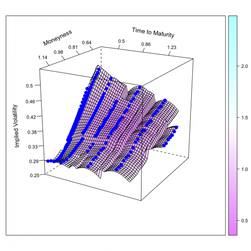

[](http://quantlet.de/index.php?p=info)

## [](http://quantlet.de/) **STFfft01** [](http://quantlet.de/d3/ia)

```yaml

Name of QuantLet : STFfft01

Published in : Statistical Tools for Finance and Insurance

Description : 'Plots the implied volatility of DAX options on January, 4th 1999, using kernel
regression employing a quartic kernel with bandwidth=c(0.05, 0.3) for moneyness and time t maturity
respectively.'

Keywords : implied-volatility, moneyness, dax, quadratic kernel, kernel, maturity

See also : XFGiv02

Author : Awdesch Melzer

Submitted : Wed, December 12 2012 by Dedy Dwi Prastyo

Datafile : volsurfdata2.dat

```




### R Code:
```r
# clear variables and close windows
rm(list = ls(all = TRUE))
graphics.off()

install.packages("MASS")
library(MASS)

# Black-Scholes Function
BS = function(S, K, Time, r, sig, type) {
    d1 = (log(S/K) + (r + sig^2/2) * Time)/(sig * sqrt(Time))
    d2 = d1 - sig * sqrt(Time)
    if (type == 1) {
        value = S * pnorm(d1) - K * exp(-r * Time) * pnorm(d2)
    }
    if (type == 0) {
        value = K * exp(-r * Time) * pnorm(-d2) - S * pnorm(-d1)
    }
    return(value)
}
# Function to find BS Implied Vol using Bisection Method
blsimpv = function(S, K, Time, r, market, type) {
    sig = 0.2
    sig.up = 1
    sig.down = 0.001
    count = 0
    err = BS(S, K, Time, r, sig, type) - market
    # repeat until error is sufficiently small or counter hits 1000
    while (abs(err) > 1e-05 && count < 1000) {
        if (err < 0) {
            sig.down = sig
            sig = (sig.up + sig)/2
        } else {
            sig.up = sig
            sig = (sig.down + sig)/2
        }
        err = BS(S, K, Time, r, sig, type) - market
        count = count + 1
    }
    # return NA if counter hit 1000
    if (count == 1000) {
        return(NA)
    } else {
        return(sig)
    }
}

# load data
x = read.table("volsurfdata2.dat")

# define variables
x[, 7] = x[, 2]/(x[, 1] * exp(x[, 3] * x[, 4]))  # define moneyness
Price = x[, 1]
Strike = x[, 2]
Rate = x[, 3]
Time = x[, 4]
Value = x[, 5]
Class = x[, 6]
mon = x[, 7]

n = length(x[, 1])

# calculate implied volatility
iv = rep(0, n)
for (i in 1:n) {
    iv[i] = blsimpv(S = Price[i], K = Strike[i], Time = Time[i], r = Rate[i], market = Value[i], type = Class[i])
}

stepwidth = c(0.02, (2/52))
bandwidth = c(0.05, 0.3)
firstmon = min(x[, 7])
lastmon = max(x[, 7])
firstmat = min(x[, 4])
lastmat = max(x[, 4])


lengthmon = ceiling((lastmon - firstmon)/stepwidth[1])
lengthmat = ceiling((lastmat - firstmat)/stepwidth[2])
mongrid = seq(firstmon, lastmon, length = c(lengthmon + 1))
matgrid = seq(firstmat, lastmat, length = c(lengthmat + 1))

# grid function
meshgrid = function(a, b) {
    list(x = outer(b * 0, a, FUN = "+"), y = outer(b, a * 0, FUN = "+"))
}

# compute grid
gridone = meshgrid(mongrid, matgrid)

MON = gridone$x
MAT = gridone$y

gmon = lengthmon + 1L
gmat = lengthmat + 1L
uu = dim(x)
v = uu[1]

# calculate the implied volatility surface

beta = matrix(0, gmat, gmon)
# kernel regression via fft using quartic kernel
j = 1L
while (j < gmat + 1L) {
    k = 1L
    while (k < gmon + 1L) {
        
        i = 1L
        X = matrix(0, v, 3)
        while (i < (v + 1L)) {
            X[i, ] = c(1, x[i, 7] - MON[j, k], x[i, 4] - MAT[j, k])
            i = i + 1
        }
        
        
        Y = iv
        
        h = bandwidth
        
        
        W = matrix(0, v, v)  #Kernel matrix
        
        i = 1L
        while (i < (v + 1L)) {
            u1 = (MON[j, k] - x[i, 7])/h[1]
            u2 = (MAT[j, k] - x[i, 4])/h[2]
            aa = 15/16 * (1 - u1^2)^2 %*% (abs(u1) <= 1)/h[1]
            bb = 15/16 * (1 - u2^2)^2 %*% (abs(u2) <= 1)/h[2]
            W[i, i] = aa %*% bb
            i = i + 1L
        }
        est = ginv(t(X) %*% W %*% X) %*% t(X) %*% W %*% Y
        beta[j, k] = est[1]
        k = k + 1L
    }
    j = j + 1L
}


IV = beta
xnew = x


# redefine variables
Price = xnew[, 1]
Strike = xnew[, 2]
Rate = xnew[, 3]
Time = xnew[, 4]
Value = xnew[, 5]
Class = xnew[, 6]
mon = xnew[, 7]

n = length(xnew[, 1])

# # calculate implied volatility for original options
iv = rep(0, n)
for (i in 1:n) {
    iv[i] = blsimpv(Price[i], Strike[i], Time[i], Rate[i], Value[i], Class[i])
}

# define points
pts = cbind(mon, Time, iv)


# load required package
require(lattice)

# plot


wireframe(IV ~ MON + MAT, drape = T, ticktype = "detailed", pts = pts, main = "", zlim = c(0.25, 0.6), aspect = c(1, 1), scales = list(arrows = FALSE, 
    y = list(labels = round(seq(firstmat, lastmat, length = 6), 2)), x = list(labels = round(seq(firstmon, lastmon, length = 6), 
        2)), z = list(labels = round(seq(0.25, max(IV), length = 8), 2))), ylab = list("Time to Maturity", rot = -8), xlab = list("Moneyness", 
    rot = 25), zlab = list("Implied Volatility", rot = 94), panel.3d.wireframe = function(x, y, z, xlim, ylim, zlim, xlim.scaled, 
    ylim.scaled, zlim.scaled, pts, drape = drape, ...) {
    panel.3dwire(x, y, z, xlim = xlim, ylim = ylim, zlim = zlim, xlim.scaled = xlim.scaled, ylim.scaled = ylim.scaled, zlim.scaled = zlim.scaled, 
        drape = TRUE, ...)
    
    panel.3dscatter(pts[, 1], pts[, 2], pts[, 3], xlim = xlim, ylim = ylim, zlim = zlim, xlim.scaled = xlim.scaled, ylim.scaled = ylim.scaled, 
        zlim.scaled = zlim.scaled, type = "p", col = c(4), lwd = 3, cex = 1, pch = c(19), .scale = TRUE, ...)
}, screen = list(z = 240, x = -70)) 

```
