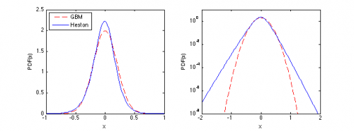

[](http://quantlet.de/)

## [](http://quantlet.de/) **STFhes02** [](http://quantlet.de/)

```yaml

Name of QuantLet : STFhes02

Published in : Statistical Tools for Finance and Insurance

Description : 'Plots the marginal pdfs in the Black-Scholes (GBM) and Heston models for [kappa,
theta, sigma, rho] = [2, 0.04, 0.3, -0.05] as well as log-linear scale of the Heston marginal pdfs.
The tails of the Heston marginal pdfs are exponential. Requires pdfHeston.m function.'

Keywords : 'heston, simulation, geometric-brownian-motion, visualization, graphical representation,
wiener-process, black-scholes, pdf'

See also : pdfHeston

Author : Rafal Weron, Agnieszka Janek

Submitted : Tue, September 18 2012 by Dedy Dwi Prastyo

Example : pdfHeston.m plots the Heston marginal pdf and log of the pdf.

```




### MATLAB Code:
```matlab
% clear variables and close windows
clear all
close all
clc

standalone = 0; % set to 0 to make plots as seen in STF2

% Sample input:
kappa = 2;  % speed of mean revision of the volatility process
theta = .04; % long-term mean of volatility process
sigma = .3; % volatility
rho = -.05; % correlation between the spot price and volatility processes
x = -2:.02:2;

% Compute Heston marginal pdf at values in x
y = pdfHeston(x,theta,kappa,sigma,rho,1,0);
% Compute GBM marginal pdf at values in x
z = normpdf(x,0,0.2); 

% Compare marginal pdf with Gaussian density of N(0,0.2)
if standalone, 
    figure(1); 
else
    figure(1);
    subplot(1,2,1);
end
plot(x,z,'r--',x,y,'b','LineWidth',1);
if standalone, title('Gaussian vs. Heston densities'); end
xlabel ('x');
ylabel ('PDF(x)');
legend('GBM','Heston',2)
set(gca,'xlim',[-1 1]);

if standalone, 
    figure(2); 
else
    subplot(1,2,2);
end
semilogy(x,z,'r--',x,y,'b','LineWidth',1);
if standalone, title('Gaussian vs. Heston log-densities'); end
xlabel ('x');
ylabel ('PDF(x)');
set(gca,'ylim',[1e-8 10],'ytick',[1e-8 1e-6 1e-4 1e-2 1]);
```
