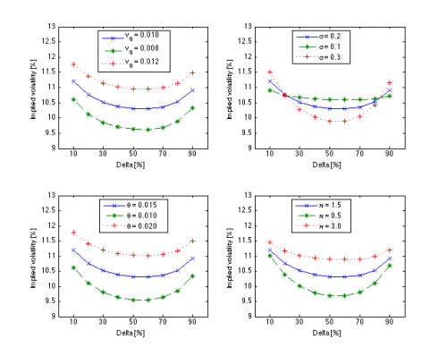

[](http://quantlet.de/)

## [](http://quantlet.de/) **STFhes04** [](http://quantlet.de/)

```yaml

Name of QuantLet : STFhes04

Published in : Statistical Tools for Finance and Insurance

Description : 'Plots the effect of changing model parameters on the shape of the smile: the
innitial variance v_0, volatility of variance sigma, long-run variance theta, and mean revision
level kappa. Requires GarmanKohlhagen.m, HestonVanillaSmile.m and HestonVanilla.m function.'

Keywords : 'volatility smile, volatility, implied-volatility, heston, model, parameter, graphical
representation, visualization'

See also : GarmanKohlhagen, HestonVanilla, HestonVanillaSmile

Author : Rafal Weron, Agnieszka Janek

Submitted : Tue, September 18 2012 by Dedy Dwi Prastyo

Example : 'GarmanKohlhagen.m, HestonVanillaSmile.m, HestonVanilla.m produce plots of the effect of
changing model parameters on the shape of the smile: the initial variance v_0 (top left panel),
volatility of variance sigma (top right panel), long-run variance theta (bottom left panel), and
mean revision level kappa (bottom right).'

```




### MATLAB Code:
```matlab

% clear variables and close windows
clear all
close all
clc

standalone = 0; % set to 0 to make plots as seen in STF2

% market volatilities for respective deltas
delta = .1:.1:.9;
marketvols = [0.1135 0.109 0.10425 0.1025 0.102 0.103 0.10575 0.1105 0.1165];
spot = 1.215; % spot on July 1, 2004
rd = 0.02165; % domestic riskless interest rate
rf = 0.01845; % foreign riskless interest rate
tau = 0.5;    % time to expiry
cp = 1;		  % call option

%Calculate strikes for respective deltas
strikes = GarmanKohlhagen(spot,delta,marketvols,rd,rf,tau,cp,2);

%Sample input:
v0 = 0.01;
kappa = 1.5;  % speed of mean revision of the volatility process
theta = .015; % long-term mean of volatility process
vv = 0.2; % volatility
rho = 0.05; % correlation between the spot price and volatility processes
lambda = 0;


% HestonVanillaSmile returns volatility smile 
smile1 = HestonVanillaSmile(cp,spot,strikes,v0,vv,rd,rf,tau,kappa,theta,lambda,rho);
smile2 = HestonVanillaSmile(cp,spot,strikes,0.008,vv,rd,rf,tau,kappa,theta,lambda,rho);
smile3 = HestonVanillaSmile(cp,spot,strikes,0.012,vv,rd,rf,tau,kappa,theta,lambda,rho);
smile4 = HestonVanillaSmile(cp,spot,strikes,v0,0.10,rd,rf,tau,kappa,theta,lambda,rho);
smile5 = HestonVanillaSmile(cp,spot,strikes,v0,0.30,rd,rf,tau,kappa,theta,lambda,rho);
smile6 = HestonVanillaSmile(cp,spot,strikes,v0,vv,rd,rf,tau,kappa,0.01,lambda,rho);
smile7 = HestonVanillaSmile(cp,spot,strikes,v0,vv,rd,rf,tau,kappa,0.02,lambda,rho);
smile8 = HestonVanillaSmile(cp,spot,strikes,v0,vv,rd,rf,tau,0.5,theta,lambda,rho);
smile9 = HestonVanillaSmile(cp,spot,strikes,v0,vv,rd,rf,tau,3,theta,lambda,rho);

if standalone, 
    figure(1); 
else
    figure(1);
    subplot(2,2,1);
end
plot(delta*100,smile1*100,'x-',...
    delta*100,smile2*100,'*--',...
    delta*100,smile3*100,'+:','LineWidth',1);
if standalone, title('Initial variance and the smile'); end
xlabel ('Delta [%]');
ylabel ('Implied volatility [%]');
legend('v_0 = 0.010', 'v_0 = 0.008', 'v_0 = 0.012','Location','North')
set(gca,'XTick', 10:20:90, 'Ylim', [9 13]);

if standalone, 
    figure(2); 
else
    figure(1);
    subplot(2,2,2);
end
plot(delta*100,smile1*100,'x-',...
    delta*100,smile4*100,'*--',...
    delta*100,smile5*100,'+:','LineWidth',1);
if standalone, title('Vol of vol and the smile'); end
xlabel ('Delta [%]');
ylabel ('Implied volatility [%]');
legend('sigma = 0.2', 'sigma = 0.1', 'sigma = 0.3','Location','North')
set(gca,'XTick', 10:20:90, 'Ylim', [9 13]);

if standalone, 
    figure(3); 
else
    figure(1);
    subplot(2,2,3);
end
plot(delta*100,smile1*100,'x-',...
    delta*100,smile6*100,'*--',...
    delta*100,smile7*100,'+:','LineWidth',1);
if standalone, title('Long-run variance and the smile'); end
xlabel ('Delta [%]');
ylabel ('Implied volatility [%]');
legend('theta = 0.015', 'theta = 0.010', 'theta = 0.020','Location','North')
set(gca,'XTick', 10:20:90, 'Ylim', [9 13]);

if standalone, 
    figure(4); 
else
    figure(1);
    subplot(2,2,4);
end
plot(delta*100,smile1*100,'x-',...
    delta*100,smile8*100,'*--',...
    delta*100,smile9*100,'+:','LineWidth',1);
if standalone, title('Mean reversion and the smile'); end
xlabel ('Delta [%]');
ylabel ('Implied volatility [%]');
legend('kappa = 1.5', 'kappa = 0.5', 'kappa = 3.0','Location','North')
set(gca,'XTick', 10:20:90, 'Ylim', [9 13]);


```
