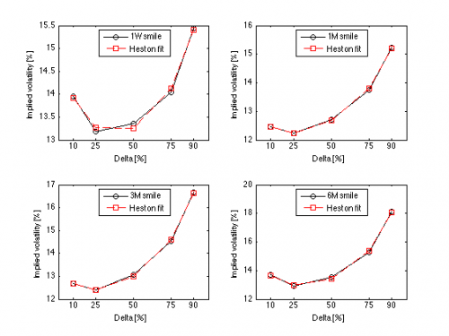
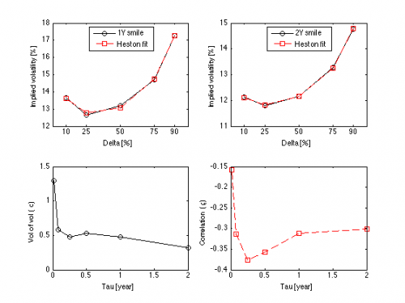

[](http://quantlet.de/)

## [](http://quantlet.de/) **STFhes07** [](http://quantlet.de/)

```yaml

Name of QuantLet : STFhes07

Published in : Statistical Tools for Finance and Insurance

Description : 'Plots the EUR/USD market smile on July 22, 2010 and the fit obtained with the Heston
model for tau = 1 week, 1 month, 3 months, 6 months 1 year, 2 years, the term structure of the
volatility of volatility and the correlation visualizing the problem of fitting the smile in the
short term. Requires HestonVanillaFitSmile.m, HestonVanilla.m, and GarmanKohlhagen.m function.'

Keywords : 'maturity, correlation, term structure, volatility smile, volatility,
implied-volatility, heston, model, parameter, graphical representation, visualization'

See also : GarmanKohlhagen, HestonVanilla, HestonVanillaFitSmile

Author : Rafal Weron, Agnieszka Janek

Submitted : Tue, September 18 2012 by Dedy Dwi Prastyo

Example : 'HestonVanillaFitSmile.m, HestonVanilla.m, GarmanKohlhagen.m produce plots of the EUR/USD
market smile on July 22, 2010 and the fit obtained with the Heston model for tau = 1 week (figure
1, top left panel), 1 month (figure 1, top right panel), 3 months (figure 1 bottom left panel), 6
months (figure 1, bottom right panel), 1 year (figure 2 top left panel), 2 years (figure 2, top
right panel), the term structure of the volatility of volatility and the correlation visualizing
the problem of fitting the smile in the short term (figure 2, bottom panels).'

```






### MATLAB Code:
```matlab
% clear variables and close windows
clear all
close all
clc

% Be aware of a simulation runtime of approximately 360 seconds.

standalone = 0; % set to 0 to make plots as seen in STF2

% Marketvols July 22, 2010 (Composite, Ldn)
marketvols1w  = 0.01*[13.948 13.192 13.35 14.042 15.4355];
marketvols1m  = 0.01*[12.45 12.249 12.7 13.749 15.225];
marketvols3m  = 0.01*[12.6885 12.3945 13.0495 14.5445 16.666];
marketvols6m  = 0.01*[13.688 12.899 13.55 15.299 18.1275];
marketvols1y  = 0.01*[13.6705 12.668 13.187 14.718 17.2705];
marketvols2y  = 0.01*[12.139 11.784 12.174 13.284 14.764];

% Forward deltas
delta = [0.1 0.25 0.5 0.75 0.9];

% Interest rates July 22, 2010
rd  = 0.01*[0.31100 0.32875 0.49781 0.70075 1.08 1.08]; %USD
rf  = 0.01*[0.58 0.631 0.884 1.131 1.399 1.399]; %EUR
tau = [7/365 1/12 3/12 6/12 1 2];

% Spot EUR/USD on July 22, 2010
spot = 1.2779; 
% Call option flag
cp = 1;

tic

% 1W smile ----------------------------------------------------------
marketvols = marketvols1w;
% Calculate spot delta
delta1w = exp(-rf(1)*tau(1))*delta;
[v01w,vv1w,kappa1w,theta1w,rho1w,IV1w,SSE1w] = HestonVanillaFitSmile(delta1w,marketvols,spot,rd(1),rf(1),tau(1),cp);

disp('=== 1W calibration results ===')
disp('v0, vv, kappa, theta, rho')
disp([v01w,vv1w,kappa1w,theta1w,rho1w, 2*kappa1w*theta1w - vv1w^2])
disp('[IV (10, 25, ATM, 75, 90), SSE] * 100%')
disp([IV1w,SSE1w]*100)

figure(1)
subplot(2,2,1)
plot(delta*100,marketvols*100,'ko-',  'LineWidth',1);
hold on
plot (delta*100,IV1w*100,'rs--',  'LineWidth',1);
if standalone, title('1W market and Heston volatilities'); end
legend('1W smile','Heston fit','Location','North')
xlabel ('Delta [%]');
ylabel ('Implied volatility [%]');
set(gca,'XTick', [10 25 50 75 90]);
hold off

% 1M smile ----------------------------------------------------------
marketvols = marketvols1m;
% Calculate spot delta
delta1m = exp(-rf(2)*tau(2))*delta;
[v01m,vv1m,kappa1m,theta1m,rho1m,IV1m,SSE1m] = HestonVanillaFitSmile(delta1m,marketvols,spot,rd(2),rf(2),tau(2),cp);

disp('=== 1M calibration results ===')
disp('v0, vv, kappa, theta, rho')
disp([v01m,vv1m,kappa1m,theta1m,rho1m, 2*kappa1m*theta1m - vv1m^2])
disp('[IV (10, 25, ATM, 75, 90), SSE] * 100%')
disp([IV1m,SSE1m]*100)

subplot(2,2,2)
plot(delta*100,marketvols*100,'ko-',  'LineWidth',1);
hold on
plot (delta*100,IV1m*100,'rs--',  'LineWidth',1);
if standalone, title('1M market and Heston volatilities'); end
legend('1M smile','Heston fit','Location','North')
xlabel ('Delta [%]');
ylabel ('Implied volatility [%]');
set(gca,'XTick', [10 25 50 75 90]);
hold off

% 3M smile ----------------------------------------------------------
marketvols = marketvols3m;
% Calculate spot delta
delta3m = exp(-rf(3)*tau(3))*delta;
[v03m,vv3m,kappa3m,theta3m,rho3m,IV3m,SSE3m] = HestonVanillaFitSmile(delta3m,marketvols,spot,rd(3),rf(3),tau(3),cp);

disp('=== 3M calibration results ===')
disp('v0, vv, kappa, theta, rho')
disp([v03m,vv3m,kappa3m,theta3m,rho3m, 2*kappa3m*theta3m - vv3m^2])
disp('[IV (10, 25, ATM, 75, 90), SSE] * 100%')
disp([IV3m,SSE3m]*100)

subplot(2,2,3)
plot(delta*100,marketvols*100,'ko-',  'LineWidth',1);
hold on
plot (delta*100,IV3m*100,'rs--',  'LineWidth',1);
if standalone, title('3M market and Heston volatilities'); end
legend('3M smile','Heston fit','Location','North')
xlabel ('Delta [%]');
ylabel ('Implied volatility [%]');
set(gca,'XTick', [10 25 50 75 90]);
hold off

% 6M smile ----------------------------------------------------------
marketvols = marketvols6m;
% Calculate spot delta
delta6m = exp(-rf(4)*tau(4))*delta;
[v06m,vv6m,kappa6m,theta6m,rho6m,IV6m,SSE6m] = HestonVanillaFitSmile(delta6m,marketvols,spot,rd(4),rf(4),tau(4),cp);

disp('=== 6M calibration results ===')
disp('v0, vv, kappa, theta, rho')
disp([v06m,vv6m,kappa6m,theta6m,rho6m, 2*kappa6m*theta6m - vv6m^2])
disp('[IV (10, 25, ATM, 75, 90), SSE] * 100%')
disp([IV6m,SSE6m]*100)

subplot(2,2,4)
plot(delta*100,marketvols*100,'ko-',  'LineWidth',1);
hold on
plot (delta*100,IV6m*100,'rs--',  'LineWidth',1);
if standalone, title('6M market and Heston volatilities'); end
legend('6M smile','Heston fit','Location','North')
xlabel ('Delta [%]');
ylabel ('Implied volatility [%]');
set(gca,'XTick', [10 25 50 75 90]);
hold off

% 1Y smile ----------------------------------------------------------
marketvols = marketvols1y;
% Calculate spot delta
delta1y = exp(-rf(5)*tau(5))*delta;
[v01y,vv1y,kappa1y,theta1y,rho1y,IV1y,SSE1y] = HestonVanillaFitSmile(delta1y,marketvols,spot,rd(5),rf(5),tau(5),cp);

disp('=== 1Y calibration results ===')
disp('v0, vv, kappa, theta, rho')
disp([v01y,vv1y,kappa1y,theta1y,rho1y, 2*kappa1y*theta1y - vv1y^2])
disp('[IV (10, 25, ATM, 75, 90), SSE] * 100%')
disp([IV1y,SSE1y]*100)

figure(2)
subplot(2,2,1)
plot(delta*100,marketvols*100,'ko-',  'LineWidth',1);
hold on
plot (delta*100,IV1y*100,'rs--',  'LineWidth',1);
if standalone, title('1Y market and Heston volatilities'); end
legend('1Y smile','Heston fit','Location','North')
xlabel ('Delta [%]');
ylabel ('Implied volatility [%]');
set(gca,'XTick', [10 25 50 75 90]);
hold off

% 2Y smile ----------------------------------------------------------
marketvols = marketvols2y;
% Calculate spot delta
delta2y = exp(-rf(6)*tau(6))*delta;
[v02y,vv2y,kappa2y,theta2y,rho2y,IV2y,SSE2y] = HestonVanillaFitSmile(delta2y,marketvols,spot,rd(6),rf(6),tau(6),cp);

disp('=== 2Y calibration results ===')
disp('v0, vv, kappa, theta, rho')
disp([v02y,vv2y,kappa2y,theta2y,rho2y, 2*kappa2y*theta2y - vv2y^2])
disp('[IV (10, 25, ATM, 75, 90), SSE] * 100%')
disp([IV2y,SSE2y]*100)

subplot(2,2,2)
plot(delta*100,marketvols*100,'ko-',  'LineWidth',1);
hold on
plot (delta*100,IV2y*100,'rs--',  'LineWidth',1);
if standalone, title('2Y market and Heston volatilities'); end
legend('2Y smile','Heston fit','Location','North')
xlabel ('Delta [%]');
ylabel ('Implied volatility [%]');
set(gca,'XTick', [10 25 50 75 90]);
hold off

% vol of vol and correlation term structure -----------------------
VV = [vv1w vv1m vv3m vv6m vv1y vv2y];
RHO = [rho1w rho1m rho3m rho6m rho1y rho2y];
tau = [7/365 1/12 3/12 6/12 1 2];

subplot(2,2,3)
plot(tau,VV,'ko-',  'LineWidth',1.2);
if standalone, title('Vol of vol term structure'); end
xlabel ('Tau [year]');
ylabel ('Vol of vol (sigma)');
set(gca,'XTick', 0:0.5:2);
hold off

subplot(2,2,4)
plot (tau,RHO,'rs--',  'LineWidth',1);
if standalone, title('Correlation term structure'); end
xlabel ('Tau [year]');
ylabel ('Correlation (rho)');
set(gca,'XTick', 0:0.5:2);
hold off

toc


```
