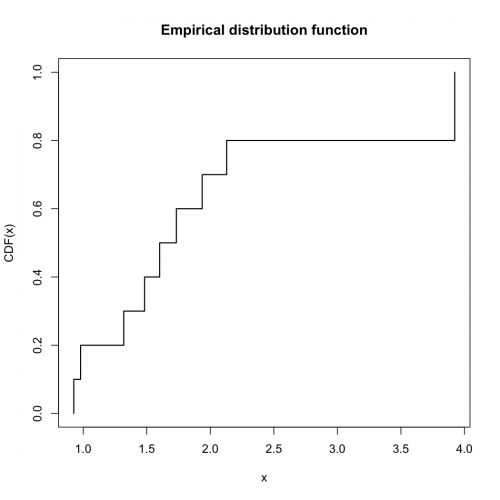
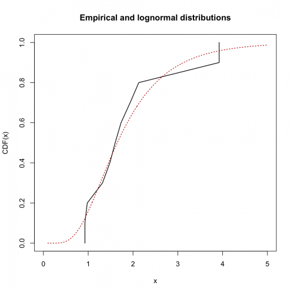
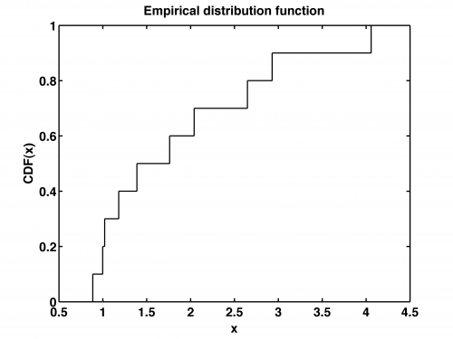
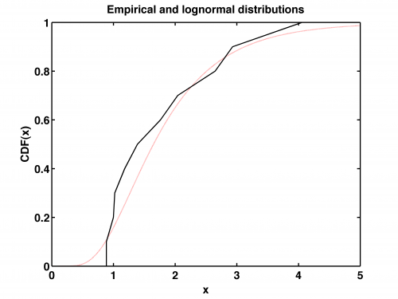

[](http://quantlet.de/)

## [](http://quantlet.de/) **STFloss02** [](http://quantlet.de/)

```yaml

Name of QuantLet : STFloss02

Published in : Statistical Tools for Finance and Insurance

Description : 'Plots the empirical distribution function (edf) of a 10-element log-normally
distributed sample with parameters mu=0.5 and sigma=0.5 and the approximation of the edf by a
continuous, piecewise linear function superimposed on the theoretical distribution function.'

Keywords : 'loss function, Poisson process, approximation, empirical, edf, lognormal, graphical
representation, visualization'

See also : 'Paretopdf, STFloss01, STFloss03, STFloss04, STFloss05, STFloss06, STFloss07, STFloss08,
STFloss09, mef'

Author : Joanna Janczura, Awdesch Melzer

Submitted : Tue, October 09 2012 by Dedy Dwi Prastyo

Example : 'Produces these plots: the empirical distribution function, the empirical and lognormal
distributions.'

```










### R Code:
```r

# clear variables and close windows
rm(list = ls(all = TRUE))
graphics.off()

# Pseudo random numbers
set.seed(25)

r = rlnorm(10, 0.5, 0.5)

edf = function(x) {
    n = length(x)
    x = sort(x)
    a = (1:n - 1)/n
    aa = cbind(x[2:n], a[2:n])
    bb = cbind(x[1:n - 1], a[2:n])
    cc = rbind(aa, bb)
    
    edf = apply(aa, 2, sort)
    end = dim(edf)[1]
    edf = rbind(c(edf[1, 1], 0), edf, c(edf[end, 1], 1))
    return(edf)
}

y = edf(r)

x = y[, 1]
y = y[, 2]

xw = (10:500)/100
w = plnorm(xw, 0.5, 0.5)

plot(x, y, col = "black", type = "s", lty = 1, lwd = 1.5, xlab = "x", ylab = "CDF(x)")
title("Empirical distribution function")

dev.new()
plot(x, y, type = "l", col = "black", lwd = 1.5, xlab = "x", xlim = c(0, 5), ylab = "CDF(x)")
lines(xw, w, col = "red3", lty = 3, lwd = 1.5)
title("Empirical and lognormal distributions")
 

```

### MATLAB Code:
```matlab

% clear variables and close windows
clear all
close all
clc

% Pseudo random numbers
RandStream.setGlobalStream(RandStream('mt19937ar','seed',12));


r=lognrnd(0.5,0.5,10,1);
[y,x] = ecdf(r);
xw = (10:500)./100;
w = logncdf(xw,0.5,0.5);
n = length(x);

stairs(x,y,'k','LineWidth',1.5);
title('Empirical distribution function','FontSize',16,'FontWeight','Bold');
xlabel('x','FontSize',16,'FontWeight','Bold');
ylabel('CDF(x)','FontSize',16,'FontWeight','Bold');
set(gca,'LineWidth',1.6,'FontSize',16,'FontWeight','Bold')
set(gca,'Ytick',[0.0:0.2:1],'YTickLabel',{0.0,0.2,0.4,0.6,0.8,1.0},'FontSize',16,'FontWeight','Bold')
box on

% to save the plot in pdf or png please uncomment next 2 lines:
%print -painters -dpdf -r600 STFloss02_01.pdf
%print -painters -dpng -r600 STFloss02_01.png

figure
plot(xw,w,':r','LineWidth',1.5);
hold on
plot(x,y,'k','LineWidth',1.5);
title('Empirical and lognormal distributions','FontSize',16,'FontWeight','Bold');
xlabel('x','FontSize',16,'FontWeight','Bold');
xlim([0,5])
ylabel('CDF(x)','FontSize',16,'FontWeight','Bold');
set(gca,'LineWidth',1.6,'FontSize',16,'FontWeight','Bold');
set(gca,'Ytick',[0.0:0.2:1],'YTickLabel',{0.0,0.2,0.4,0.6,0.8,1.0},'FontSize',16,'FontWeight','Bold')
box on

% to save the plot in pdf or png please uncomment next 2 lines:
%print -painters -dpdf -r600 STFloss02_02.pdf
%print -painters -dpng -r600 STFloss02_02.png
```
