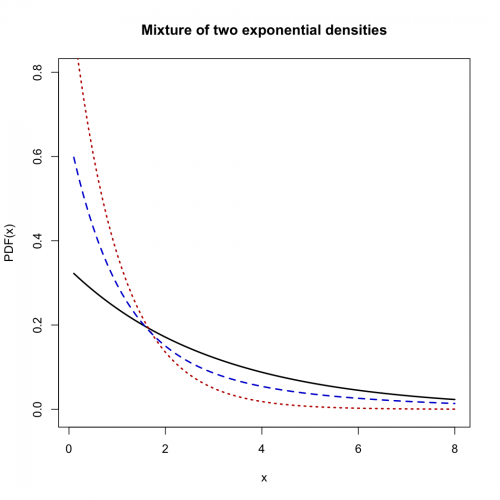
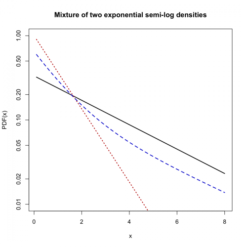
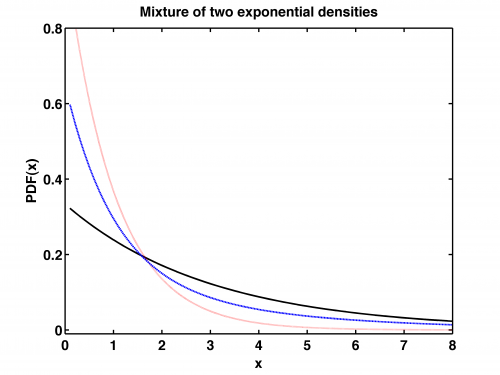
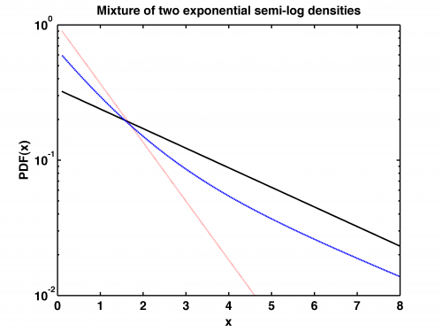

[](http://quantlet.de/)

## [](http://quantlet.de/) **STFloss03** [](http://quantlet.de/)

```yaml

Name of QuantLet : STFloss03

Published in : Statistical Tools for Finance and Insurance

Description : 'Plots a probability density function (pdf) of a mixture of two exponential
distributions with mixing parameter a = 0.5 superimposed on the pdfs of the component distributions
as well as semi-logarithmic plots. In the semi-logarithmic plot, the exponential pdfs are straight
lines with slopes -beta. Note, the curvature of the pdf of the mixture if two exponentials.
Requires mixexppdf.m to run the program (see quantnet).'

Keywords : 'loss function, exponential, approximation, pdf, lognormal, graphical representation,
visualization'

See also : 'Paretopdf, STFloss01, STFloss02, STFloss04, STFloss05, STFloss06, STFloss07, STFloss08,
STFloss09, mef , mixexppdf'

Author : Joanna Janczura, Awdesch Melzer

Submitted : Tue, October 09 2012 by Dedy Dwi Prastyo

Example : 'Produces these plots: a mixture of two exponential densities, a mixture of two
exponential semi-log densities. The exponential pdfs are straight.'

```










### R Code:
```r
# clear all variables and close windows
rm(list = ls(all = TRUE))
graphics.off()

mixexppdf = function(x, alpha, beta1, beta2) {
    # MIXEXPPDF Mixed exponential probability density function (pdf).  Y = MIEXEXPPDF(X,ALPHA,BETA1,BETA2) returns the pdf of
    # the mixed exponential distribution with mixing probability A and distributions parameters BETA1, BETA2, evaluated at the
    # values in X.  For CONTROL=0 the error message is displayed, if the parmeters are negative or a>1.  The default values for
    # A, BETA1, BETA2 are 0.5, 1, 2.
    if (missing(alpha) == T) 
        alpha = 0.5
    if (missing(beta1) == T) 
        beta1 = 1
    if (missing(beta2) == T) 
        beta2 = 2
    if (beta1 <= 0) {
        stop("Non-positive beta1! Please insert a positive beta1!")
    }
    if (beta2 <= 0) {
        stop("Non-positive beta2! Please insert a positive beta2!")
    }
    if (alpha <= 0) {
        stop("Alpha lesser or equal 0! Please insert alpha between 0 and 1!")
    }
    if (alpha >= 1) {
        stop("Alpha greater or equal 1! Please insert alpha between 0 and 1!")
    }
    
    y = matrix(0, dim(x)[1], dim(x)[2])
    pos = x > 0
    y[pos] = alpha * beta1 * exp(-beta1 * x[pos]) + (1 - alpha) * beta2 * exp(-beta2 * x[pos])
    return(cbind(y))
}

step = 10

x = cbind((1:(8 * step))/step)

y1 = dexp(x, 1/3)
y2 = dexp(x, 1)
y3 = mixexppdf(x, 0.5, 0.3, 1)

plot(x, y1, col = "black", type = "l", lwd = 2, xlab = "x", ylab = "PDF(x)", ylim = c(-0.01, 0.8))
title("Mixture of two exponential densities")
lines(x, y2, col = "red3", lty = 3, lwd = 2)
lines(x, y3, col = "blue3", lty = 2, lwd = 2)

dev.new()

plot(x, y1, log = "y", col = "black", type = "l", lwd = 2, xlab = "x", ylab = "PDF(x)", frame = T, ylim = c(0.01, 1))
par(new = T)
plot(x, y2, log = "y", axes = F, frame = F, col = "red3", type = "l", lty = 3, lwd = 2, ylab = "", xlab = "", ylim = c(0.01, 
    1))
par(new = T)
plot(x, y3, log = "y", axes = F, frame = F, col = "blue3", type = "l", lty = 2, lwd = 2, ylab = "", xlab = "", ylim = c(0.01, 
    1))
title("Mixture of two exponential semi-log densities") 

```

### MATLAB Code:
```matlab
% clear all variables and close windows
clear all
close all
clc


step = 10;

x=(1:8*step)/step;

y1 = exppdf(x,3);
y2 = exppdf(x,1);
y3 = mixexppdf(x,0.5,0.3,1);


figure(1)
plot(x,y1,'k','LineWidth',2);
hold on
plot(x,y2,':r','LineWidth',2);
plot(x,y3,'--','LineWidth',2);
set(gca,'LineWidth',1.6,'FontSize',16,'FontWeight','Bold');
box on
xlabel('x','FontSize',16,'FontWeight','Bold');
ylabel('PDF(x)','FontSize',16,'FontWeight','Bold');
title('Mixture of two exponential densities','FontSize',16,'FontWeight','Bold');
set(gca,'Ytick',[0.0:0.2:1],'YTickLabel',{0.0,0.2,0.4,0.6,0.8,1.0},'FontSize',16,'FontWeight','Bold')
ylim([-0.01 0.8]);

% to save the plot in pdf or png please uncomment next 2 lines:
% print -painters -dpdf -r600 STFloss03_01.pdf
% print -painters -dpng -r600 STFloss03_01.png


figure(2)
semilogy(x,y1,'k','LineWidth',2);
hold on
semilogy(x,y2,':r','LineWidth',2);
semilogy(x,y3,'--','LineWidth',2);
set(gca,'LineWidth',1.6,'FontSize',16,'FontWeight','Bold');
box on
xlabel('x','FontSize',16,'FontWeight','Bold');
ylabel('PDF(x)','FontSize',16,'FontWeight','Bold');
title('Mixture of two exponential semi-log densities','FontSize',16,'FontWeight','Bold');
ylim([10e-3 10e-1]);

% to save the plot in pdf or png please uncomment next 2 lines:
% print -painters -dpdf -r600 STFloss03_02.pdf
% print -painters -dpng -r600 STFloss03_02.png
```
