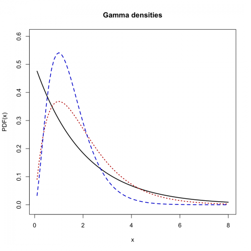
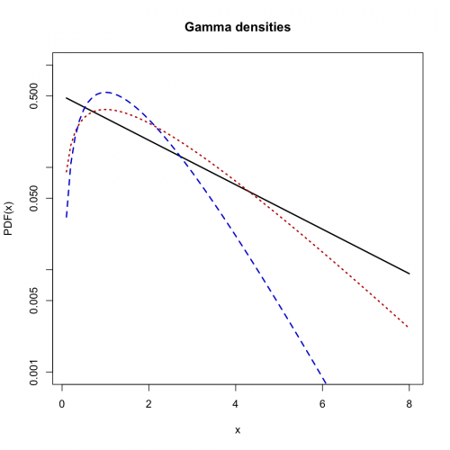
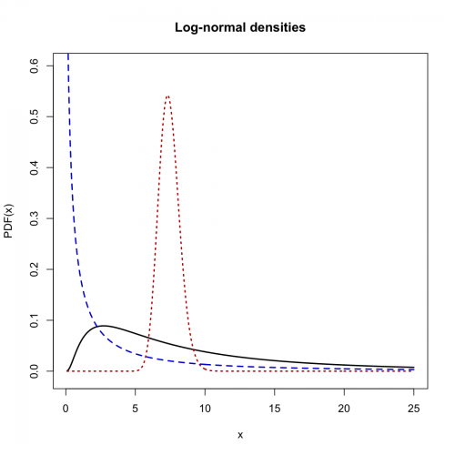
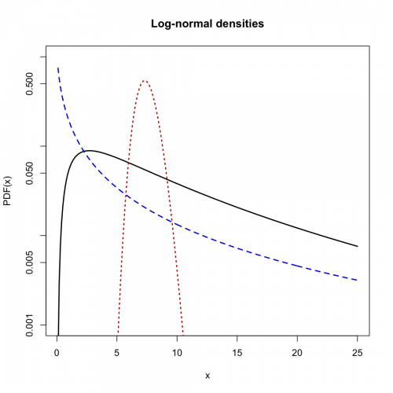
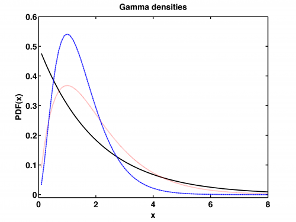
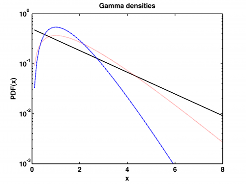
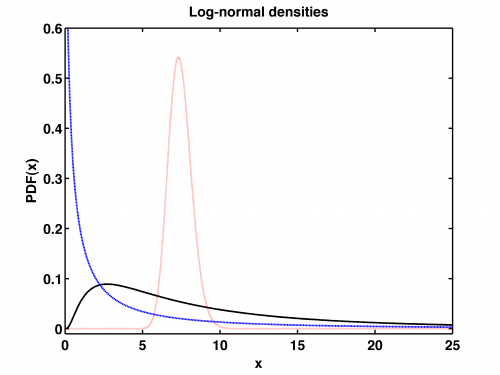
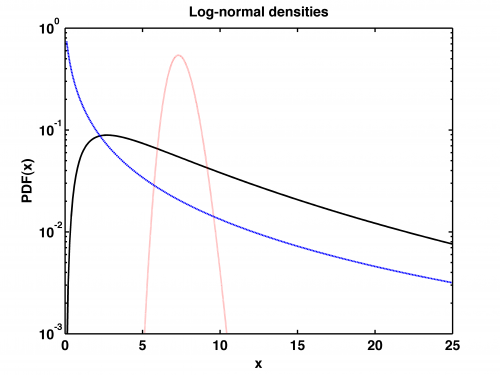

[](http://quantlet.de/)

## [](http://quantlet.de/) **STFloss04** [](http://quantlet.de/)

```yaml

Name of QuantLet : STFloss04

Published in : Statistical Tools for Finance and Insurance

Description : 'Plots three sample gamma pdfs, Gamma(alpha, beta), on linear and Semi-logarithmic
scales. Note, that the first one (black solid line) is an exponential law, while the last one
(dashed blue line) is a chi-square distribution with nu=6 degrees of freedom. It also plots three
sample log-normal pdfs, LogN(mu,sigma), on linear and semi-logarithmic plots. For small sigma the
log-normal distribution resembles the Gaussian.'

Keywords : 'loss function, gamma, pdf, chi-square, lognormal, graphical representation,
visualization'

See also : 'Paretopdf, STFloss01, STFloss02, STFloss03, STFloss05, STFloss06, STFloss07, STFloss08,
STFloss09, mef'

Author : Joanna Janczura, Awdesch Melzer

Submitted : Tue, October 09 2012 by Dedy Dwi Prastyo

Example : 'Produces these plots: the gamma densities and the log-normal densities.'

```


















### R Code:
```r
# clear variables and close windows
rm(list = ls(all = TRUE))
graphics.off()

# gamma densities
step = 10

x = (1:(8 * step))/step
y1 = dgamma(x, shape = 1, scale = 2)
y2 = dgamma(x, shape = 2, scale = 1)
y3 = dgamma(x, shape = 3, scale = 0.5)

# linear plot
plot(x, y1, col = "black", type = "l", lwd = 2, xlab = "x", ylab = "PDF(x)", ylim = c(-0.01, 0.6))
title("Gamma densities")
lines(x, y2, col = "red3", lty = 3, lwd = 2)
lines(x, y3, col = "blue3", lty = 2, lwd = 2)

# semi-logarithmic plot
dev.new()
plot(x, y1, log = "y", col = "black", type = "l", lwd = 2, xlab = "x", ylab = "PDF(x)", ylim = c(0.001, 1))
par(new = T)
plot(x, y2, type = "l", log = "y", axes = F, frame = F, ylab = "", xlab = "", col = "red3", lty = 3, lwd = 2, ylim = c(0.001, 
    1))
par(new = T)
plot(x, y3, log = "y", type = "l", axes = F, frame = F, ylab = "", xlab = "", col = "blue3", lty = 2, lwd = 2, ylim = c(0.001, 
    1))
title("Gamma densities")

# log-normal densities
x = (1:(25 * step))/step

y1 = dlnorm(x, 2, 1)
y2 = dlnorm(x, 2, 0.1)
y3 = dlnorm(x, 0.5, 2)

# linear plot
dev.new()
plot(x, y1, col = "black", type = "l", lwd = 2, xlab = "x", ylab = "PDF(x)", ylim = c(-0.01, 0.6))
title("Log-normal densities")
lines(x, y2, col = "red3", lty = 3, lwd = 2)
lines(x, y3, col = "blue3", lty = 2, lwd = 2)

# semi-logarithmic plot

dev.new()
plot(x, y1, log = "y", col = "black", type = "l", lwd = 2, xlab = "x", ylab = "PDF(x)", ylim = c(0.001, 1))
par(new = T)
plot(x, y2, type = "l", log = "y", axes = F, frame = F, ylab = "", xlab = "", col = "red3", lty = 3, lwd = 2, ylim = c(0.001, 
    1))
par(new = T)
plot(x, y3, log = "y", type = "l", axes = F, frame = F, ylab = "", xlab = "", col = "blue3", lty = 2, lwd = 2, ylim = c(0.001, 
    1))
title("Log-normal densities") 

```

### MATLAB Code:
```matlab
% clear variables and close windows
clear all
close all
clc

step=10;

x=(1:8*step)/step;
y1=gampdf(x,1,2);
y2=gampdf(x,2,1);
y3=gampdf(x,3,0.5);

figure(1)
plot(x,y1,'k','LineWidth',2);
hold on
plot(x,y2,':r','LineWidth',2);
plot(x,y3,'--','LineWidth',2);
xlabel('x','FontSize',16,'FontWeight','Bold');
ylabel('PDF(x)','FontSize',16,'FontWeight','Bold');
set(gca,'Ytick',[0.0:0.1:0.6],'YTickLabel',[0.0:0.1:0.6],'FontSize',16,'FontWeight','Bold')
set(gca,'Xtick',[0:2:8],'XTickLabel',{0,2,4,6,8},'FontSize',16,'FontWeight','Bold')
title('Gamma densities','FontSize',16,'FontWeight','Bold');
ylim([-0.01 0.6]);
set(gca,'LineWidth',1.6,'FontSize',16,'FontWeight','Bold');
box on
% to save the plot in pdf or png please uncomment next 2 lines:
%print -painters -dpdf -r600 STFloss04_01.pdf
%print -painters -dpng -r600 STFloss04_01.png

figure(2)
semilogy(x,y1,'k','LineWidth',2);
hold on
semilogy(x,y2,':r','LineWidth',2);
semilogy(x,y3,'--','LineWidth',2);

ylim([10e-4, 10e-1]);
set(gca,'Xtick',[0:2:8],'XTickLabel',{0,2,4,6,8},'FontSize',16,'FontWeight','Bold')
set(gca,'LineWidth',1.6,'FontSize',16,'FontWeight','Bold');
box on

xlabel('x','FontSize',16,'FontWeight','Bold');
ylabel('PDF(x)','FontSize',16,'FontWeight','Bold');
title('Gamma densities','FontSize',16,'FontWeight','Bold');
% to save the plot in pdf or png please uncomment next 2 lines:
%print -painters -dpdf -r600 STFloss04_02.pdf
%print -painters -dpng -r600 STFloss04_02.png

figure(3)

x=(1:25*step)/step;
y1=lognpdf(x,2,1);
y2=lognpdf(x,2,0.1);
y3=lognpdf(x,0.5,2);

plot(x,y1,'k' ,'LineWidth',2);
hold on
plot(x,y2,':r' ,'LineWidth',2);
plot(x,y3,'--' ,'LineWidth',2);
xlim([0 25]);
ylim([-0.01 0.6])

xlabel('x','FontSize',16,'FontWeight','Bold');
ylabel('PDF(x)','FontSize',16,'FontWeight','Bold');
title('Log-normal densities','FontSize',16,'FontWeight','Bold');
set(gca,'Ytick',[0.0:0.1:0.6],'YTickLabel',[0.0:0.1:0.6],'FontSize',16,'FontWeight','Bold')
set(gca,'Xtick',[0:5:25],'XTickLabel',[0:5:25],'FontSize',16,'FontWeight','Bold')
set(gca,'LineWidth',1.6,'FontSize',16,'FontWeight','Bold');
box on
% to save the plot in pdf or png please uncomment next 2 lines:
%print -painters -dpdf -r600 STFloss04_03.pdf
%print -painters -dpng -r600 STFloss04_03.png

figure(4)

semilogy(x,y1,'k' ,'LineWidth',2);
hold on
semilogy(x,y2,':r' ,'LineWidth',2);
semilogy(x,y3,'--' ,'LineWidth',2);
xlim([0 25]);
ylim([10e-4 10e-1])

xlabel('x','FontSize',16,'FontWeight','Bold');
ylabel('PDF(x)','FontSize',16,'FontWeight','Bold');
title('Log-normal densities','FontSize',16,'FontWeight','Bold');
set(gca,'Xtick',[0:5:25],'XTickLabel',[0:5:25],'FontSize',16,'FontWeight','Bold')
set(gca,'LineWidth',1.6,'FontSize',16,'FontWeight','Bold');
box on

% to save the plot in pdf or png please uncomment next 2 lines:
%print -painters -dpdf -r600 STFloss04_04.pdf
%print -painters -dpng -r600 STFloss04_04.png
```
