[](http://quantlet.de/)

## [](http://quantlet.de/) **STFloss06** [](http://quantlet.de/)

```yaml

Name of QuantLet : STFloss06

Published in : Statistical Tools for Finance and Insurance

Description : 'Plots three sample Burr pdfs, Burr(alpha, lambda, tau), on linear and
double-logarithmic scales and three sample Weibull pdfs, Weib(beta, tau), on a linear and
semi-logarithmic scales. We can see that for tau<1 the tails are much heavier and they look like
power-law. Requires Burrpdf.m to run the program (see quantnet).'

Keywords : loss function, weibull, pdf, graphical representation, visualization

See also : 'Burrpdf, STFloss01, STFloss02, STFloss03, STFloss04, STFloss05, STFloss07, STFloss08,
STFloss09, mef'

Author : Joanna Janczura, Awdesch Melzer

Submitted : Tue, October 09 2012 by Dedy Dwi Prastyo

Example : Produces these plots of the Burr and Weibull densities.

```


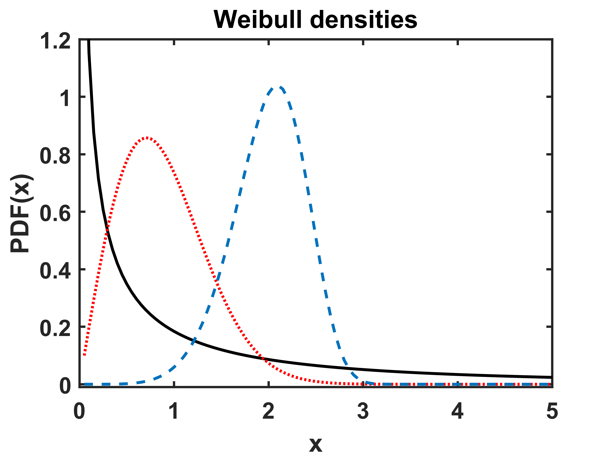

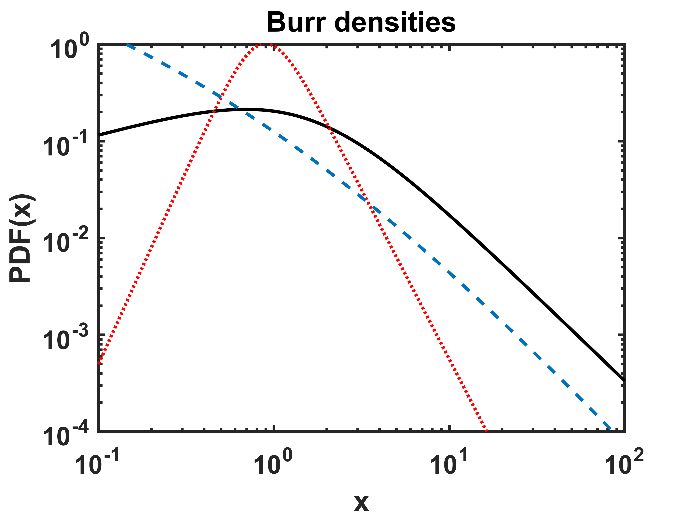

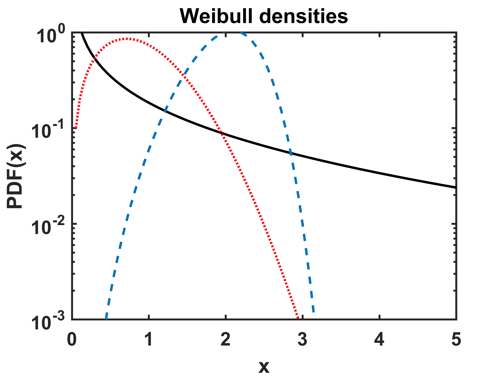

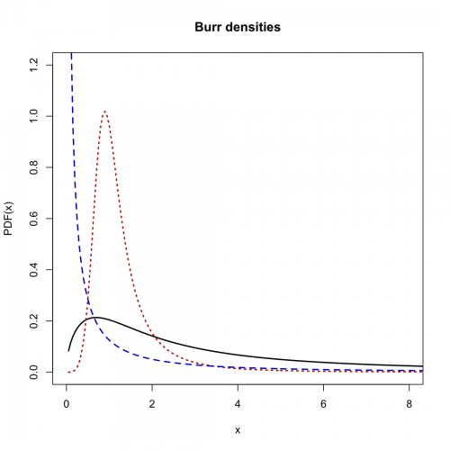

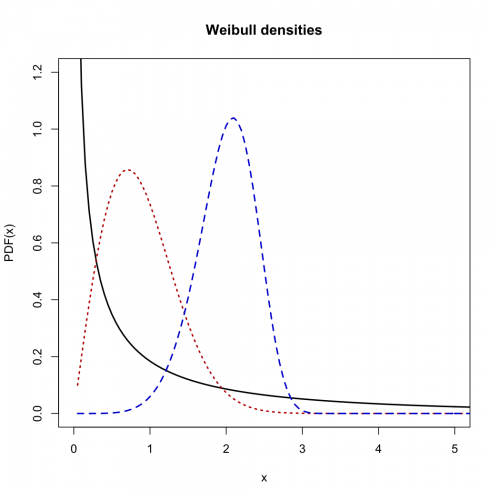

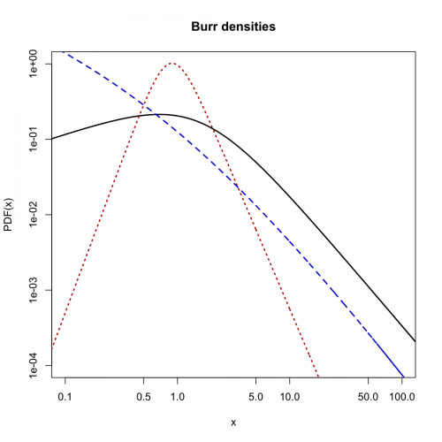

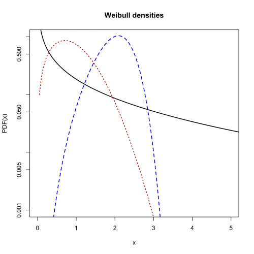

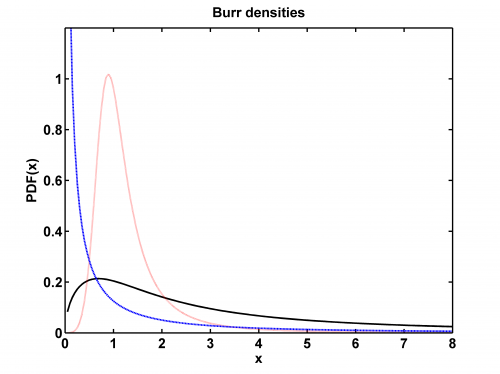

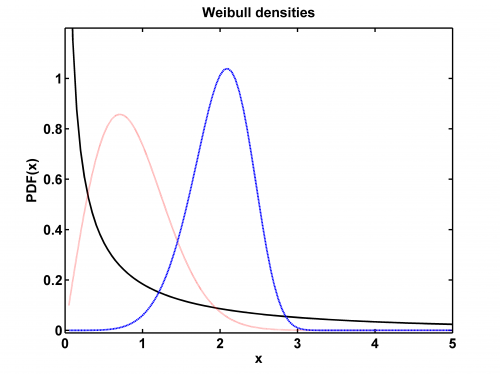

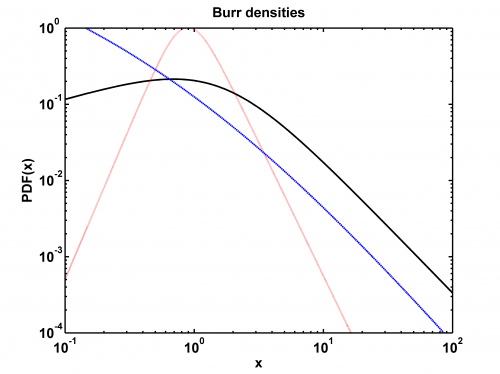

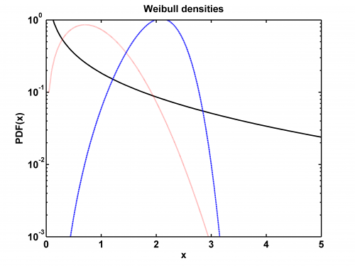


### R Code:
```r
# clear variables and close windows
rm(list = ls(all = TRUE))
graphics.off()

Burrpdf = function(x, alpha, lambda, tau) {
    # BURRPDF Burr probability density function (pdf).  Y = BURRPDF(X,ALPHA,LAMBDA,TAU) returns the pdf of the Burr distribution
    # with parameters ALPHA,LAMBDA,TAU, evaluated at the values in X.  For CONTROL=0 the error message is displayed, if the
    # parmeters are negative.  The default values for the parameters ALPHA, LAMBDA, TAU, CONTROL are 1, 1, 2, 0, respectively.
    if (missing(tau) == TRUE) {
        tau = 2
    }
    if (missing(lambda) == TRUE) {
        lambda = 1
    }
    if (missing(alpha) == TRUE) {
        alpha = 1
    }
    if (missing(x) == TRUE) {
        stop("stats:normpdf:TooFewInputs! Input argument X is undefined.")
    }
    if (lambda <= 0) {
        stop("Non-positive lambda!")
    }
    if (alpha <= 0) {
        stop("Non-positive alpha!")
    }
    
    x = cbind(x)
    y = matrix(0, dim(x)[1], dim(x)[2])
    pos = x > 0
    y[pos] = tau * alpha * lambda^alpha * x[pos]^(tau - 1) * (lambda + x[pos]^tau)^(-alpha - 1)
}

step = 20

# Burr densities
x = (1:(144 * step))/step
y1 = Burrpdf(x, 0.5, 2, 1.5)
y2 = Burrpdf(x, 0.5, 0.5, 5)
y3 = Burrpdf(x, 2, 1, 0.5)


# Burr linear plot
plot(x, y1, col = "black", type = "l", lwd = 2, xlab = "x", ylab = "PDF(x)", ylim = c(0, 1.2), xlim = c(0, 8))
title("Burr densities")
lines(x, y2, col = "red3", lty = 3, lwd = 2)
lines(x, y3, col = "blue3", lty = 2, lwd = 2)

# Burr double-logarithmic densities
dev.new()
plot(x, y1, log = "xy", col = "black", type = "l", lwd = 2, xlab = "x", ylab = "PDF(x)", ylim = c(1e-04, 1), xlim = c((0.1), 
    (100)))
par(new = T)
plot(x, y2, type = "l", log = "xy", axes = F, frame = F, ylab = "", xlab = "", col = "red3", lty = 3, lwd = 2, ylim = c(1e-04, 
    1), xlim = c((0.1), (100)))
par(new = T)
plot(x, y3, type = "l", log = "xy", axes = F, frame = F, ylab = "", xlab = "", col = "blue3", lty = 2, , lwd = 2, ylim = c(1e-04, 
    1), xlim = c((0.1), (100)))
title("Burr densities")

# Weibull densities
y1 = dweibull(x, shape = 0.5, scale = (1^(-1/0.5)))
y2 = dweibull(x, shape = 2, scale = (1^(-1/2)))
y3 = dweibull(x, shape = 6, scale = (0.01^(-1/6)))

# Weibull linear plot
dev.new()
plot(x, y1, col = "black", type = "l", lwd = 2, xlab = "x", ylab = "PDF(x)", ylim = c(0, 1.2), xlim = c(0, 5))
title("Weibull densities")
lines(x, y2, col = "red3", lty = 3, lwd = 2)
lines(x, y3, col = "blue3", lty = 2, lwd = 2)

# Weibull semi-logarithmic plot
dev.new()
plot(x, y1, log = "y", col = "black", type = "l", lwd = 2, xlab = "x", ylab = "PDF(x)", ylim = c(0.001, 1), xlim = c(0, 5))
par(new = T)
plot(x, y2, type = "l", log = "y", axes = F, frame = F, ylab = "", xlab = "", col = "red3", lty = 3, lwd = 2, ylim = c(0.001, 
    1), xlim = c(0, 5))
par(new = T)
plot(x, y3, type = "l", log = "y", axes = F, frame = F, ylab = "", xlab = "", col = "blue3", lty = 2, , lwd = 2, ylim = c(0.001, 
    1), xlim = c(0, 5))
title("Weibull densities") 

```

### MATLAB Code:
```matlab
% ---------------------------------------------------------------------
% clear variables and close windows
clear all
close all
clc


step=20;

% Burr densities
x=(1:144*step)/step;
y1=Burrpdf(x,0.5,2,1.5);
y2=Burrpdf(x,0.5,0.5,5);
y3=Burrpdf(x,2,1,0.5);

figure(1)
plot(x,y1,'k','LineWidth',2);
hold on
plot(x,y2,':r','LineWidth',2);
plot(x,y3,'--','LineWidth',2);
xlim([0,8])
xlabel('x','FontSize',16,'FontWeight','Bold');
ylabel('PDF(x)','FontSize',16,'FontWeight','Bold');
title('Burr densities','FontSize',16,'FontWeight','Bold');
ylim([0 1.2]);
set(gca,'LineWidth',1.6,'FontSize',16,'FontWeight','Bold');
box on
% to save the plot in pdf or png please uncomment next 2 lines:
print -painters -dpdf -r600 STFloss06_01.pdf
print -painters -dpng -r600 STFloss06_01.png

% Weibull densities
x=(1:144*step)/step;
y1=wblpdf(x,1.^(-1./0.5),0.5);
y2=wblpdf(x,1.^(-1/2),2);
y3=wblpdf(x,0.01.^(-1/6),6);


figure(2)
plot(x,y1,'k','LineWidth',2);
hold on
plot(x,y2,':r','LineWidth',2);
plot(x,y3,'--','LineWidth',2);
xlim([0,5])
xlabel('x','FontSize',16,'FontWeight','Bold');
ylabel('PDF(x)','FontSize',16,'FontWeight','Bold');
title('Weibull densities','FontSize',16,'FontWeight','Bold');
ylim([-0.01 1.2]);
set(gca,'LineWidth',1.6,'FontSize',16,'FontWeight','Bold');
box on
% to save the plot in pdf or png please uncomment next 2 lines:
print -painters -dpdf -r600 STFloss06_02.pdf
print -painters -dpng -r600 STFloss06_02.png

% Burr double-logarithmic densities
figure(3)

x=(1:144*step)/step;
y1=Burrpdf(x,0.5,2,1.5);
y2=Burrpdf(x,0.5,0.5,5);
y3=Burrpdf(x,2,1,0.5);

loglog(x,y1,'k','LineWidth',2);
hold on
loglog(x,y2,':r','LineWidth',2);
loglog(x,y3,'--','LineWidth',2);

xlabel('x','FontSize',16,'FontWeight','Bold');
ylabel('PDF(x)','FontSize',16,'FontWeight','Bold');
title('Burr densities','FontSize',16,'FontWeight','Bold');
ylim([10e-5, 10e-1]);
xlim([10e-2, 10e1]);
set(gca,'LineWidth',1.6,'FontSize',16,'FontWeight','Bold');

box on
% to save the plot in pdf or png please uncomment next 2 lines:
%print -painters -dpdf -r600 STFloss06_03.pdf
%print -painters -dpng -r600 STFloss06_03.png

% Weibull double-logarithmic densities

x=(1:144*step)/step;
y1=wblpdf(x,1.^(-1./0.5),0.5);
y2=wblpdf(x,1.^(-1/2),2);
y3=wblpdf(x,0.01.^(-1/6),6);


figure(4)
semilogy(x,y1,'k','LineWidth',2);
hold on
semilogy(x,y2,':r','LineWidth',2);
semilogy(x,y3,'--','LineWidth',2);

xlim([0,5])
xlabel('x','FontSize',16,'FontWeight','Bold');
ylabel('PDF(x)','FontSize',16,'FontWeight','Bold');
title('Weibull densities','FontSize',16,'FontWeight','Bold');
ylim([10e-4 10e-1]);

set(gca,'LineWidth',1.6,'FontSize',16,'FontWeight','Bold');
box on
% to save the plot in pdf or png please uncomment next 2 lines:
%print -painters -dpdf -r600 STFloss06_04.pdf
%print -painters -dpng -r600 STFloss06_04.png
```
