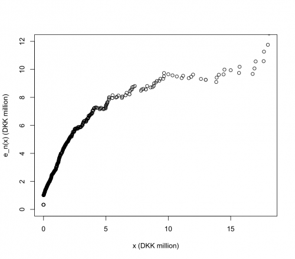
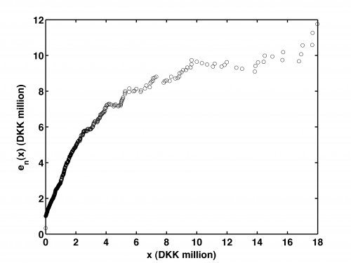

[](http://quantlet.de/)

## [](http://quantlet.de/) **STFloss08** [](http://quantlet.de/)

```yaml

Name of QuantLet : STFloss08

Published in : Statistical Tools for Finance and Insurance

Description : 'Plots the empirical mean excess function e_n(x) for the Danish fire loss data
(dfl.dat or dfl.txt). Requires samplemef.m from the Quantnet website.'

Keywords : loss function, empirical, scatterplot, graphical representation, visualization

See also : 'STFloss01, STFloss02, STFloss03, STFloss04, STFloss05, STFloss06, STFloss07, STFloss09,
samplemef'

Author : Joanna Janczura

Submitted : Fri, December 07 2012 by Dedy Dwi Prastyo

Datafile : dfl.dat, dfl.txt

Example : 'Produces this plot of the empirical mean excess function e_n(x) in DKK million for the
Danish fire loss data.'

```






### R Code:
```r
# clear variables and close windows
rm(list = ls(all = TRUE))
graphics.off()

samplemef = function(data, xaxis) {
    # SAMPLEMEF Sample mean excess function.  RES = SAMPLEMEF (DATA, XAXIS) returns the value of the sample mean excess function
    # for the vector DATA in the points from vector XAXIS.
    
    
    sorteddata = sort(data)
    dataLength = length(sorteddata)
    resLength = length(xaxis)
    res = xaxis
    
    
    i = 0
    valuesOnTheLeft = 0
    smef = mean(sorteddata[1:dataLength])
    
    while (i < resLength) {
        i = i + 1
        while (sorteddata[valuesOnTheLeft + 1] < xaxis[i]) {
            valuesOnTheLeft = valuesOnTheLeft + 1
        }
        smef = mean(sorteddata[(valuesOnTheLeft + 1):dataLength])
        res[i] = smef - xaxis[i]
    }
    return(res)
}


# load the data
data = read.table("dfl.txt")
data = data[, 5]
xaxis = sort(data)

# calculate empirical mean excess function on dfl data
sampleMef = samplemef(data, xaxis)
sampleMef = sampleMef/1e+06

xaxis = xaxis/1e+06

plot(xaxis, sampleMef, col = "black", xlab = "x (DKK million)", ylab = "e_n(x) (DKK million)", xlim = c(0, 18), ylim = c(0, 
    max(sampleMef))) 

```

### MATLAB Code:
```matlab

% clear variables and close windows
clear all
close all
clc


% load the data
data = load('dfl.dat','-ascii');
data = data(:,5);
xaxis = sort(data);

sampleMef = samplemef (data, xaxis);
sampleMef = sampleMef / 1e6;

xaxis = xaxis / 1e6;
figure
plot(xaxis,sampleMef,'ok');
ylabel('e_n(x) (DKK million)','FontSize',16,'FontWeight','Bold');
xlabel('x (DKK million)','FontSize',16,'FontWeight','Bold');
xlim([0,18]);
set(gca,'LineWidth',1.6,'FontSize',16,'FontWeight','Bold');
set(gca,'Ytick',[0:2:12],'YTickLabel',{0,2,4,6,8,10,12},'FontSize',16,'FontWeight','Bold')
box on

% to save the plot in pdf or png please uncomment next 2 lines:
%print -painters -dpdf -r600 STFloss08.pdf
%print -painters -dpng -r600 STFloss08.png

```
