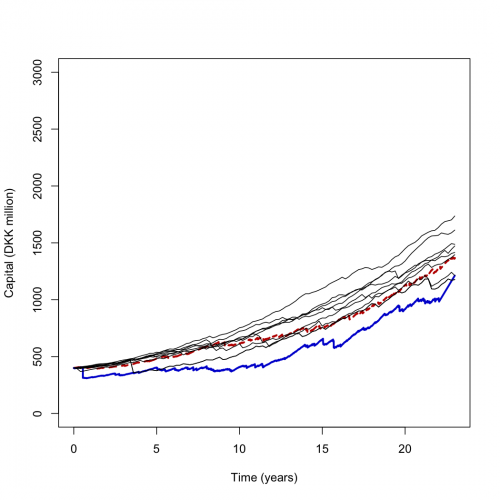
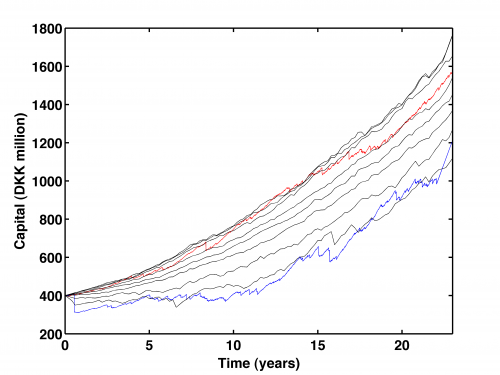
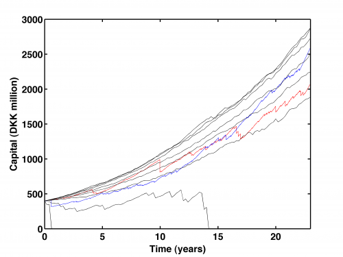

[](http://quantlet.de/)

## [](http://quantlet.de/) **STFloss10** [](http://quantlet.de/)

```yaml

Name of QuantLet : STFloss10

Published in : Statistical Tools for Finance and Insurance

Description : 'Plots the Danish fire data simulation results for a NHPP with log-normal claim sizes
and a NHPP with Burr / Pareto claim sizes. The lines are the sample 0.001, 0.01, 0.05, 0.25, 0.50,
0.75, 0.95, 0.99, 0.999-quantile lines based on 3000 trajectories of the risk process (dfl.dat /
dfl.txt). Requires simNHPPRP.m, simNHPPRPRT.m, quantiles.m, Paretornd.m, simNHPP.m, Burrrnd.m,
mixexprnd.m, simHPP.m from the Quantnet website.'

Keywords : pareto, model, loss function, empirical, graphical representation, visualization, risk

See also : Burrrnd, Paretornd, mixexprnd, quantiles, simHPP, simNHPP, simNHPPRP, simNHPPRPRT

Author : Joanna Janczura, Awdesch Melzer

Submitted : Fri, December 07 2012 by Dedy Dwi Prastyo

Datafile : dfl.dat, dfl.txt

Example : Produces these plots of Capital (DKK million) over time.

```









### R Code:
```r

# clear variables and close windows
rm(list = ls(all = TRUE))
graphics.off()

##################################################### Subroutine simHPP ################## simulation of a homogeneous poisson process ####

simHPP = function(lambda, T, N) {
    # SIMHPP Homogeneous Poisson process.  Y = SIMHPP(lambda,T,N) generates N trajectories of the homogeneous Poisson process
    # with intensity LAMBDA. T is the time horizon.
    
    if (lambda <= 0) {
        stop("simHPP: Lambda must be a positive real number")
    }
    if (T <= 0) {
        stop("simHPP: T must be a positive real number")
    }
    EN = rpois(n = N, lambda = (lambda * T))
    max(EN)
    y = T * matrix(1, (max(EN) + 1), N)
    i = 1
    while (i <= N) {
        y[1, i] = 0
        if (EN[i] > 0) {
            y[2:(EN[i] + 1), i] = sort(T * runif(EN[i], 0, 1))
        }
        i = i + 1
    }
    return(y)
}

########################################################## Subroutine simNHPP ###################### simulation of a non-homogeneous poisson process #####

simNHPP = function(lambda, parlambda, T, N) {
    # SIMNHPP Non-homogeneous Poisson process.  Y = SIMNHPP(lambda,parlambda,T,N) generates N trajectories of the
    # non-homogeneous Poisson process with intensity specified by LAMBDA (0 - sine function, 1 - linear function, 2 - sine
    # square function) with paramters in PARLAMBDA. T is the time horizon. The function usues thining method.
    
    a = parlambda[1]
    b = parlambda[2]
    if (a <= 0) {
        stop("simNHPP: a must be a positive real number")
    }
    if (a + b <= 0) {
        stop("simNHPP: b does not fulfill special condition")
    }
    if (T <= 0) {
        stop("simNHPP: T must be a positive real number")
    }
    if (lambda == 0) {
        c = parlambda[3]
        JM = simHPP(a + b, T, N)
    } else if (lambda == 1) {
        JM = simHPP(a + b * T, T, N)
    } else if (lambda == 2) {
        c = parlambda[3]
        JM = simHPP(a + b, T, N)
    }
    n = nrow(JM)
    m = ncol(JM)
    i = 1
    y = T * matrix(1, n, N)
    while (i <= N) {
        pom = subset(JM, JM[, i] < T)
        poml = nrow(pom)
        pom = pom[2:poml]
        U = runif(length(pom), 0, 1)
        
        if (lambda == 0) {
            lambdat = (a + b * sin(2 * pi * (pom + c)))/(a + b)
        } else if (lambda == 1) {
            lambdat = (a + b * pom)/(a + b * T)
        } else if (lambda == 2) {
            lambdat = (a + b * sin(2 * pi * (pom + c))^2)/(a + b)
        }
        
        pom = subset(pom, U < lambdat)
        EN = length(pom)
        y[1, i] = 0
        y[2:(EN + 1), i] = pom
        i = i + 1
    }
    return(y)
}

###################################### Subroutine simNHPPRP ######## simulation of a risk process ####

simNHPPRP = function(u, theta, lambda, parlambda, distrib, params, T, N) {
    
    # SIMNHPPRP Simulated trajectories of the risk process.  [t,y]=SIMNHPPRP(u,theta,lambda,parlambda,distrib,params,T,N)
    # returns N simulated trajectories of the risk process with claim sizes from the distribution specified in DISTRIB with
    # parameters in PARAMS. The claim arrival process corresponds to the non-homogeneous Poisson process with inensity specified
    # by LAMBDA (0 - sine function, 1 - linear function, 3 - sine square function) with parameters in PARLAMBDA. THETA is the
    # relative safety loading, U the initial capital and T the time horizon.
    
    poisproc = simNHPP(lambda, parlambda, T, N)
    rpp = nrow(poisproc)
    cpp = ncol(poisproc)
    losses = matrix(0, 2 * rpp - 1, cpp)
    
    a = parlambda[1]
    b = parlambda[2]
    
    if (lambda == 0) {
        c = parlambda[3]
        ct = (1 + theta) * (a * poisproc + b/(2 * pi) * cos(2 * pi * c) - b/(2 * pi) * cos(2 * pi * (poisproc + c)))
    } else if (lambda == 1) {
        ct = (1 + theta) * (a * poisproc + b/2 * poisproc^2)
    } else if (lambda == 3) {
        c = parlambda[3]
        ct = (1 + theta) * (a * poisproc + b * (0.5 * poisproc - 1/(8 * pi) * sin(4 * pi * (poisproc + c)) + 1/(8 * pi) * sin(4 * 
            pi * c)))
    }
    
    if (distrib == "Burr") {
        ct = ct * params[2]^(1/params[3]) * exp(gamma(1 + 1/params[3]) + gamma(params[1] - 1/params[3]) - gamma(params[1]))
        # check dimensions
        i = 1
        while (i <= N) {
            aux = which(poisproc[, i] == T)
            aux = aux[1]  # take only first index
            if (aux > 0) {
                laux = cumsum(Burrrnd(params[1], params[2], params[3], aux - 1, 1))
                end = length(laux)
                losses[1:(2 * aux - 1), i] = sort(c(0, 0, laux, laux[1:(end - 1)]))
                endl = 2 * rpp - 1
                losses[(2 * aux):endl, i] = laux[end]
            } else {
                losses[1:rpp, i] = matrix(0, rpp, 1)
            }
            i = i + 1
        }
    } else if (distrib == "exponential") {
        ct = ct/params[1]
        i = 1
        while (i <= N) {
            aux = which(poisproc[, i] == T)
            aux = aux[1]  # first index
            if (aux > 0) {
                laux = cumsum(rexp(n = (aux - 1), rate = 1/params[1]))
                end = length(laux)
                endl = 2 * rpp - 1
                losses[1:(2 * aux - 1), i] = sort(c(0, 0, laux, laux[1:(end - 1)]))
                losses[(2 * aux):endl, i] = laux[end]
            }
            i = i + 1
        }
    } else if (distrib == "gamma") {
        ct = ct * params[1]/params[2]
        i = 1
        while (i <= N) {
            aux = which(poisproc[, i] == T)
            aux = aux[1]  # first index
            if (aux > 0) {
                laux = cumsum(rgamma(n = (aux - 1), shape = params[1], rate = params[2], scale = (1/params[2]), aux - 1, 1))
                end = length(laux)
                endl = 2 * rpp - 1
                losses[1:(2 * aux - 1), i] = sort(c(0, 0, laux, laux[1:(end - 1)]))
                losses[(2 * aux):endl, i] = laux[end]
            }
            i = i + 1
        }
    } else if (distrib == "lognormal") {
        ct = ct * exp(params[1] + params[2]^2/2)
        i = 1
        while (i <= N) {
            aux = which(poisproc[, i] == T)
            aux = aux[1]  # first index
            if (aux > 0) {
                laux = cumsum(rlnorm(n = (aux - 1), meanlog = params[1], sdlog = params[2]))
                end = length(laux)
                endl = 2 * rpp - 1
                losses[1:(2 * aux - 1), i] = sort(c(0, 0, laux, laux[1:(end - 1)]))
                losses[(2 * aux):endl, i] = laux[end]
            }
            i = i + 1
        }
    } else if (distrib == "mixofexps") {
        ct = ct * (params[1]/params[2] + (1 - params[1])/params[3])
        i = 1
        while (i <= N) {
            aux = which(poisproc[, i] == T)
            aux = aux[1]  # first index
            if (aux > 0) {
                laux = cumsum(mixexprnd(params[1], params[2], params[3], aux - 1, 1))
                end = length(laux)
                endl = 2 * rpp - 1
                losses[1:(2 * aux - 1), i] = sort(c(0, 0, laux, laux[1:(end - 1)]))
                losses[(2 * aux):endl, i] = laux[end]
            }
            i = i + 1
        }
    } else if (distrib == "Pareto") {
        ct = ct * params[2]/(params[1] - 1)
        i = 1
        while (i <= N) {
            aux = which(poisproc[, i] == T)
            aux = aux[1]  # first index
            if (aux > 0) {
                laux = cumsum(Paretornd(params[1], params[2], aux - 1, 1))
                end = length(laux)
                endl = 2 * rpp - 1
                losses[1:(2 * aux - 1), i] = sort(c(0, 0, laux, laux[1:(end - 1)]))
                losses[(2 * aux):endl, i] = laux[end]
            }
            i = i + 1
        }
    } else if (distrib == "Weibull") {
        ct = ct * exp(gamma(1 + 1/params[2]))/params[1]^(1/params[2])
        i = 1
        while (i <= N) {
            aux = which(poisproc[, i] == T)
            aux = aux[1]  # first index
            if (aux > 0) {
                laux = cumsum(rweibull(n = (aux - 1), scale = params[1]^(-1/params[2]), shape = params[2]))
                end = length(laux)
                endl = 2 * rpp - 1
                losses[1:(2 * aux - 1), i] = sort(c(0, 0, laux, laux[1:(end - 1)]))
                losses[(2 * aux):endl, i] = laux[end]
            }
            i = i + 1
        }
    }
    end = nrow(ct)
    if (ncol(ct) > 1) {
        ctt = rbind(ct[2:end, ], ct)
        cts = matrix(0, nrow(ctt), ncol(ctt))
        for (i in 1:N) {
            cts[, i] = sort(ctt[, i])
        }
        y = u + cts - losses
    } else {
        y = u + sort(c(ct[2:end, ], ct)) - losses
    }
    if (any(y < 0)) {
        
        ind = which(y < 0, arr.ind = TRUE)
        
        dind = matrix(0, 1, N)
        for (i in 1:N) {
            
            dd = subset(ind, ind[, 2] == i)
            
            dind[, i] = min(dd[, 1])
            
        }
        dcol = which(dind != Inf)
        dind = dind[dind != Inf]
        index = cbind(dind, dcol)  # first index
        
        end = nrow(as.matrix(y))
        for (i in 1:nrow(index)) {
            y[index[i, 1]:end, index[i, 2]] = 0
        }
    }
    
    end = nrow(poisproc)
    if (ncol(poisproc) > 1) {
        t = rbind(poisproc[2:end, ], poisproc)
        tsort = matrix(0, nrow(t), ncol(t))
        for (i in 1:N) {
            tsort[, i] = sort(t[, i])
        }
        t = tsort
    } else {
        t = sort(c(poisproc[2:end, ], poisproc))
    }
    
    return(list(y = y, t = t))
}


###################################### Subroutine mixexprnd ######## simulates mixed exponential #### random numbers ###########
mixexprnd = function(p, beta1, beta2, n, m) {
    # MIXEXPRND Random arrays from the mixed exponential distribution.  Y = MIXEXPRND(P,BETA1,BETA2,N,M) returns an M-by-N array
    # of random numbers chosen from the mixed exponential distribution with parameters P, BETA1, BETA2.  The default values for
    # A, BETA1, BETA2, N, M are 0.5, 1, 2, 1, 1, respectively.  MIXEXPRND uses the exponential number generator.
    
    if (missing(p)) {
        p = 0.5
    }
    if (missing(beta1)) {
        beta1 = 1
    }
    if (missing(beta2)) {
        beta2 = 2
    }
    y = rexp(n * m, rate = (1/beta2))
    aux = which(runif(n * m, 0, 1) <= p)
    
    if (!missing(aux)) {
        y[aux] = rexp(length(aux), 1/beta1)
    }
    
    y = matrix(y, n, m)
    return(y)
}

###################################### Subroutine Paretornd ######## simulates random numbers from ### the Pareto distribution ######


Paretornd = function(alpha, lambda, n, m) {
    # PARETORND Random arrays from Pareto distribution.  Y = PARETORND(ALPHA,LAMBDA,N,M) returns an M-by-N array of random
    # numbers chosen from the Pareto distribution with parameters ALPHA, LAMBDA.  The default values for ALPHA, LAMBDA, N, M 1,
    # 1, 1, 1, respectively.  PARETORND uses the inversion method.
    
    if (missing(m)) {
        m = 1
    }
    if (missing(n)) {
        n = 1
    }
    if (missing(lambda)) {
        lambda = 1
    }
    if (missing(alpha)) {
        alpha = 1
    }
    u = matrix(0, n, m)
    for (i in 1:m) {
        u[, i] = lambda * (runif(n, 0, 1)^(-1/alpha) - 1)
    }
    y = u
    return(y)
}


###################################### Subroutine Burrrnd ######### simulates random numbers from ### the Burr distribution #######

Burrrnd = function(alpha, lambda, tau, n, m) {
    # BURRRND Random arrays from Burr distribution.  R = BURRRND(ALPHA,LAMBDA,TAU,N,M) returns an M-by-N array of random numbers
    # chosen from the Burr distribution with parameters ALPHA, LAMBDA, TAU.  The default values for the parameters ALPHA,
    # LAMBDA, TAU, M, N are 1, 1, 2, 1, 1, respectively.  BURRRND uses the inversion method.
    
    
    if (missing(m)) {
        m = 1
    }
    if (missing(n)) {
        n = 1
    }
    if (missing(tau)) {
        tau = 2
    }
    if (missing(lambda)) {
        lambda = 1
    }
    if (missing(alpha)) {
        alpha = 1
    }
    u = matrix(0, n, m)
    for (i in 1:m) {
        u[, i] = (lambda * (runif(n, 0, 1)^(-1/alpha) - 1))^(1/tau)
    }
    y = u
    return(y)
}

################################################## Subroutine simNHPPRPRT ############# real-life simulation of a risk process ######

simNHPPRPRT = function(u, theta, lambda, parlambda, distrib, params, time, val, T) {
    # SIMNHPPRPRT Real-life trajectory of the risk process.  [t,y]=simNHPPRPRT(u,theta,lambda,parlambda,distrib,params,time,val,
    # T) returns the real-life trajectory of the risk process with claim sizes specified by VAL and the moments of losses by
    # TIME. The premium corresponds to the non-homogeneous Poisson process with inensity specified by LAMBDA (0 - sine function,
    # 1 - linear function, 3 - sine square function) with parameters in PARLAMBDA and mean claim size from a distribution
    # specified by DISTRIB with parameters in PARAMS. THETA is the relative safety loading, U the initial capital and T the time
    # horizon.
    
    lt = length(time)
    t = c(0, sort(c(time, time)), T)
    rpp = nrow(as.matrix(t))
    cpp = ncol(as.matrix(t))
    
    losses = matrix(0, rpp, cpp)
    
    a = parlambda[1]
    b = parlambda[2]
    
    if (lambda == 0) {
        c = parlambda[3]
        ct = (1 + theta) * (a * t + b/(2 * pi) * cos(2 * pi * c) - b/(2 * pi) * cos(2 * pi * (t + c)))
    } else if (lambda == 1) {
        ct = (1 + theta) * (a * t + b/2 * t^2)
    } else if (lambda == 2) {
        c = parlambda[3]
        ct = (1 + theta) * (a * t + b * (0.5 * t - 1/(8 * pi) * sin(4 * pi * (t + c)) + 1/(8 * pi) * sin(4 * pi * c)))
    }
    
    if (distrib == "Burr") {
        ct = ct * params[2]^(1/params[3]) * exp(gamma(1 + 1/params[3]) + gamma(params[1] - 1/params[3]) - gamma(params[1]))
    } else if (distrib == "exponential") {
        ct = ct/params[1]
    } else if (distrib == "gamma") {
        ct = ct * params[1]/params[2]
    } else if (distrib == "lognormal") {
        ct = ct * exp(params[1] + params[2]^2/2)
    } else if (distrib == "mixofexps") {
        ct = ct * (params[1]/params[2] + (1 - params[1])/params[3])
    } else if (distrib == "Pareto") {
        ct = ct * params[2]/(params[1] - 1)
    } else if (distrib == "Weibull") {
        ct = ct * exp(gamma(1 + 1/params[2]))/params[1]^(1/params[2])
    }
    
    
    if (lt > 0) {
        laux = cumsum(val)
        end = length(laux)
        endl = rpp
        losses[1:(2 * lt + 1)] = sort(c(0, 0, laux, laux[1:(end - 1)]))
        losses[(2 * lt + 2):endl] = laux[end]
    }
    
    y = u + ct - losses
    
    ind = which(y < 0)
    if (length(ind) != 0) {
        ind = ind[1]  # first index
        if (is.na(ind) == FALSE) {
            end = length(y)
            y[ind:end, 1] = 0
        }
    }
    return(list(y = y, t = t))
}


#################################################### subroutine quantiles ############### computes risk process quantile lines #######

quantiles = function(tt, data, step, perc) {
    # QUANTILES Risk process quantile lines .  [vecstep,y]=quantiles(t,data,step,perc) computes quantile lines of the risk
    # process specified by [T, DATA] in equally spaced points with the step size specified by STEP. PERC is the vector with
    # orders of quantiles.
    
    if (missing(perc)) {
        perc = c(1:9)/10
    }
    N = nrow(data)
    R = ncol(data)
    begin = tt[1, 1]
    theend = tt[N, 1]
    numofpoints = (theend - begin)/step + 1
    vecstep = seq(begin, theend, by = step)
    # y=zeros(1,length(perc));
    i = 2
    val = matrix(0, R, numofpoints)
    while (i < numofpoints) {
        j = 1
        while (j <= R) {
            ind = which(tt[, j] < vecstep[i])
            if (length(ind) != 0) {
                inl = length(ind)
                ind = ind[inl]  # last index
                val[j, i] = data[ind, j] + (vecstep[i] - tt[ind, j]) * (data[ind + 1, j] - data[ind, j])/(tt[ind + 1, j] - tt[ind, 
                  j])
            }
            j = j + 1
        }
        i = i + 1
    }
    j = 1
    while (j <= R) {
        end1 = numofpoints
        end2 = N
        val[j, end1] = data[end2, j]
        val[j, 1] = data[1, j]
        j = j + 1
    }
    vals = matrix(0, nrow(val), ncol(val))
    for (i in 1:ncol(val)) {
        vals[, i] = sort(val[, i])
    }
    y = val[ceiling(perc * R), ]
    
    return(list(vecstep = vecstep, y = y))
}

######################## main calculation ###


# Pseudo random numbers
set.seed(90)

# set model parameters
nsim = 100
T = 23
u = 4e+08
theta = 0.5
a = 17.9937
b = 3.5759 * 2
q = c(0.001, 0.01, 0.05, 0.25, 0.5, 0.75, 0.95, 0.99, 0.999)

data = read.table("dfl.txt")
data = data[which(data[, 5] != 0), c(2, 5)]
dantime = data[, 1]
danval = data[, 2]

# lognormal
mulogn = 12.5247
sigmalogn = 1.5384

t1y1 = simNHPPRP(u, theta, 1, c(a, b), "lognormal", c(mulogn, sigmalogn), T, 1)
y1 = t1y1$y
t1 = t1y1$t
y1 = y1/1e+06

t2y2 = simNHPPRPRT(u, theta, 1, c(a, b), "lognormal", c(mulogn, sigmalogn), dantime, danval, T)
y2 = t2y2$y
y2 = y2/1e+06
t2 = t2y2$t

t3y3 = simNHPPRP(u, theta, 1, c(a, b), "lognormal", c(mulogn, sigmalogn), T, nsim)
y3 = t3y3$y
t3 = t3y3$t
QQ = quantiles(t3, y3, 0.2, q)
tq = QQ$vecstep
valq = QQ$y
plot(t1, y1, type = "l", col = "red3", lty = 2, lwd = 2.5, xlab = "Time (years)", ylab = "Capital (DKK million)", ylim = c(0, 
    3000))
lines(t2, y2, col = "blue3", lwd = 2.5)
for (i in 1:nrow(valq)) {
    lines(tq, valq[i, ]/1e+06, col = "black")
}

# Pareto
alphaPareto = 1.3127
lambdaPareto = 405880

pty1 = simNHPPRP(u, theta, 1, c(a, b), "Pareto", c(alphaPareto, lambdaPareto), T, 1)
py1 = pty1$y
pt1 = pty1$t
py1 = py1/1e+06


pty2 = simNHPPRPRT(u, theta, 1, c(a, b), "Pareto", c(alphaPareto, lambdaPareto), dantime, danval, T)
py2 = pty2$y
pt2 = pty2$t
py2 = py2/1e+06

pty3 = simNHPPRP(u, theta, 1, c(a, b), "Pareto", c(alphaPareto, lambdaPareto), T, nsim)
pt3 = pty3$t
py3 = pty3$y
PQQ = quantiles(pt3, py3, 0.2, q)
ptq = PQQ$vecstep
pvalq = PQQ$y

dev.new()
plot(pt1, py1, type = "l", col = "red3", lwd = 2.5, lty = 2, xlab = "Time (years)", ylab = "Capital (DKK million)", ylim = c(0, 
    3000))
lines(pt2, py2, col = "blue3", lwd = 2.5)
for (i in 1:nrow(valq)) {
    lines(ptq, pvalq[i, ]/1e+06, col = "black")
} 

```

### MATLAB Code:
```matlab
% clear variables and close windows
clear all
close all
clc


% Pseudo random numbers
RandStream.setGlobalStream(RandStream('mt19937ar','seed',1));

nsim = 100 ;
T=23;
u = 4e8;
theta = 0.5;
a = 17.9937;
b = 3.5759*2;
q = [0.001,0.01,0.05,0.25,0.5,0.75,0.95,0.99,0.999]; 

data = load('dfl.dat');
data = data(find(data(:,5)~=0),[2,5]);
dantime = data(:,1);
danval = data(:,2);

% lognormal
mulogn = 12.5247;
sigmalogn = 1.5384;

[t1,y1]=simNHPPRP(u,theta,1,[a,b],'lognormal',[mulogn,sigmalogn],T,1);
y1=y1/1e6;
plot(t1,y1,'r')
hold on

[t2,y2]=simNHPPRPRT(u,theta,1,[a,b],'lognormal',[mulogn,sigmalogn],dantime,danval,T);
y2=y2/1e6;
plot(t2,y2)

[t3,y3]=simNHPPRP(u,theta,1,[a,b],'lognormal',[mulogn,sigmalogn],T,nsim);
[tq,valq]=quantiles(t3,y3,0.2,q);
plot(tq,valq/1e6,'k')
xlim([0,T]);
xlabel('Time (years)','FontSize',16,'FontWeight','Bold')
ylabel('Capital (DKK million)','FontSize',16,'FontWeight','Bold');
set(gca,'LineWidth',1.6,'FontSize',16,'FontWeight','Bold');
box on

% to save the plot in pdf or png please uncomment next 2 lines:
%print -painters -dpdf -r600 STFloss10_01.pdf
%print -painters -dpng -r600 STFloss10_01.png

%Pareto
alphaPareto=1.3127;
lambdaPareto=4.0588e+005;

[t1,y1]=simNHPPRP(u,theta,1,[a,b],'Pareto',[alphaPareto,lambdaPareto],T,1);
 y1=y1/1e6;
 figure
plot(t1,y1,'r')
hold on

[t2,y2]=simNHPPRPRT(u,theta,1,[a,b],'Pareto',[alphaPareto,lambdaPareto],dantime,danval,T);
 y2=y2/1e6;
plot(t2,y2)

[t3,y3]=simNHPPRP(u,theta,1,[a,b],'Pareto',[alphaPareto,lambdaPareto],T,nsim);
[tq,valq]=quantiles(t3,y3,0.2,q);
plot(tq,valq/1e6,'k')
xlim([0,T]);
xlabel('Time (years)','FontSize',16,'FontWeight','Bold')
ylabel('Capital (DKK million)','FontSize',16,'FontWeight','Bold');
set(gca,'LineWidth',1.6,'FontSize',16,'FontWeight','Bold');
box on

% to save the plot in pdf or png please uncomment next 2 lines:
%print -painters -dpdf -r600 STFloss10_02.pdf
%print -painters -dpng -r600 STFloss10_02.png


```
