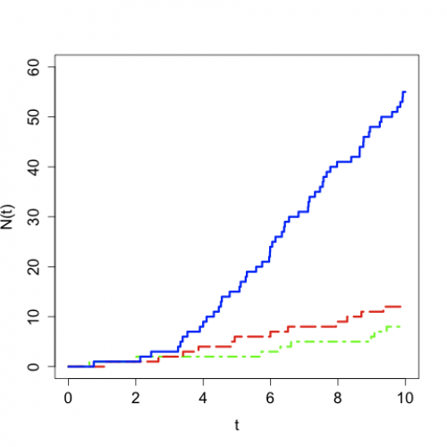
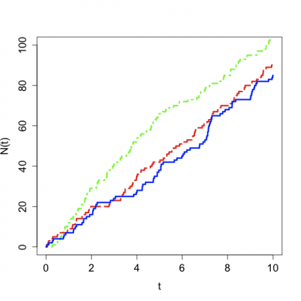

[](http://quantlet.de/)

## [](http://quantlet.de/) **STFrisk01** [](http://quantlet.de/)

```yaml

Name of QuantLet : STFrisk01

Published in : Statistical Tools for Finance and Insurance

Description : 'Produces the plots of non-homogeneous Poisson processes with linear and sinusoidal
intensity.'

Keywords : 'poisson, Poisson process, model, loss function, empirical, graphical representation,
visualization, risk process'

Author : Zografia Anastasiadou

Submitted : Wed, October 26 2011 by Dedy Dwi Prastyo

Example : Produces these plots of N(t) over t.

```






### R Code:
```r
rm(list = ls(all = TRUE))
# setwd('C:/...')

# install.packages('abind')
library(abind)

# generates a homogeneous Poisson process with intensity lambda
simHPP <- function(lambda, T, N) {
    # lambda: scalar, intensity of the Poisson process T: scalar, time horizon N: scalar, number of trajectories
    EN <- rpois(N, lambda * T)
    y <- matrix(T, nrow = 2 * max(EN) + 2, ncol = N) * matrix(1, nrow = 2 * max(EN) + 2, ncol = N)
    yy <- abind(y, matrix(1, nrow = 2 * max(EN) + 2, ncol = N) * EN, along = 3)
    i = 1
    while (i <= N) {
        if (EN[i] > 0) {
            yy[1:(2 * EN[i] + 1), i, 1] <- c(0, rep(sort(T * runif(EN[i])), each = 2))
        } else {
            yy[1, i, 1] = 0
        }
        yy[1:(2 * EN[i] + 2), i, 2] <- c(0, floor((1:(2 * EN[i]))/2), EN[i])
        i = i + 1
    }
    return(yy)
}

# generates a non-homogeneous Poisson process with intensity lambda
simNHPP <- function(lambda, parlambda, T, N) {
    # lambda: scalar, intensity function, sine function (lambda=0), linear function (lambda=1) or sine square function
    # (lambda=2) parlambda: n x 1 vector, parameters of the intensity function lambda (n=2 for lambda=1, n=3 otherwise) T:
    # scalar, time horizon N: scalar, number of trajectories
    a <- parlambda[1]
    b <- parlambda[2]
    if (lambda == 0) {
        c <- parlambda[3]
        JM <- simHPP(a + b, T, N)
    } else {
        if (lambda == 1) {
            JM <- simHPP(a + b * T, T, N)
        } else {
            if (lambda == 3) {
                JM <- simHPP(a + b * T, T, N)
            }
        }
    }
    rjm <- nrow(JM)
    yy <- abind(matrix(T, nrow = rjm, ncol = N), matrix(0, nrow = rjm, ncol = N), along = 3)
    i = 1
    maxEN = 0
    while (i <= N) {
        pom <- JM[, i, 1][JM[, i, 1] < T]
        pom <- pom[2 * (1:(length(pom)/2))]
        R <- runif(NROW(pom))
        if (lambda == 0) {
            lambdat <- (a + b * sin(2 * pi * (pom + c)))/(a + b)
        } else {
            if (lambda == 1) {
                lambdat <- (a + b * pom)/(a + b * T)
            } else {
                if (lambda == 3) {
                  lambdat <- (a + b * sin(2 * pi * (pom + c))^2)/(a + b)
                }
            }
        }
        pom <- pom[R < lambdat]
        EN <- NROW(pom)
        maxEN <- max(maxEN, EN)
        yy[1:(2 * EN + 1), i, 1] <- c(0, rep(pom, each = 2))
        yy[2:(2 * EN), i, 2] <- c(floor((1:(2 * EN - 1))/2))
        yy[(2 * EN + 1):rjm, i, 2] <- matrix(EN, nrow = rjm - 2 * EN, ncol = 1)
        i = i + 1
    }
    yy <- yy[1:(2 * maxEN + 2), , ]
    return(yy)
}

# linear intensity
set.seed(1)

y1 <- simNHPP(1, c(1, 0), 10, 1)
y2 <- simNHPP(1, c(1, 0.1), 10, 1)
y3 <- simNHPP(1, c(1, 1), 10, 1)

plot(y1, type = "l", col = "green", ylim = c(0, 60), xlab = "t", ylab = "N(t)", cex.lab = 1.4, cex.axis = 1.4, lwd = 3, lty = 4)
lines(y2, col = "red", lwd = 3, lty = 5)
lines(y3, col = "blue", lwd = 3)

# sinusoidal intensity

y1 <- simNHPP(0, c(10, 0, 1/4), 10, 1)
y2 <- simNHPP(0, c(10, 1, 1/4), 10, 1)
y3 <- simNHPP(0, c(10, 10, 1/4), 10, 1)

plot(y1, type = "l", col = "green", ylim = c(0, 100), xlab = "t", ylab = "N(t)", cex.lab = 1.4, cex.axis = 1.4, lwd = 3, lty = 4)
lines(y2, col = "red", lwd = 3, lty = 5)
lines(y3, col = "blue", lwd = 3) 

```
