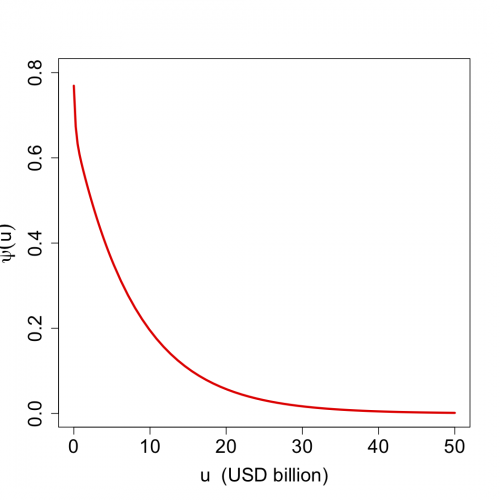
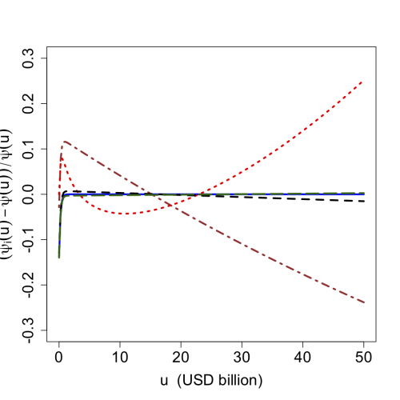
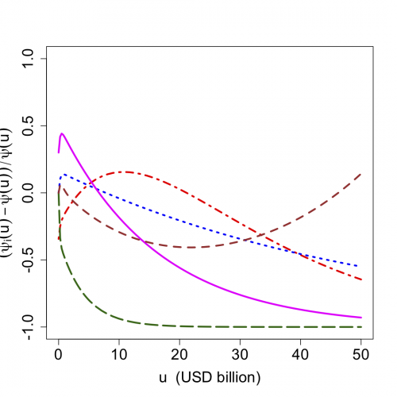

[](http://quantlet.de/)

## [](http://quantlet.de/) **STFruin17** [](http://quantlet.de/)

```yaml

Name of QuantLet : STFruin17

Published in : Statistical Tools for Finance and Insurance

Description : 'Produces the relative error of the approximations (with respect to exact method) of
ruin probability in infinite time treated as a function of the initial capital for the mixture of 2
exponentials distibution claims.'

Keywords : heavy-tailed, pdf, probability, poisson process, approximation, exponential

See also : 'STFruin02, STFruin03, STFruin04, STFruin05, STFruin06, STFruin07, STFruin08, STFruin09,
STFruin10, STFruin11, STFruin12, STFruin13, STFruin14'

Author : Zografia Anastasiadou

Submitted : Mon, October 17 2011 by Awdesch Melzer

Example : 'Produces these plots: a plot of the ruin probability and capital of an insurance company
and plots of the relative error and capital. One error plot with: blue - err2 brown - err3 red -
err5 black - err7 darkgreen - err8 One error plot with: red - err4 blue - err6 magenta - err9
darkgreen - err10 brown - err11.'

```








### R Code:
```r
rm(list = ls(all = TRUE))
graphics.off()

# setwd('C:/...')

# install.packages('MASS')
library(MASS)

u0 <- 5 * 10^10  # initial capital of insurance company (in USD)
n <- 70
u1 <- c(seq(0, by = u0/200, length.out = 21), seq(u0/10 + u0/200, by = (u0 - u0/10 - u0/200)/48, length.out = 49))
theta1 <- 0.3  # relative safety loading
dparameters1 <- list(c(0.0584, 0.9416), c(3.59e-10, 7.5088e-09))  # weights (first vector) and exponential parameters (second vector)

# produces the exact ruin probability in infinite time for insurance collective risk model with mixture of 2 exponentials
# distribution claims
ruinmix2exps <- function(u, theta, dparameters) {
    # u: initial capital for risk process theta: security loading in insurance collective risk model dparameters: list, composed
    # of 2 vectors containing the parameters of loss distribution, exponential parameters (first vector) and weights (second
    # vector)
    p1 <- dparameters[[1]]  # exponential parameters
    p2 <- dparameters[[2]]  # weights
    p <- p1[1]/p2[1]/(p1[1]/p2[1] + (1 - p1[1])/p2[2])
    psii <- p2[1] * (1 - p) + p2[2] * p
    r1 <- (psii + theta * sum(p2) - sqrt((psii + theta * sum(p2))^2 - 4 * prod(p2) * theta * (1 + theta)))/(2 * (1 + theta))
    r2 <- (psii + theta * sum(p2) + sqrt((psii + theta * sum(p2))^2 - 4 * prod(p2) * theta * (1 + theta)))/(2 * (1 + theta))
    y <- 1/((1 + theta) * (r2 - r1)) * ((psii - r1) * exp(-r1 * u) + (r2 - psii) * exp(-r2 * u))  # ruin probability using the Laplace transform inversion
    return(y)
}

# the exact ruin probability in infinite time
psi1 <- ruinmix2exps(u1, theta1, dparameters1)

# returns the k-th moment (up to fourth) of the mixture of 2 exponentials distribution claims
moments <- function(k, dparameters) {
    # k: order of moment to calculate dparameters: list, composed of 2 vectors containing the parameters of loss distribution,
    # weights (first vector) and exponential parameters (second vector)
    p1 <- dparameters[[1]]  # weights
    p2 <- dparameters[[2]]  # exponential parameters
    if (k == 1) {
        mk <- sum(p1/p2)
    } else {
        if (k == 2) {
            mk <- 2 * sum(p1/p2^2)
        } else {
            if (k == 3) {
                mk <- 6 * sum(p1/p2^3)
            } else {
                if (k == 4) {
                  mk <- 24 * sum(p1/p2^4)
                }
            }
        }
    }
    return(mk)  # k-th raw moment of the mixture of 2 exponentials distribution claims 
}

# returns the moment generating function or its k-th derivative (up to third) for mixture of 2 exponentials distribution
# claims
mgfs <- function(x, k, dparameters) {
    # x: scalar, n x 1 vector or m x n matrix, argument of the moment generating function k: scalar, integer, 0 =< k <= 3, order
    # of the derivative dparameters: list, composed of 2 vectors containing the parameters of the loss distribution, weights
    # (first vector) and exponential parameters (second vector)
    p1 <- dparameters[[1]]  # weights
    p2 <- dparameters[[2]]  # exponential parameters
    if (k == 0) {
        y <- sum((p1 * p2)/(p2 - t(x)))
    } else {
        if (k == 1) {
            y <- sum((p1 * p2)/(p2 - t(x))^2)
        } else {
            if (k == 2) {
                y <- 2 * sum((p1 * p2)/(p2 - t(x))^3)
            } else {
                if (k == 3) {
                  y <- 6 * sum((p1 * p2)/(p2 - t(x))^4)
                }
            }
        }
    }
    return(y)
}

m <- moments(1, dparameters1)  # 1st raw moment
m2 <- moments(2, dparameters1)  # 2nd raw moment
m3 <- moments(3, dparameters1)  # 3nd raw moment
m4 <- moments(4, dparameters1)  # 4th raw moment

# returns the adjustment coefficient R for mixture of 2 exponentials distribution claims
adjR <- function(theta, dparameters) {
    # theta: security loading in insurance collective risk model dparameters: list, composed of 2 vectors containing the
    # parameters of the loss distribution, weights (first vector) and exponential parameters (second vector)
    p1 <- dparameters[[1]]  # weights
    p2 <- dparameters[[2]]  # exponential parameters
    R0 <- min(p2)
    R0 <- c(12 * theta * m/(3 * m2 + sqrt(9 * m2^2 + 24 * m * m3 * theta)), R0)
    R0 <- min(R0)
    r <- R0
    err = 1
    while (err > 1e-09) {
        D1 <- 1 + (1 + theta) * m * r - mgfs(r, 0, dparameters1)
        D2 <- (1 + theta) * m - mgfs(r, 1, dparameters1)
        err <- r
        r <- r - D1/D2
        err <- abs(err - r)/r
        R <- r
    }
    return(R)  # adjustment coefficient R 
}

R <- adjR(theta1, dparameters1)  # adjustment coefficient R
mgfprim <- mgfs(R, 1, dparameters1)  # moment generating function 

C <- (theta1 * m)/(mgfprim - m * (1 + theta1))

# the exact ruin probability in infinite time
psi1 <- ruinmix2exps(u1, theta1, dparameters1)

# the Cramer-Lundberg approximation
psi2 <- C * exp(-R * u1)

# the exponential approximation
psi3 <- exp(-1 - (2 * m * theta1 * u1 - m2)/sqrt(m2^2 + 4 * theta1 * m * m3/3))

# the Lundberg approximation
psi4 <- (1 + (theta1 * u1 - m2/m/2) * (4 * theta1 * m^2 * m3/(3 * m2^3))) * exp(-(2 * m * theta1 * u1)/m2)

delta1 <- (2 * m * theta1)/(m2 + ((4 * m * m3/3/m2) - m2) * theta1)  # scale parameter of gamma distribution function
delta2 <- (1 + theta1)/(1 + ((4 * m * m3/3/m2^2) - 1) * theta1)  # shape parameter of gamma distribution function

# the Beekman-Bowers approximation
psi5 <- (1 - pgamma(u1, shape = delta2, scale = 1/delta1))/(1 + theta1)

# the Renyi approximation
psi6 <- exp(-(2 * m * theta1 * u1)/(m2 * (1 + theta1)))/(1 + theta1)

# parameters of the De Vylder approximation
delta <- 3 * m2/m3
beta <- 9 * m2^3/(2 * (1 + theta1) * m * m3^2)
p <- 3 * m2^2/(2 * (1 + theta1) * m * m3) - 1/(1 + theta1) + 1

# the De Vylder approximation
psi7 <- (beta/(p * delta)) * exp(-(delta - beta/p) * u1)

if (m2 * m4 < 3/2 * m3^2) {
    thetanew <- (theta1 * m * (2 * m3^2 - m2 * m4)/m2^2/m3)
    mnew <- ((3 * m3^2 - 2 * m2 * m4)/m2/m3)
    m2new <- ((m2 * m4 - 2 * m3^2) * (2 * m2 * m4 - 3 * m3^2)/m3^2/m2^2)
} else {
    thetanew <- 1/2 * theta1/m2^2 * m * (m3 + m2 * m)
    mnew <- m
    m2new <- 1/2/m2 * m * (m3 + m2 * m)
}

p1 <- mnew^2/(m2new - mnew^2)
p2 <- mnew/(m2new - mnew^2)
dparametersnew <- list(p1, p2)  # gamma parameters

# returns the k-th moment (up to fourth) of the mixture of 2 gamma distribution claims
momentsgam <- function(k, dparameters) {
    # k: order of moment to calculate dparameters: list of scalars, parameters of gamma distribution
    p1 <- dparameters[[1]]
    p2 <- dparameters[[2]]
    if (k == 1) {
        mk <- p1/p2
    } else {
        if (k == 2) {
            mk <- (p1^2 + p1)/(p2^2)
        } else {
            if (k == 3) {
                mk <- (p1^3 + 3 * p1^2 + 2 * p1)/(p2^3)
            } else {
                if (k == 4) {
                  mk <- p1 * (p1 + 1) * (p1 + 2) * (p1 + 3)/(p2^4)
                }
            }
        }
    }
    return(mk)  # k-th raw moment of gamma distribution claims 
}

# returns the moment generating function or its k-th derivative (up to third) for gamma distribution claims
mgfsg <- function(x, k, dparameters) {
    # x: scalar, argument of the moment generating function k: scalar, integer, 0 =< k <= 3, order of the derivative
    # dparameters: list of scalars, parameters of gamma distribution
    p1 <- dparameters[[1]]
    p2 <- dparameters[[2]]
    if (k == 0) {
        y <- p2^p1/((p2 - x)^p1)
    } else {
        if (k == 1) {
            y <- (p1/p2) * (p2/(p2 - x))^(p1 + 1)
        } else {
            if (k == 2) {
                y <- p1 * (p1 + 1) * p2^p1/(p2 - x)^(p1 + 2)
            } else {
                if (k == 3) {
                  y <- p1 * (p1 + 1) * (p1 + 2) * p2^p1/(p2 - x)^(p1 + 3)
                }
            }
        }
    }
    return(y)
}

# moments for gamma distribution claims
mg <- momentsgam(1, dparametersnew)  # 1st raw moment
mg2 <- momentsgam(2, dparametersnew)  # 2nd raw moment
mg3 <- momentsgam(3, dparametersnew)  # 3nd raw moment

# returns the adjustment coefficient R for gamma distribution claims
adjR <- function(theta, dparameters) {
    # theta: security loading in insurance collective risk model dparameters: list of scalars, parameters of gamma distribution
    p1 <- dparameters[[1]]
    p2 <- dparameters[[2]]
    R0 <- 0.99999999 * p2
    R0 <- c(12 * theta * mg/(3 * mg2 + sqrt(9 * mg2^2 + 24 * mg * mg3 * theta)), R0)
    R0 <- min(R0)
    r <- R0
    err <- 1
    while (err > 1e-09) {
        D1 <- 1 + (1 + theta) * mg * r - mgfsg(r, 0, dparameters)
        D2 <- (1 + theta) * mg - mgfsg(r, 1, dparameters)
        err <- r
        r <- r - D1/D2
        err <- abs(err - r)/r
        R <- r
    }
    return(R)  # adjustment coefficient R 
}

R <- adjR(thetanew, dparametersnew)  # adjustment coefficient R for gamma distribution claims
mgfprim <- mgfsg(R, 1, dparametersnew)  # moment generating function for gamma distribution claims 

C <- (thetanew * mg)/(mgfprim - mg * (1 + thetanew))
Cram <- C * exp(-R * u1)  # the Cramer-Lundberg approximation for gamma claims 

u1 <- u1 * p2/p1
b <- 1/p1
n <- length(u1)

# the function to be integrated
exactgamint <- function(x) {
    j <- 1
    while (j < n + 1) {
        uj <- u1[j]
        L <- x^(1/b) * exp(-(x + 1) * uj/b)
        M <- (x^(1/b) * (1 + (1 + thetanew) * (x + 1)/b) - cos(pi/b))^2 + sin(pi/b)^2
        j <- j + 1
    }
    y <- L/M
    return(y)
}

# integrates exactgamint function using the Simpson's method
d <- area(exactgamint, 0, 0.001)
d <- d + area(exactgamint, 0.001, 1)
d <- rbind(1, d)

err <- 1e-05
int <- matrix(1, n)
j <- 1
while (j < n + 1) {
    i <- 2
    while (abs((d[i - 1] - d[i])/d[i]) > err) {
        v <- area(exactgamint, i - 1, i)
        d <- rbind(d, (v + d[i]))
        i <- i + 1
    }
    endd <- length(d)
    int[j] <- d[endd]
    j <- j + 1
}

# the 4-moment gamma De Vylder approximation
psi8 <- Cram + as.vector((thetanew * sin(pi/b)/pi/b) * int)

u1 <- c(seq(0, by = u0/200, length.out = 21), seq(u0/10 + u0/200, by = (u0 - u0/10 - u0/200)/48, length.out = 49))

# the heavy traffic approximation
psi9 <- exp((-2 * theta1 * m * u1)/m2)

pa <- matrix(dparameters1[[1]])  # 2 x 1 matrix of weights
pb <- matrix(dparameters1[[2]])  # 2 x 1 matrix of exponential parameters

paa <- matrix(pa, nrow = 2, ncol = length(u1))
pbb <- matrix(pb, nrow = 2, ncol = length(u1))

d <- rowSums(t(paa/pbb * exp(-pb %*% u1)))
c <- matrix(m, nrow = length(d)) - d

# the light traffic approximation
psi10 <- (m - c)/(1 + theta1)/m

u2 <- (1 - 1/(1 + theta1)) * u1  # capital for the light traffic approximation

paa <- matrix(pa, nrow = 2, ncol = length(u2))
pbb <- matrix(pb, nrow = 2, ncol = length(u2))

d <- rowSums(t(paa/pbb * exp(-pb %*% u2)))
c <- matrix(m, nrow = length(d)) - d

psil <- (m - c)/(1 + theta1)/m  # the new light traffic approximation

# the heavy-light traffic approximation
psi11 <- (1/(1 + theta1)^2) * psi9 + (1 - 1/(1 + theta1)) * psil

u1 <- u1/10^9

# the relative errors of the approximations
err2 <- (psi2 - psi1)/psi1
err3 <- (psi3 - psi1)/psi1
err4 <- (psi4 - psi1)/psi1
err5 <- (psi5 - psi1)/psi1
err6 <- (psi6 - psi1)/psi1
err7 <- (psi7 - psi1)/psi1
err8 <- (psi8 - psi1)/psi1
err9 <- (psi9 - psi1)/psi1
err10 <- (psi10 - psi1)/psi1
err11 <- (psi11 - psi1)/psi1

plot(u1, psi1, type = "l", col = "red", ylim = c(0, 0.801), lwd = 3, main = "", xlab = "u  (USD billion)", ylab = expression(psi(u)), 
    cex.axis = 1.6, cex.lab = 1.6)
dev.new()
plot(u1, err2, type = "l", col = "blue", ylim = c(-0.301, 0.301), lwd = 3, main = "", xlab = "u  (USD billion)", ylab = expression((psi[i](u) - 
    psi(u))/psi(u)), cex.axis = 1.6, cex.lab = 1.6)
lines(u1, err3, col = "brown", lwd = 3, lty = 4)
lines(u1, err5, col = "red", lwd = 3, lty = 3)
lines(u1, err7, col = "black", lwd = 3, lty = 2)
lines(u1, err8, col = "darkgreen", lwd = 3, lty = 5)
dev.new()
plot(u1, err4, type = "l", lty = 4, col = "red", ylim = c(-1.01, 1.01), lwd = 3, main = "", xlab = "u  (USD billion)", ylab = expression((psi[i](u) - 
    psi(u))/psi(u)), cex.axis = 1.6, cex.lab = 1.6)
lines(u1, err6, col = "blue", lwd = 3, lty = 3)
lines(u1, err9, col = "magenta", lwd = 3)
lines(u1, err10, col = "darkgreen", lwd = 3, lty = 5)
lines(u1, err11, col = "brown", lwd = 3, lty = 2) 

```
