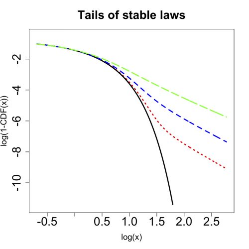
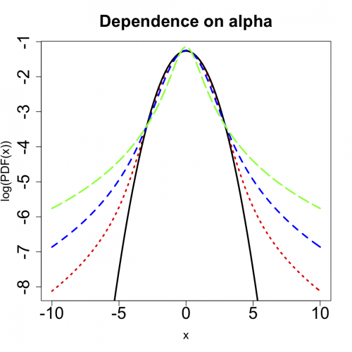
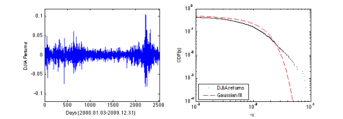

[](http://quantlet.de/index.php?p=info)

## [](http://quantlet.de/) **STFstab01** [](http://quantlet.de/d3/ia)

```yaml

Name of QuantLet : STFstab01

Published in : Statistical Tools for Finance and Insurance

Description : 'STFstab01.R creates a) a semilog plot of symmetric stable probability density
function for different alphas b) a double logarithmic plot of right tails of symmetric stable
disribution functions for different alphas. STFstab01.m calculates the log returns of the DIJA
daily closing values from the period January 3, 2000 - December 31, 2009 and plots the Gaussian fit
to the empirical culmulative distribution function (cdf) of the returns on a double logarithmic
scale. Requires the "empcdf.m" function.'

Keywords : cdf, pdf, stable distribution, graphical representation, visualization

See also : STFstab02, STFstab03, empcdf

Author : Zografia Anastasiadou, Rafal Weron

Submitted : Tue, September 18 2012 by Dedy Dwi Prastyo

Datafile : Dane_copula.txt

Example : 'STFstab01.R produces these plots: a double logarithmic plot of right tails of symmetric
stable disribution functions for different alphas and a semilog plot of symmetric stable
probability density function for different alphas. empcdf.m in STFstab01.m produces a plot of the
the Gaussian fit to the empirical culmulative distribution function (cdf) of the returns on a
double logarithmic scale (only left tail is plotted).'

```








### R Code:
```r
graphics.off()
rm(list = ls(all = TRUE))
# setwd('C:/...')

# install.packages('fBasics') install.packages('stabledist')
library(stabledist)
library(fBasics)

x1 <- c(-30:30)/5
x2 <- c(-50:50)/5

alpha1 <- c(2, 1.8, 1.5, 1)

# symmetric stable pdfs
w1 <- dstable(x1, alpha1[1], beta = 0)
w2 <- dstable(x2, alpha1[2], beta = 0)
w3 <- dstable(x2, alpha1[3], beta = 0)
w4 <- dstable(x2, alpha1[4], beta = 0)

plot(x2, log(w2), type = "l", main = "Dependence on alpha", xlab = "x", ylab = "log(PDF(x))", cex.axis = 2, cex.lab = 1.4, cex.main = 2, 
    lwd = 3, col = "red", lty = 3)
lines(x1, log(w1), lwd = 3)
lines(x2, log(w3), col = "blue", lwd = 3, lty = 2)
lines(x2, log(w4), col = "green", lwd = 3, lty = 5)

########################################### 

x3 <- c(5:60)/10
x4 <- c(1:200)/20 + 60/10

x <- c(x3, x4)

alpha2 <- c(2, 1.95, 1.8, 1.5)

# symmetric stable cdfs
w5 <- pstable(x3, alpha2[1], beta = 0)
w6 <- pstable(x, alpha2[2], beta = 0)
w7 <- pstable(x, alpha2[3], beta = 0)
w8 <- pstable(x, alpha2[4], beta = 0)

s1 <- cbind(x3, 1 - w5)
s2 <- cbind(x, 1 - w6)
s3 <- cbind(x, 1 - w7)
s4 <- cbind(x, 1 - w8)
dev.new()
plot(log(s2), type = "l", ylim = c(-11.5, -0.5), main = "Tails of stable laws", xlab = "log(x)", ylab = "log(1-CDF(x))", cex.axis = 2, 
    cex.lab = 1.4, cex.main = 2, lwd = 3, col = "red", lty = 3)
lines(log(s1), lwd = 3)
lines(log(s3), col = "blue", lwd = 3, lty = 2)
lines(log(s4), col = "green", lwd = 3, lty = 5) 

```

### MATLAB Code:
```matlab
% clear variables and close windows
clear all
close all
clc

cmd = [1 1];

dane = load('Dane_copula.txt');


if ismember(1,cmd),
    %d - DJIA
    %x - zwroty z d
    %xx - linspace na zwrotach d
    d = dane(:,7); % DJIA data
    d = d(~isnan(d));
    x = log(d(2:end)./d(1:end-1));
    xx = linspace(min(x),max(x),1000);
    f = figure(1);
    subplot(1,2,1)
    plot(x)
    xlabel('Days (2000.01.03-2009.12.31)')
    ylabel('DJIA Returns')
    set(gca,'xlim',[0,length(x)+1],'ylim',[-.12 .12])

    subplot(1,2,2)
    [xemp,yemp] = empcdf(x);
    [mu,sig] = normfit(x);
    loglog(-xemp,yemp,'k.')
    hold on
    loglog(-xx,normcdf(xx,mu,sig),'r--','linewidth',1)
    hold off
    xlabel('-x')
    ylabel('CDF(x)')
    set(gca,'xlim',[1e-3 1e-1],'ylim',[1e-4 1])
    legend('DJIA returns','Gaussian fit',3)
    
    print(f,'-dpsc2','STF2stab01.ps')
end
```
