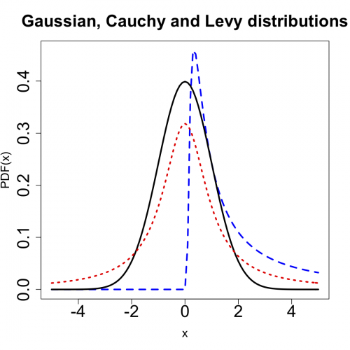
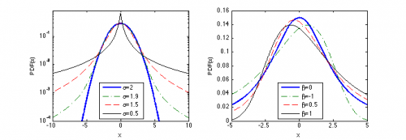

[](http://quantlet.de/index.php?p=info)

## [](http://quantlet.de/) **STFstab02** [](http://quantlet.de/d3/ia)

```yaml

Name of QuantLet : STFstab02

Published in : Statistical Tools for Finance and Insurance

Description : 'STFstab02.R creates a) a plot of stable probability density function for different
betas b) a plot of probability density functions of Gaussian, Cauchy, Levy distributions.
STFstab02.m shows a semi-logarithmic plot of symmetric (beta=mu=0) stable densities for four values
of alpha and a plot of stable densities for alpha = 1.2 and four values of beta. Requires the
"stabpdf_fft.m" function.'

Keywords : 'Levy, cauchy, gaussian, pdf, stable distribution, graphical representation,
visualization'

See also : STFstab01, STFstab03, stabpdf_fft

Author : Zografia Anastasiadou, Rafal Weron

Submitted : Tue, September 18 2012 by Dedy Dwi Prastyo

Example : 'STFstab02.R produces these plots: a plot of probability density functions of Gaussian,
Cauchy and Levy distributions and a plot of stable probability density function for
beta=[0,0.5,0.8,1]. stabpdf_fft.m in STFstab02.m produces a semi- logarithmic plot of symmetric
(beta=mu=0) stable densities for four values of alpha (Note the distinct behavior of the Gaussian
(alpha = 2) distribution) and a plot of stable densities for alpha = 1.2 and four values of beta.'

```







### R Code:
```r
rm(list = ls(all = TRUE))
graphics.off()
# setwd('C:/...')

install.packages("fBasics")
install.packages("stabledist")
library(stabledist)
library(fBasics)

x <- c(-50:50)/10

alpha <- 1.2
beta <- c(0, 0.5, 0.8, 1)

# stable pdfs
w1 <- dstable(x, alpha, beta = beta[1], pm = 1)
w2 <- dstable(x, alpha, beta = beta[2], pm = 1)
w3 <- dstable(x, alpha, beta = beta[3], pm = 1)
w4 <- dstable(x, alpha, beta = beta[4], pm = 1)

plot(x, w1, type = "l", main = "Dependence on beta", xlab = "x", ylab = "PDF(x)", cex.axis = 2, cex.lab = 1.4, cex.main = 2, 
    lwd = 3)
lines(x, w2, col = "red", lwd = 3, lty = 3)
lines(x, w3, col = "blue", lwd = 3, lty = 2)
lines(x, w4, col = "green", lwd = 3, lty = 5)

################################### 

# Gaussian, Cauchy, Levy pdfs
w5 <- dnorm(x)

w6 <- dcauchy(x, location = 0, scale = 1)

w7 <- matrix(0, length(x))
for (i in 1:length(x)) {
    if (x[i] > 0) {
        w7[i] <- dstable(x[i], alpha = 0.5, beta = 1, pm = 1)
    }
}
dev.new()
plot(x, w7, type = "l", main = "Gaussian, Cauchy and Levy distributions", xlab = "x", ylab = "PDF(x)", cex.axis = 2, cex.lab = 1.4, 
    cex.main = 2, col = "blue", lwd = 3, lty = 2)
lines(x, w5, lwd = 3)
lines(x, w6, col = "red", lwd = 3, lty = 3) 

```

### MATLAB Code:
```matlab
% clear variables and close windows
clear all
close all
clc


cmd = [1 2];


if ismember(2,cmd),
    f = figure(2);
    subplot(1,2,1)
    [x1,y1] = stabpdf_fft(2,1,0,0,6);
    [x2,y2] = stabpdf_fft(1.9,1,0,0,10);
    [x3,y3] = stabpdf_fft(1.5,1,0,0,10);
    [x4,y4] = stabpdf_fft(0.5,1,0,0,10);
    semilogy(x1,y1,'b-','linewidth',2)
    hold on
    semilogy(x2,y2,'-.','color',[0 .5 0],'linewidth',1)
    semilogy(x3,y3,'r--','linewidth',1)
    semilogy(x4,y4,'k-','linewidth',1)
    hold off
    xlabel('x')
    ylabel('PDF(x)')
    legend('alpha=2','alpha=1.9','alpha=1.5','alpha=0.5','Location','South')
    set(gca,'ylim',[1e-4 .8]);

    subplot(1,2,2)
    [x1,y1] = stabpdf_fft(1.2,2,0,0,5);
    [x2,y2] = stabpdf_fft(1.2,2,-1,0,5);
    [x3,y3] = stabpdf_fft(1.2,2,0.5,0,5);
    [x4,y4] = stabpdf_fft(1.2,2,1,0,5);
    plot(x1,y1,'b-','linewidth',2)
    hold on
    plot(x2,y2,'-.','color',[0 .5 0],'linewidth',1)
    plot(x3,y3,'r--','linewidth',1)
    plot(x4,y4,'k-','linewidth',1)
    hold off
    xlabel('x')
    ylabel('PDF(x)')
    legend('beta=0','beta=-1','beta=0.5','beta=1','Location','South')
    set(gca,'xtick',-5:2.5:5,'ylim',[0 .16])
    
    print(f,'-dpsc2','STF2stab02.ps')
end
```
